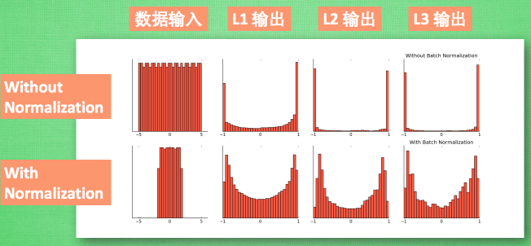
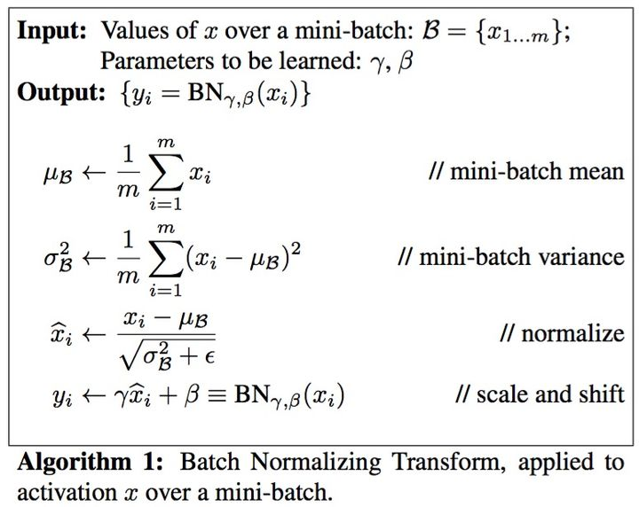
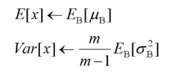

## Batch Normalization
输入数据Normalization：
- Normalization 即将数据规范化，一般是将数据映射到指定的范围，用于去除不同维度数据的量纲以及量纲单位。这样可以去除因为量纲以及量纲单位导致模型对数据中某些特征的倾向。
- DNN中经常用到的一种Normalization技术是白化（whitening），即将原始特征转化成相互之间相关性低并且方差相同的新特征

Batch Normalization
- 对输入到BN层的hidden states 规范化，然后通过可学习参数将规范化后的hidden states重新rescale到网络学习到最优范围
如下图所示，展示了有BN和没BN的差别，**那么为什么要使用BN呢，BN到底解决了什么问题？**

    
图1

### Internal Covariate Shift 引起的问题
提到BN，就会提到Internal Covariate Shift，**即神经网络的不同层之间输入和输出分布不同，导致了每层网络的输入是不同分布的**。这里covariate shift通常指训练即和测试集分布不同，不符合独立同分布假设，需要用到其他的技术来修复这种Shift。这一点类似于重要性采样中在一个易于学习统计的分布下采样，然后通过映射函数计算源分布的相关统计量。
然而BN面对的问题真和covariate shift一样吗？**如果是，为何BN中会有可学变量$\gamma$和$\beta$对归一化后的结果进行rescale呢？**

比这认为Internal Covariate Shift本身并不是导致神经网络效果变差的主要问题，**而较强的Internal Covariate Shift导致的每层输出分布极度不均才是导致神经网络效果变差的主要问题主要原因之一**，如图1所示。可以这么理解：
- 如果神经网络中间层输出出现聚积现象（即不均匀现象），表示较上一层该层的信息出现了缺失，并且这种聚积通常随着层数增加会出现积累现象（即该现象是不可逆的）
- 聚积通常都是往两边聚积（即很很大的值或者很小的值），对于sigmoid之类的激活函数非常不友好，会导致神经元输出在饱和区，梯度非常小，很难训练。
- 即使将sigmoid函数替换成ReLu，由于神经网络的最终预测层一般是sigmoid之类的，因此还是无法避免该问题。
- 此外，不同Batch间的输入分布不同也会导致神经网络难训练。由于Internal Covariate Shift，经过多层网络之后，神经网络中间层的输出变化范围可能很大，不同Batch之间对应的输出分布之间可能存在很大差异

因此BN就是要解决上述问题。

### 具体算法
BN的具体算法如下图所示：
- 首先求出每个Batch中的$\mu_\beta$和$\sigma_\beta$，并以此来归于化输入$x$
- 用可学变量$\gamma$和$\beta$将归一化后的$x$重新映射到合适的范围。

- 在预测时，均值和方差用训练集上的moving_mean和moving_variance，该方式是流式数据统计均值和方差的方法

### BN的主要作用
- 减缓了Internal Covariate Shift导致的中间层输出极度不均现象
- 减缓了不同Batch在同一神经网络层输出的分布的差异性
- 将神经网络的输出拉离饱和区，减缓了梯度弥散现象。
- 通过可学变量$\gamma$和$\beta$，将每层输出重新映射到合适的范围，增强了网络的学习能力。
