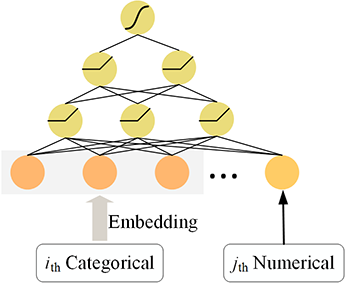
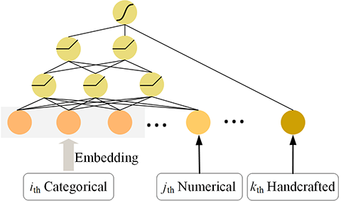

<head>
    
    
</head>

- [DeepCTR](#deepctr)
  - [Embedding Vector](#embedding-vector)
  - [Wide & Deep](#wide--deep)
  - [DeepFM](#deepfm)
  - [AutoInt](#autoint)
  - [DeepCross](#deepcross)
  - [XDeepFM](#xdeepfm)

## DeepCTR
在DeepCTR模型通常应用于表数据场景，该场景通常由离散特征和连续特征组成。如下图所示，每一行表示一个样本，每一列表示特征。机器学习任务就是要根据特征x预测目标y。其中离散特征一般用one-hot encoding处理，连续特征用归一化处理。然而在实际应用中，例如CTR预测场景，离散特征可能包含了上百万的不同值，这也就导致了one-hot vector是高纬稀疏的，进而特征向量x也是高纬稀疏的。

**应用深度神经网络到该领域首先要解决的就是离散变量高维稀疏问题**。

### Embedding Vector
Deep模型能在CTR领域应用的最重要技术之一就是Embedding，Embedding技术可以将高纬稀疏的离散特征映射成低纬的稠密向量，如下图所示：

其定义如下 ：
$$
    \mathbf{e}_i =  \mathbf{W}_i \mathbf{x}_i \tag{1}
$$
其中，$\mathbf{x}_i\in R^n$是one-hot向量（在多值field时为multi-hot向量）, $\mathbf{W}_i\in R^{n\times d}$是embedding矩阵, $\mathbf{e}_i\in R^d$是embedding向量，n是field $i$中不同值的个数, d是embedding factor。实际上，公式(1)也可以被看作是取出矩阵$\mathbf{W}_i$的第$x_i$列。

此时，可以将离散变量的embedding向量和连续变量concat起来作为上层DNN的输入。即
$$
    \mathbf{X}_{dnn} = concat([\mathbf{e}_i,\cdots, x_j\cdots])
$$
其中$x_j$是连续特征。下图所示就是一个典型的DNN模型。

### Wide & Deep
Wide & Deep 是Google 2016年提出的用于表数据的经典模型，该模型将DNN学习到的高阶特征表示、原始特征和专家构造的特征拼到一起，直接预测最终结果，如下图所示：

其定义如下：
$$
    P(Y=1|X)=\sigma(W_{wide}^T[X, \phi(X)] + W_{deep}^TDNN(X) + b)
$$
其中, $\phi(X)$是专家构造的特征, $DNN(X)$是DNN学习到的高阶特征表示，$X$是原始特征。
这里，Wide部分和Deep部分可以用不同的优化器来联合训练。例如，Wide部分用FTRL，Deep部分用adam。
目前主流的DeepCTR模型都是Wide & Deep模式，即用一个FM、CIN等网络替换Wide部分。

### DeepFM
DeepFM是将FM模块和Deep模块并联到一起，如下图所示：

FM是用来表征Field之间内积的网络表征方式，定义如下:
$$
    y_{FM}= w_0 + \mathbf{w_1}^T \mathbf{X} + \sum_{i=1}^{n-1}\sum_{j=i+1}^{n} <\mathbf{e_i}, \mathbf{e_j}>
$$
其中, $\mathbf{X}=concat([\mathbf{x_i}\cdots x_j\cdots])$是离散特征one-hot和连续特征拼接的结果，$e_i$和$e_j$是embedding 向量。
这里，很容易发现FM不能学到连续特征之间以及连续特征与离散特征之间的交互。一个简单的办法是将连续特征离散化后使用DeepFM，或者可通过一个映射矩阵，将连续特征映射到同embedding 向量相同的维度，如下：
$$
    \mathbf{e_j} = x_j \mathbf{V}_j
$$
其中，$\mathbf{V}_j$即为映射向量。
DeepFM的最终预测为:
$$
    \hat{y}=\sigma(y_{DNN} + y_{FM})
$$

### AutoInt
AutotInt的核心网络如下图所示，即使用Multi-head self-attention 网络来学习特征之间的交互信息。其中，它对连续特征的处理方式就是通过一个映射矩阵，将连续特征映射到同embedding 向量相同的维度。

Interacting层是AutoInt的核心，它使用经典的 Multi-head Self-Attention 来构造组合特征，即 key-value attention 的实现方式，具体结构如下图所示。

每个Attention head 都对应着三个转换矩阵$\mathbf{W}_{query},\mathbf{W}_{key},\mathbf{W}_{value}\in R^{d'\times d}$,对于第 h 个 Attention head，当第 m 个嵌入向量$\mathbf{e}_{m}$作为query时，其对应输出$\tilde{\boldsymbol{e}}_{m}^{(h)}$为：
$$
\begin{gathered}
\alpha_{m, k}^{(h)}=\frac{\exp \left(\phi^{(h)}\left(\boldsymbol{e}_{m}, \boldsymbol{e}_{k}\right)\right)}{\sum_{l=1}^{M} \exp \left(\phi^{(h)}\left(\boldsymbol{e}_{m}, \boldsymbol{e}_{l}\right)\right)} \\
\phi^{(h)}\left(\boldsymbol{e}_{m}, \boldsymbol{e}_{k}\right)=\left\langle\boldsymbol{W}_{Q u e r y}^{(h)} \boldsymbol{e}_{m}, \boldsymbol{W}_{K e y}^{(h)} \boldsymbol{e}_{k}>\right. \\
\tilde{\boldsymbol{e}}_{m}^{(h)}=\sum_{k=1}^{M} \alpha_{m, k}^{(h)}\left(\boldsymbol{W}_{\text {Value }}^{(h)} \boldsymbol{e}_{k}\right)
\end{gathered}
$$
上式中，$\phi(\cdot)$是可选的相似度计算函数，文中简单地选择向量内积。

对第m个嵌入$\mathbf{e}_{m}$，作者简单拼接它在$\tilde{\boldsymbol{e}}_{m}^{(h)}$个Attention head的输出，然后引入标准的残差连接作为其最终输出$\mathbf{e}_{m}^{Res}$ ：
$$
\begin{gathered}
\tilde{\boldsymbol{e}}_{m}=\tilde{\boldsymbol{e}}_{m}^{(1)} \oplus \tilde{\boldsymbol{e}}_{m}^{(2)} \oplus \ldots \oplus \tilde{\boldsymbol{e}}_{m}^{(H)} \in \mathbb{R}^{d^{\prime} H} \\
\boldsymbol{e}_{m}^{\text {Res }}=\operatorname{Relu}\left(\tilde{\boldsymbol{e}}_{m}+\boldsymbol{W}_{\text {Res }} * \boldsymbol{e}_{m}\right), \quad \boldsymbol{W}_{\text {Res }} \in \mathbb{R}^{d^{\prime} H * d}
\end{gathered}
$$
最终的预测输出为：
$$
\hat{y}=\sigma\left(\boldsymbol{w}^{T}\left(\boldsymbol{e}_{1}^{\text {Res }} \oplus \boldsymbol{e}_{2}^{\text {Res }} \oplus \ldots \oplus \boldsymbol{e}_{M}^{\text {Res }}\right)+b\right)
$$
其中 $\boldsymbol{w} \in \mathbb{R}^{d^{\prime} H M}$, $\sigma(\cdot)$ 表示sigmoid函数。 **这里可以看到，每个特征embedding向量$\{1,\cdots,M\}$有会基于Attention和残差网络的输出。**

### DeepCross
DeepCross的网络结构如下图所示，核心点是左边分支的Cross network

首先
$$
    \mathbf{x}_0=concat([\mathbf{e}_1,\cdots,x_j,\cdots])
$$
Cross network的第l层输出为:
$$
    \mathbf{x}_{l+1} = \mathbf{x}_0 * \mathbf{x}_l^T * \mathbf{w} + \mathbf{x}_0 + \mathbf{b}
$$
其中, $\mathbf{x}_{l+1}$,$\mathbf{x}_l$,$\mathbf{x}_0$维度相同。其计算过程如下图所示：

Cross的设计有如下特点：
- 有限高阶：叉乘阶数由网络深度决定，深度$l$对应最高$l+1$阶的叉乘
- 自动叉乘：Cross输出包含了原始特征从一阶（即本身）到$l+1$阶的所有叉乘组合，而模型参数量仅仅随输入维度成线性增长：$2\times d \times l$
- 参数共享：不同叉乘项对应的权重不同，但并非每个叉乘组合对应独立的权重（指数数量级）， 通过参数共享，Cross有效降低了参数量。此外，参数共享还使得模型有更强的泛化性和鲁棒性。

### XDeepFM
XDeepFM的结构如下图所示，其核心点是CIN网络。

CIN的网络结构如下图所示，它的结构同Cross Network类似,即：
$$
    \mathbf{X}^k = F( \mathbf{X}^{k-1}, \mathbf{X}^{0})
$$
其中, $\mathbf{X}^k \in R^{H_k \times D}$, $H_k$是示第k层的vector个数, $D$就是embedding factor。

这里$F$操作的定义是
$$
\boldsymbol{X}_{h, *}^{k}=\sum_{i=1}^{H_{k-1}} \sum_{j=1}^{m} \boldsymbol{W}_{i j}^{k, h}\left(\boldsymbol{X}_{i, *}^{k-1} \circ \boldsymbol{X}_{j, *}^{0}\right) \in \mathbb{R}^{1 * D}, \quad \text { where } 1 \leq h \leq H_{k}\tag{2}
$$
其中，其中$\boldsymbol{W}^{k, h}\in R^{H_{k-1} \times m}$表示第k层的第h个vector的权重矩阵, $\circ$ 表示Hadamard乘积，即逐元素乘。下图展示了这个计算过程。
- 首先采用类似外积的操作，获取中间结果$\boldsymbol{X}^k_{tmp}=\boldsymbol{X}^{k-1} \otimes  \boldsymbol{X}^{0}$。
- 通过权重矩阵$\boldsymbol{W}^{k, h}$，将$\boldsymbol{X}^k_{tmp}\in R^{H_{k-1}\times D \times m}$压缩到$\boldsymbol{X}^k_{h}\in R^{1\times D}$
- 将$H_k$个$\boldsymbol{X}^k_{h}$拼起来就得到$\boldsymbol{X}^k$

最终,$\boldsymbol{X}^1,\cdots,\boldsymbol{X}^k$在$D$维上求sum 然后concat 起来，即为CIN的输出。