<head>
    
    
</head>

## 深度稀稀疏网络（Network on Network）
如今，在金融、零售、电商、互联网等领域的 AI 应用中，表数据都是最为常见且应用广泛的数据格式。将表数据进行准确的分类预测，对业务的提升起着至关重要的作用。日前，第四范式提出了全新的深度神经网络表数据分类模型——深度稀疏网络（Deep Sparse Network，又名 NON），通过充分捕捉特征域内信息、刻画特征域间潜在相互作用、深度融合特征域交互操作的输出，获得超过 LR、GBDT 等常用算法以及 FFM、Wide&Deep、xDeepFM、AutoInt 等基于深度学习算法的分类效果，提升了表数据的预测准确度。

文章地址: [Network On Network for Tabular Data Classification in Real-world Applications](https://arxiv.org/abs/2005.10114)

### 要解决的问题
已有的深度模型在表数据上已经取了成功，然而还有许多问题需要解决，包括：
* 已有的网络结构没有显示的考虑特征域内的信息，**文中称之为intra-field information**。以为每个特征域本身的含义并不同，导致了每个特征域内在的分布也不相同，而已有的网络并有显示的考虑这个信息。
* 已有的网络结构中，**不同的特征交互操作(Operations)的选择是固定的**，如下表所示。
* 已有的网络结构中，最终预测结构是对不同交互操作的输出线性加权得到，**忽略了他们之间非线性**。
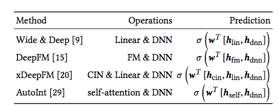

基于对上述三个主要问题，我们提出了Network on Network。

### 网络结构
其网络结构如下图所示，包含了三个结构
- Field-wise network，该层主要是为了显示学习intra-field information，得到更好的embedding 表示
- Across field network，该层从设计上兼容目前主流的特征交互操作，并且用调参数的方式来选择特征交互操作的选择
- Operation fusion network，利用DNN进一步学习不同交互操作输出之间的非线性。

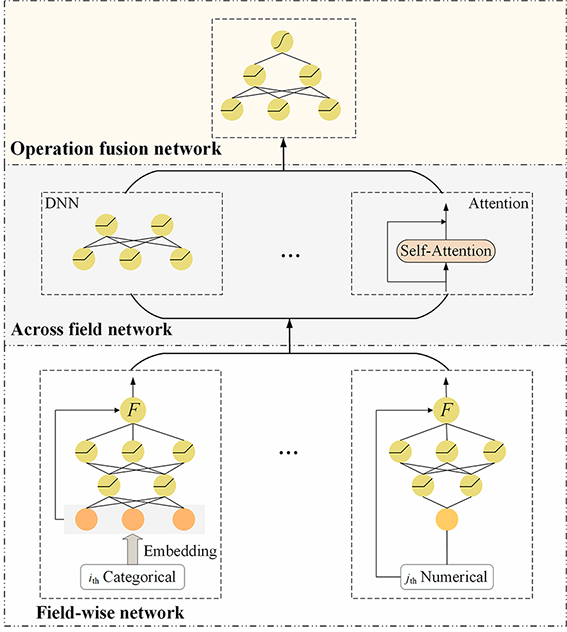

#### Field-wise network
结构如下图所示，利用DNN+Gate Function来学习intra-field information，定义如下:
$$
    F(DNN(\mathbf{X}),\mathbf{X}))
$$
其中DNN是用主要用来学习intra-field information， Gate Function $F$是用来融合DNN的输出和$\mathbf{X}$以丰富Field-wise network的输出结果。常用的Gate Function有逐元相加、concat、tanh等。
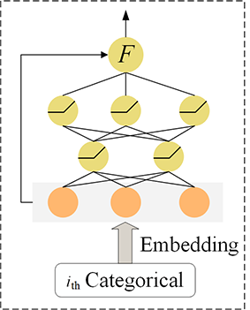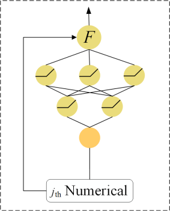
这里需要说明一下，每个Field都有一个小网络。**可以将离散Field和连续Filed对应的小网络stack起来，用并行矩阵运算来加速。**
$$
	\begin{aligned}
	 	\mathbf{X} &= \textup{stack} \left( \left[ \bm{X_1}, \bm{X_2}, \cdots, \bm{X_c} \right] \right) \in \mathbb{R}^{c \times b \times d_1} \\
	 	\mathbf{W} &= \textup{stack} \left( \left[ \bm{W_1}, \bm{W_2}, \cdots, \bm{W_c} \right] \right) \in \mathbb{R}^{c \times d_1 \times d_2}
	 \end{aligned}
$$
stack后的神经网络层输出为
$$
\mathbf{X}^{'} = \textup{ReLU}\left( \textup{matmul} \left( \mathbf{X}, \mathbf{W} \right) + \mathbf{b} \right)
$$

#### Across field network
该层以Field-wise network的输出为输入，学习不同特征Field之间的交互操作。该层从设计上兼容目前主流的特征交互操作，并且用调参数的方式来选择特征交互操作的选择。包括：线性模块、DNN、self-attention、Bi-Interaction。

#### Operation fusion network
现有的方法对不同操作的输出线性地加权求和，然后通过 sigmoid 函数得到最终的预测结果，而忽略了不同操作输出之间的非线性关系。在深度稀疏网络中，融合网络通过 DNN 对域间网络所选操作的输出进行深度融合，并得到最终的预测结果。
首先将不同的Operation的输出concat起来，
$$
	\bm{x_{\textup{ofn}}} = \textup{concat} \left( \left[ \bm{o}_{1}, \bm{o}_{2}, \cdots, \bm{o}_{k}\right] \right)  \in \mathbb{R}^{\sum_{i}d_{i}}
$$
然后，利用DNN预测最终结果：
$$
    y^{'}=\textup{DNN}_{\textup{ofn}} \left(\bm{x_{\textup{ofn}}}\right)
$$

### DNN with auxiliary losses
由于NON层数较深，会遇到由于梯度弥散导致的难以训练的问题。为了解决该问题，我们将auxiliary losses引入到了DNN中。即从DNN的每一层网络输出输出一个预测连接到loss上，如下图所示，其定义如下：
$$
    \ell_{aux}^{i} = \ell \left( \textup{sigmoid}\left( {{\mathbf{W}}_{aux}}^T_{i}  \bm{h}_{i} \right), y \right)
$$
最终loss为：
$$
    \ell = \ell(y', y) + \alpha \sum_{i}{ \ell_{aux}^{i} } + \gamma \left \| \mathbf{W} \right \|
$$
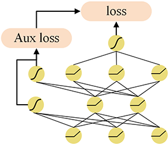
DNN和DNN with auxiliary losses的对比结果如下图所示：
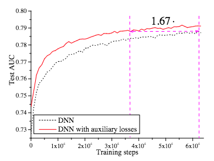

### 实验

#### 实验数据

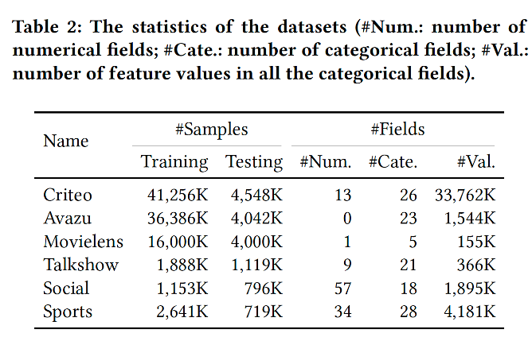

#### NON的设计范式可以提高模型泛化能力
通过消融学习，可以证明，域内网络捕获的域内信息有助于提高模型的泛化性能；且随着 NON 不同的组件堆叠，模型的预测效果持续增长。
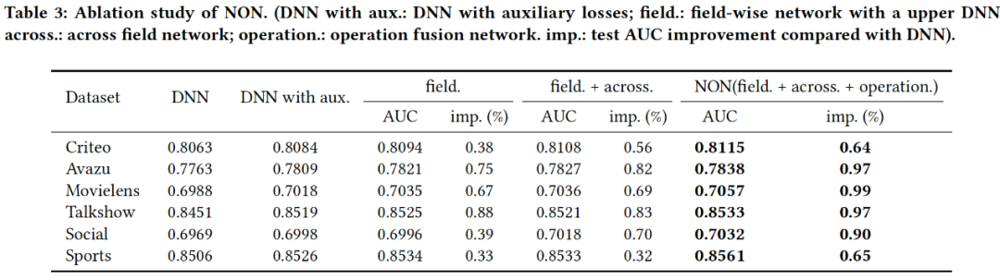

#### 效果全面领先主流深度模型
对比NON与SOTA模型的性能，可以发现NON全面领先于SOTA模型。
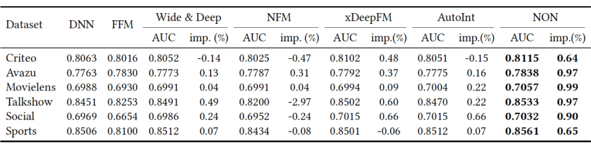

#### 根据数据选定合适的特征域间交互操作
通过对比不同操作组合下NON的性能，我们发现不同数据集偏好不同操作组合，我们需要根据数据来选择特征域间交互操作。
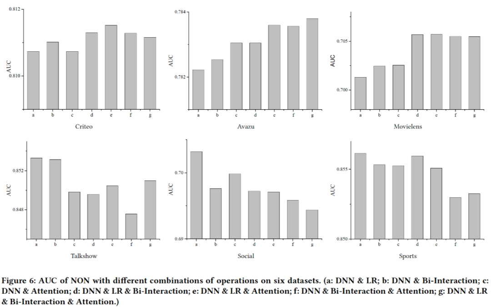
NON中Across field network就是这么设计的，即以调参的方式来选择合适的特征域间交互操作组合。结果如下图所示：
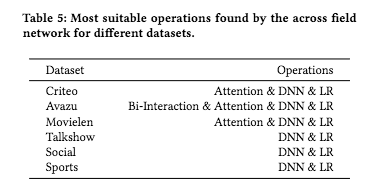

#### Field-wise network可以有效捕获intra-field information
Field-wise network设计之初的目的是捕获intra-field information。然而intra-field information是一个难以量化并展示出来的内容。因此我们从侧来展示Field-wise network捕获的intra-field information。
我们对域内网络处理前后特征值对应的向量进行可视化和比较，可以看出经过域内网络后，每个域内的特征在向量空间中更加接近，不同域间的特征也更容易区分。
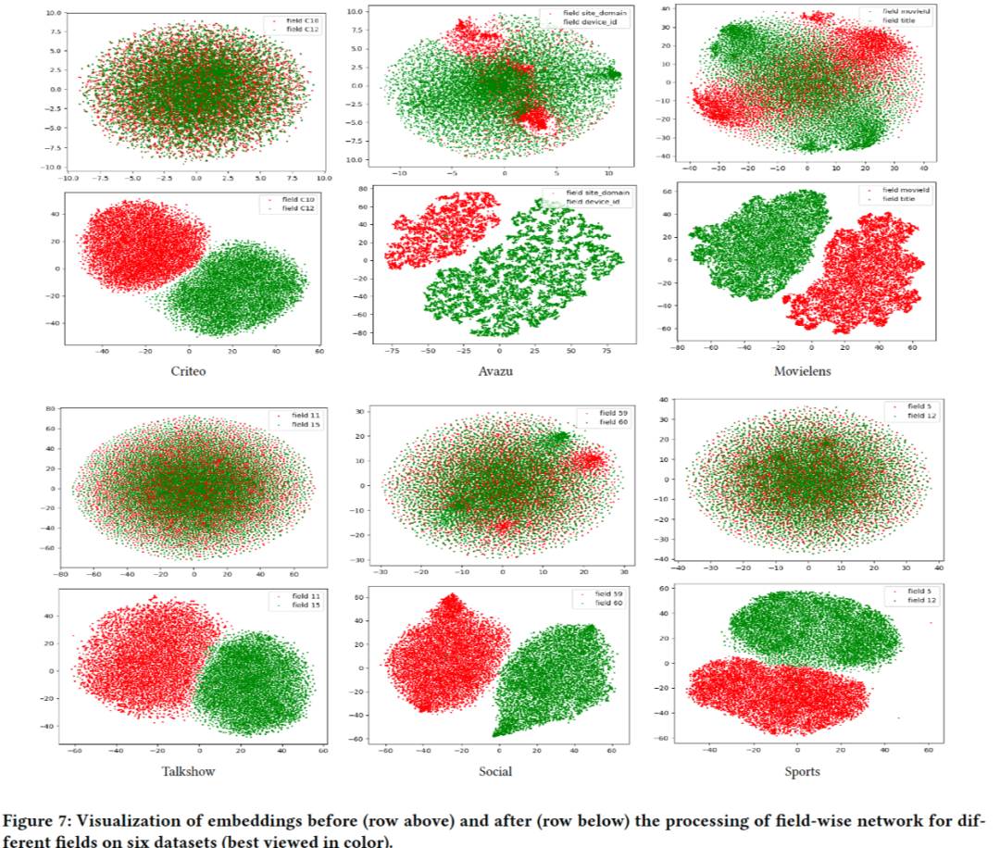
通过进一步计算数据中特征的平均余弦距离（数值越大，相似度越高），域内网络可以使余弦距离提高一到两个量级，即能有效地捕获每个域内特征的相似性。
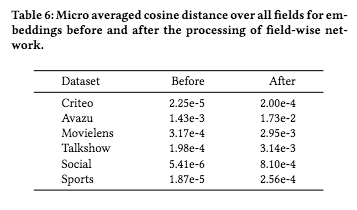