<head>
    
    
</head>

## 用户行为模型

理解用户是搜索排序中一个非常重要的问题，工业级的推荐系统一般需要大量的泛化特征来较好的表达用户。这些泛化特征可以分为两类：
- 偏静态的特征，例如用户的基本属性（年龄、性别、职业等等）特征、长期偏好（品类、价格等等）特征；
- 动态变化的特征，例如刻画用户兴趣的实时行为序列特征。

用户的实时行为特征能够明显加强不同样本之间的区分度，所以在模型中优化用户行为序列建模是让模型更好理解用户的关键环节。
推荐系统中的用户兴趣变化非常剧烈，比如电商推荐中，用户一会看看服饰，一会看看电子产品，若只使用静态特征进行推荐，每次推荐的内容是一样的，这无疑是不能满足用户需求，实时性需要保障。
这里需要说明的是:
- 用户历史行为一般是指用户历史点击过商品或者广告
- 基于用户历史行为预测用户对当前商品或者广告的点击率或者转化率

### Pooling
第一种对用户历史行为建模的方式是使用Mean Pooling、Sum Pooling等Pooling操作按位聚合用户历史行为对应的Embedding Vectors，如下图所示,这里需要说明的是:
- 用户历史行为items的和当前item共享embedding矩阵
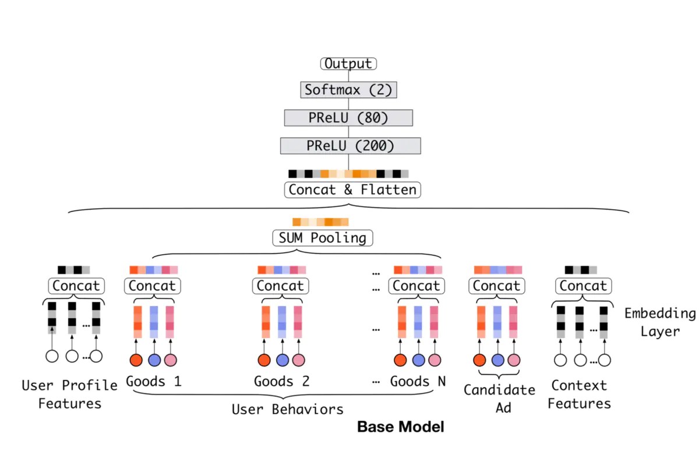

上述方法的主要问题是：
* 忽略了目标item与用户先前历史行为序列各item之间的相关性，导致模型无法从用户丰富的历史行为中捕捉用户多样的兴趣
事实是在一个用户浏览购买的过程中：
兴趣是多样的：
比如一个女性用户喜欢买女装，也喜欢化妆品，还可能同时还喜欢母婴用品，那么该女性用户在购买大衣的时候，要把对母婴用品的偏好考虑进来么？所以在对指定item预估CTR的时候，不能只是对历史Behavior进行简单pooling。

* 忽略了用户历史行为各个item背后的在时序性

### Attention
Pooling方法的主要问题之一，是忽略了目标item与用户先前历史行为序列各item之间的相关性，**换句话说是就是在做Pooling操作时每个历史item的权重是相等的。**
Attention机制NLP领域常用对hidden states向量求当前state下系数的方法。简而言之，Attention机制可以认为是一个小的神经网络，模拟
$$
    f(V_i, V_{current})\rightarrow\alpha_i
$$
的映射, $V_i$是历史某个item的embedding vector, $V_{current}$是当前item的embedding vector。用户历史的行为的特征最终表示为:
$$
    V_{history} = \sum_{i=1}^N f(V_i, V_{current})V_i
$$
需要注意的是，上式是按位逐元相加。如下图所示
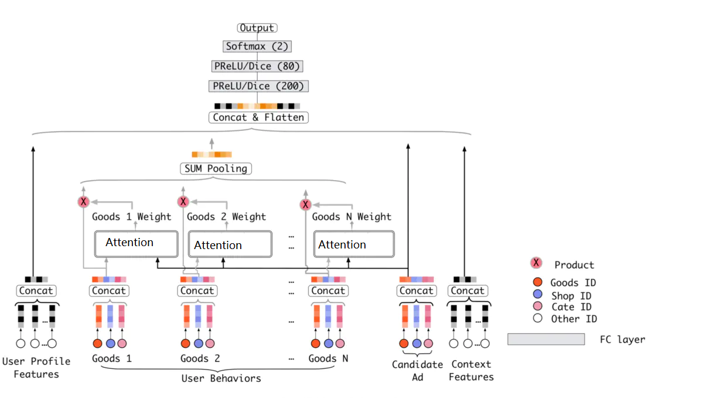

其中典型的Attention网络有：
- 点乘
$$
     f(V_i, V_{current})=V_i^TV_{current}
$$
- 双线性
$$
    f(V_i, V_{current}) = V_i^T W  V_{current}
$$
- 缩放点积
$$
    f(V_i, V_{current})=\frac{V_i^TV_{current}}{\sqrt{d}}
$$
- 加性模型
$$
    f(V_i, V_{current})=W_1^Ttanh(W_2 V_i+ W_3 V_3)
$$
- 也可以构建一个小的MLP输入是$[V_i, V_{current}]$，输出是$V_i$的系数大小。

### DIN
DIN本质上是Attention方法的一种，其中构建了一个Activation Unit来学习
$$
    f(V_i, V_{current})\rightarrow\alpha_i
$$
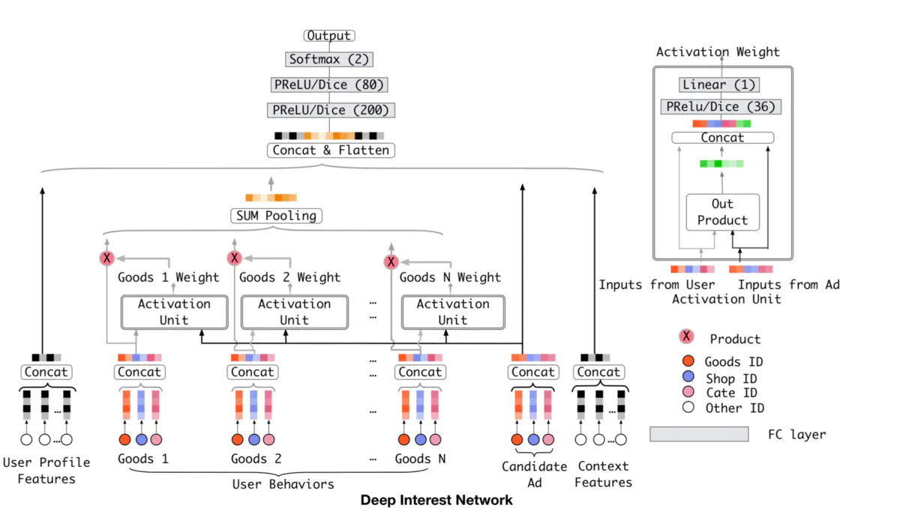
其中Activation Unit本质上就是一个小的神经网络。
* 首先是把$V_i, V_{current}$，以及$V_i, V_{current}$的element wise差值向量和乘积向量concat起来作为输入
* 然后fed给全连接层
* 最后得出权重

值得一提的是DIN论文中提出了一种新的激活函数Dice
#### Dice
首先PReLU是一种常用的激活函数，其定义如下
$$
f(s)=\left\{\begin{array}{ll}
s & \text { if } s>0 \\
\alpha s & \text { if } s \leq 0
\end{array}=p(s) \cdot s+(1-p(s)) \cdot \alpha s\right.
$$
其中, $p(s)$是PReLu的控制函数，定义如下：
$$
p(s)=\left\{\begin{array}{ll}
1 & \text { if } s>0 \\
0 & \text { if } s \leq 0
\end{array}\right.
$$
Dice认为上述控制函数没有考虑数据的特征，提出如下图所示控制函数
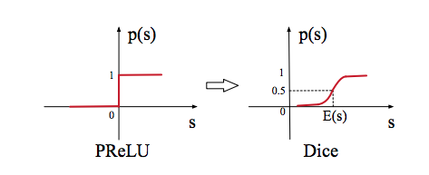
其中，$E(s)是s的均值$，$p(s)$的定义如下：
$$
p(s)=\frac{1}{1+e^{-\frac{s-E[s]}{\sqrt{\operatorname{Var}[s]+\epsilon}}}}
$$
其中$E[s],Var[s]$是一个batch内输入数据的均值的方长。

### DIEN
#### DIN的不足

利用用户行为序列特征，直接把用户历史行为当做兴趣

直接用行为表示兴趣可能存在问题。因为行为是序列化产生的，行为之间存在依赖关系，比如当前时刻的兴趣往往直接导致了下一行为的发生。

用户的兴趣是不断进化的，而DIN抽取的用户兴趣之间是独立无关联的，没有捕获到兴趣的动态进化性，比如用户对衣服的喜好，会随季节、时尚风潮以及个人品味的变化而变化，呈现一种连续的变迁趋势。

为了解决上述问题，阿里进一步提出了DIEN网络，结构如下图所示：
其中主要结构是Interest Extractor Layer和Interest Evolution Layer
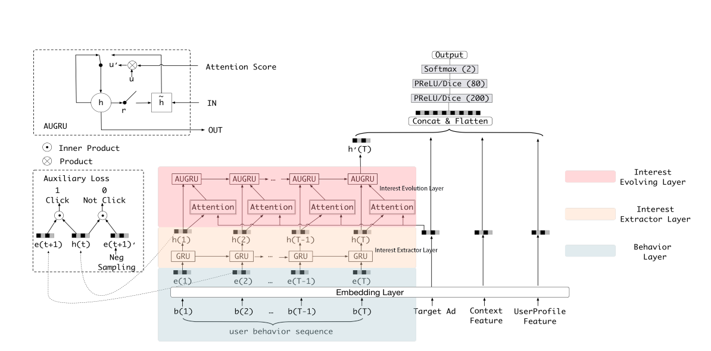

#### Interest Extractor Layer
兴趣抽取层Interest Extractor Layer的主要目标是从embedding数据中提取出interest。但一个用户在某一时间的interest不仅与当前的behavior有关，也与之前的behavior相关，所以作者们使用GRU单元来提取interest。GRU单元的表达式如下：
$$
\begin{aligned}
&\mathbf{u}_{t}=\sigma\left(W^{u} \mathbf{i}_{t}+U^{u} \mathbf{h}_{t-1}+\mathbf{b}^{u}\right) \\
&\mathbf{r}_{t}=\sigma\left(W^{r} \mathbf{i}_{t}+U^{r} \mathbf{h}_{t-1}+\mathbf{b}^{r}\right) \\
&\tilde{\mathbf{h}}_{t}=\tanh \left(W^{h} \mathbf{i}_{t}+\mathbf{r}_{t} \circ U^{h} \mathbf{h}_{t-1}+\mathbf{b}^{h}\right) \\
&\mathbf{h}_{t}=\left(\mathbf{1}-\mathbf{u}_{t}\right) \circ \mathbf{h}_{t-1}+\mathbf{u}_{t} \circ \tilde{\mathbf{h}}_{t}
\end{aligned}
$$
其中, $\mathbf{i}_{t}$表示GRU的输入，即历史第t个item的embedding 向量$\mathbf{e}(t)$， $\mathbf{h}_{t-1}$是GRU单元输入到下一步的隐状态，$\circ$表示按位乘, **这里我们可以认为$\mathbf{h}_{t}$是提取出的用户兴趣**.
为了训练好GRU和embedding layer，DIEN中引入了auxiliary loss如下图所示，包括：
- 当前item的embedding vector$\mathbf{e}(t+1)$ 和 GRU隐状态$\mathbf{h}_{h}$对应的正例
- 当前负采样item的embedding vector$\mathbf{e}(t+1)'$ 和 GRU隐状态$\mathbf{h}_{h}$对应的负例

aux loss形式为：
$$
\begin{aligned}
L_{a u x}=-& \frac{1}{N}\left(\sum_{i=1}^{N} \sum_{t} \log \sigma\left(\mathbf{h}_{t}, \mathbf{e}_{b}^{i}[t+1]\right)\right.\\
&\left.+\log \left(1-\sigma\left(\mathbf{h}_{t}, \hat{\mathbf{e}}_{b}^{i}[t+1]\right)\right)\right),
\end{aligned}
$$
其中$\mathbf{e}_{b}^{i}[t+1]$是当前item的embedding向量，$\hat{\mathbf{e}}_{b}^{i}[t+1]$是负采样的item的embedding向量。最终损失函数为$L=L_{target}+\alpha L_{aux}$ ，其中$\alpha$是平衡最终预测和兴趣表示的超参数。
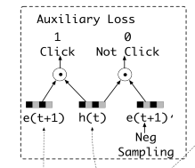

#### Interest Evolution Layer
兴趣进化层Interest Evolution Layer的主要目标是刻画用户兴趣的进化过程。举个简单的例子：

以用户对衣服的interest为例，随着季节和时尚风潮的不断变化，用户的interest也会不断变化。这种变化会直接影响用户的点击决策。建模用户兴趣的进化过程有两方面的好处：
- 追踪用户的interest可以使我们学习final interest的表达时包含更多的历史信息。
- 可以根据interest的变化趋势更好地进行CTR预测。

而interest在变化过程中遵循如下规律：
- interest drift：用户在某一段时间的interest会有一定的集中性。比如用户可能在一段时间内不断买书，在另一段时间内不断买衣服。
- interest individual：一种interest有自己的发展趋势，不同种类的interest之间很少相互影响，例如买书和买衣服的interest基本

DISN中提出了将Attention加入到GRU来实现刻画用户兴趣的进化过程。
即在GRU中加入了Attention score。
首先是当前兴趣$\mathbf{h}_{t}$对应的Attention score计算公式为：
$$
a_{t}=\frac{\exp \left(\mathbf{h}_{t} W \mathbf{e}_{a}\right)}{\sum_{j=1}^{T} \exp \left(\mathbf{h}_{j} W \mathbf{e}_{a}\right)}
$$
其中$\mathbf{e}_{a}$是当前要预测的item的embedding 向量。
但是如何将attention机制加到GRU中呢？文中提出了三个方法：
* 直接改变GRU的输入(AIGRU):
这种方式将attention直接作用于输入，无需修改GRU的结构：
$$
     \mathbf{i}'_{t}=\alpha_t \mathbf{h}_{t}
$$
* Attention based GRU(AGRU)
这种方式需要修改GRU的结构，此时hidden state的输出变为：
$$
\mathbf{h}'_{t}=\left(\mathbf{1}-\alpha_t\right) \circ \mathbf{h}'_{t-1}+\alpha_t \circ \tilde{\mathbf{h}}_{t}
$$
* GRU with attentional update gate (AUGRU)
这种方式需要修改GRU的结构，此时hidden state的输出变为:
$$
\begin{aligned}
&\tilde{\mathbf{u}}'_{t}=\alpha_t \mathbf{u}'_t \\
&\mathbf{h}'_{t}=\left(\mathbf{1}-\tilde{\mathbf{u}}'_{t}\right) \circ \mathbf{h}'_{t-1}+\tilde{\mathbf{u}}'_{t} \circ \tilde{\mathbf{h}}'_{t}
\end{aligned}
$$
如下图所示:
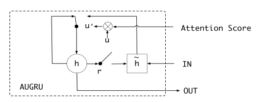

### DSIN
* 根据相关的介绍，虽然目前绝大多数的CTR都是从用户历史行为数据中建模他们动态、兴趣特征。 但是大多数都停留到behavior sequence的阶段便不再分析下去了。
* 虽然sessions和sequence性质上都是由多个behaviors组成。但是session是根据一定规则对sequence进行划分的结果。
所以可以看到，图中上下两个方框其实是一样的内容，但上面是k个session组成，而下面只有一个sequence。
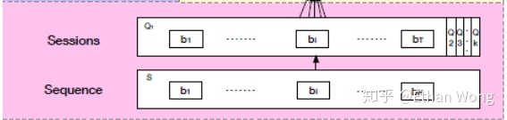
* session的划分规则
根据用户的点击时间：前一个session最后一个behavior到后一个session第一个behavior的时间差大于等于30min [Grbovic and Cheng, 2018]。
* 采用session而非单纯sequence的优势？
  * 首先要强调一下，不论是sessions之间还是sequences之间，在目前考虑的CTR问题中他们都是有顺序的，这样做的目的也很直接：方便对用户时序的兴趣变化进行建模。
  * 从sequence的角度我们可能会看到：
  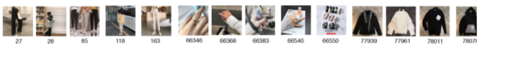
  * 但是如果从session的角度：
  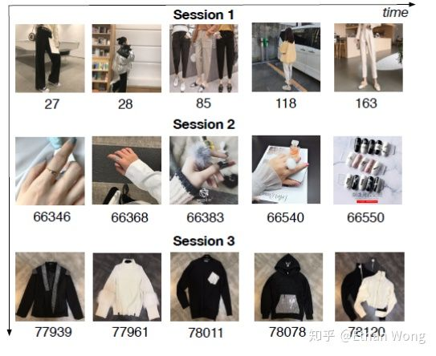
  * 从sequence的角度我们虽然能看到interest的变化过程，但是却忽视了这样两个事实： **1.同一个session内的行为高度同构 2. 不同sessions间的behavior异构**
  * 基于这样的观察，作者构造了DSIN来更好地利用session处理CTR prediction task

DSIN的框架如下图所示，它的核心Session Division Layer，Session Interest Extractor layer， Session Interest Interacting Layer， Session Interest Activating Layer。
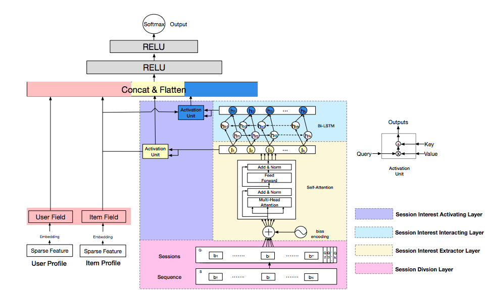

#### Session Division Layer
该层就是根据规则（间隔30分钟）将sequence S划分成sessions 第$k$个session：
$$
    \mathbf{Q}_k = \left[\mathbf{b}_1, \mathbf{b}_2, \cdots,\mathbf{b}_T \right]\in R^{T\times d}
$$
$T$是session内序列长度（固定长度），$d$是embedding size。因此，S被划分成了
$$
    \mathbf{Q}=[\mathbf{Q}_1, \mathbf{Q}_2, \cdots,\mathbf{Q}_K]
$$

#### Session Interest Extractor Layer
该层本质上是一个Transformer
##### 首先通过 bias encoding 在$\mathbf{Q}$中加入位置信息包括
  - 属于第几个Session: $1\sim K$
  - 属于Session中第几个Item$: 1\sim T$
  - 属于单个vector的第几位: $1\sim d$

Transfomer中原生的positional encoding方式为：
$$
\begin{gathered}
P E(p o s, 2 i)=\sin \left(\frac{\text { pos }}{10000^{2 i / d_{\text {model }}}}\right) \\
P E(\text { pos }, 2 i+1)=\cos \left(\frac{\text { pos }}{10000^{2 i / d_{\text {model }}}}\right)
\end{gathered}
$$
其中, $\text { pos }\in [1, T]$表示vetor在session中的位置，$i \in [1, d_{\text {model }}//2], 2i, 2i+1$分表表示在一个embedding vector中位置。
很明显，上式子没有加入当前属于第几个Session的信息。

bias encoder的方式是
$$
    \begin{split}
    &\mathbf{Q} = \mathbf{Q} + \mathbf{W^K}+\mathbf{W^T}+\mathbf{W^d}, \\
    &\mathbf{Q} \in R^{K\times T \times d}, \mathbf{W}^K\in R^{K\times 1\times 1},  \mathbf{W}_T\in R^{1\times T\times 1},  \mathbf{W}_d\in R^{1\times 1\times d}
     \end{split}
$$
这里，由于$\mathbf{Q}\text{同}\mathbf{W}^K,\mathbf{W^T},\mathbf{W^d}$形状不一样，在做加法时候会自动broadcast使之补齐。
##### 然后是通过Multi-head self Attention
第h个head的结果为:
$$
\begin{aligned}
\operatorname{head}_{h} &=\operatorname{Attention}\left(\mathbf{Q}_{k} \mathbf{W}^{Qh}, \mathbf{Q}_{k} \mathbf{W}^{Kh}, \mathbf{Q}_{k} \mathbf{W}^{Vh}\right) \\
&=\operatorname{softmax}\left(\frac{\mathbf{Q}_{k} \mathbf{W}^{Qh} \mathbf{W}^{Kh^T} \mathbf{Q}_{k}^{T}}{\sqrt{d_{model}}}\right) \mathbf{Q}_{k} \mathbf{W}^{Vh}
\end{aligned}
$$
然后，可以对上述结果增加residual connect 和 layer normalization 
$$
    \begin{split}
    head &= [head_1, head_2\cdots head_H] \\
    \mathbf{I} &= LayerNormalization(head + Q_kW^Q)
    \end{split}
$$
layer normalization 即对一个Layer中神经元输出做normalization, 它和BatchNormalization形式相似，不同之处是layer normalization指对当前样本下整个Layer做，而BatchNormalization是都一个神经元在一个Batch内做。
然后将结果输入前反馈网络
$$
    \mathbf{I}^Q_k = FNN(\mathbf{I}\mathbf{W}^O)\in R^{T\times d}
$$
其中，Attention网络中H*att_size=d。最后对结果在$T$这个维度上取平均值
$$
    \mathbf{I}_k = Avg(\mathbf{I}^Q_k )\in R^{d}
$$
$\mathbf{I}_k$就是用户的第$k$个session interest。

#### Session Interest Interacting Layer
该层使用双向LSTM建模session之间的演变。
$$
\begin{aligned}
\mathbf{i}_{t} &=\sigma\left(\mathbf{W}_{x i} \mathbf{I}_{t}+\mathbf{W}_{h i} \mathbf{h}_{t-1}+\mathbf{W}_{c i} \mathbf{c}_{t-1}+\mathbf{b}_{i}\right) \\
\mathbf{f}_{t} &=\sigma\left(\mathbf{W}_{x f} \mathbf{I}_{t}+\mathbf{W}_{h f} \mathbf{h}_{t-1}+\mathbf{W}_{c f} \mathbf{c}_{t-1}+\mathbf{b}_{f}\right) \\
\mathbf{c}_{t} &=\mathbf{f}_{t} \mathbf{c}_{t-1}+\mathbf{i}_{t} \tanh \left(\mathbf{W}_{x c} \mathbf{I}_{t}+\mathbf{W}_{h c} \mathbf{h}_{t-1}+\mathbf{b}_{c}\right) \\
\mathbf{o}_{t} &=\sigma\left(\mathbf{W}_{x o} \mathbf{I}_{t}+\mathbf{W}_{h o} \mathbf{h}_{t-1}+\mathbf{W}_{c o} \mathbf{c}_{t}+\mathbf{b}_{o}\right) \\
\mathbf{h}_{t} &=\mathbf{o}_{t} \tanh \left(\mathbf{c}_{t}\right)
\end{aligned}
$$
其中$\sigma(\cdot)$是logistic函数，$\mathbf{i},\mathbf{f},\mathbf{o},\mathbf{c}$分别是输入门、忘记门、输出们和Cell向量，他们都与$\mathbf{I}_t$有同样的形状。
在Bi-LSTM中，其中的hidden state为
$$
    \mathbf{H}_k = \mathbf{h}_{bk} \oplus  \mathbf{h}_{fk}
$$
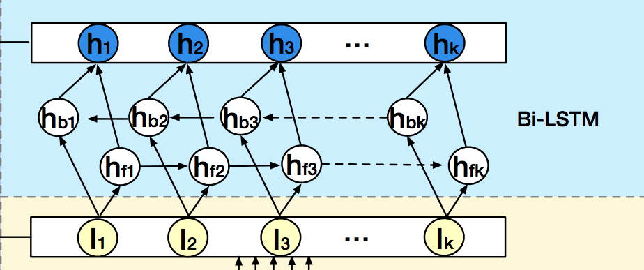

#### Session Interest Activating Layer
这里分别对$\mathbf{I}_k$和$\mathbf{H}_k$加权求和：
$$
\begin{aligned}
a_{k}^{I} &=\frac{\left.\exp \left(\mathbf{I}_{k} \mathbf{W}^{I} \mathbf{X}^{I}\right)\right)}{\sum_{k}^{K} \exp \left(\mathbf{I}_{k} \mathbf{W}^{I} \mathbf{X}^{I}\right)} \\
\mathbf{U}^{I} &=\sum_{k}^{K} a_{k}^{I} \mathbf{I}_{k}
\end{aligned}
$$
$$
\begin{aligned}
a_{k}^{H} &=\frac{\left.\exp \left(\mathbf{H}_{k} \mathbf{W}^{H} \mathbf{X}^{I}\right)\right)}{\sum_{k}^{K} \exp \left(\mathbf{H}_{k} \mathbf{W}^{H} \mathbf{X}^{I}\right)} \\
\mathbf{U}^{H} &=\sum_{k}^{K} a_{k}^{H} \mathbf{H}_{k}
\end{aligned}
$$
其中$\mathbf{X}^{I}$是当前item的embedding vector

最终将$\mathbf{U}^{I},\mathbf{U}^{H}$与其他特征（用户profile，item attributes）拼起来输入到DNN中。

### BST
BST 即用Transformer 把 history以及当前item放到一起学习，如下图所示
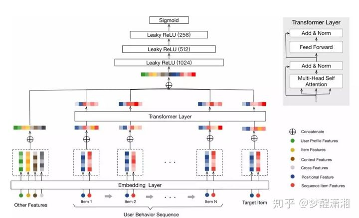

### SIM
通过对用户行为数据进行建模，证明了该方法对于CTR预估模型的有效性。典型地，基于attention的CTR模型，如DIN[20]和DIEN[19]设计了复杂的模型结构，并引入了attention机制，通过从用户行为序列中搜索有效的知识，利用不同候选项的输入来捕捉用户的不同兴趣。但在真实系统中，这些模型只能处理短期行为序列数据，其长度通常小于150。另一方面，长期的用户行为数据是有价值的，对用户的长期兴趣进行建模可以为用户带来更加多样化的推荐结果。似乎我们正处于两难境地：我们无法在现实世界的系统中用有效但复杂的方法处理有价值的终身（life-long）用户行为数据。

为了应对这一挑战，阿里妈妈提出了一种新的建模范式，即基于搜索的兴趣模型（Search-based Interest Model，SIM）。SIM采用两阶段搜索策略，能够有效地处理长用户行为序列。
- 通用搜索单元（GSU）：从life-long行为数据中粗略选出和当前item最相关的TopK
- 精确搜索单元（ESU）：使用DIN等网络进一步学习所选出的item对最终预测的影响。
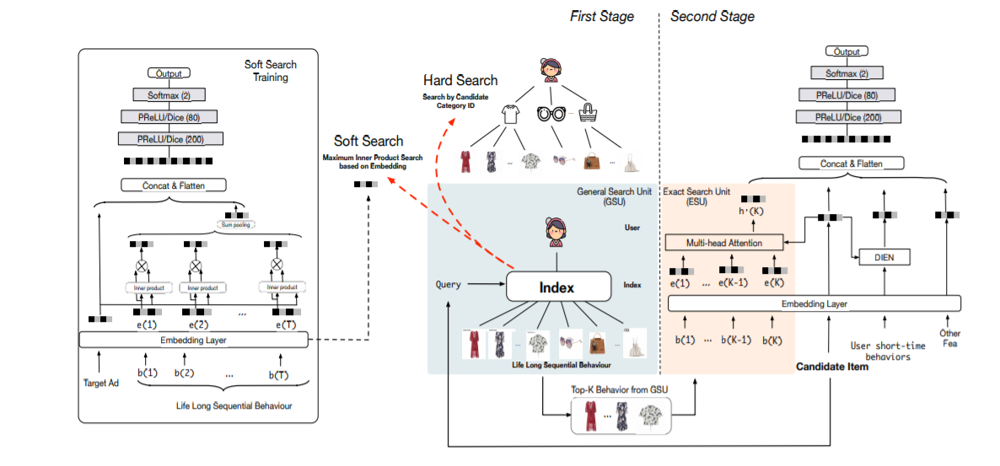

#### GSU
GSU是为了挑选与当前Top-K相关的历史item，文中提出了两种方法，包括：
$$
r_{i}= \begin{cases}\operatorname{Sign}\left(C_{i}=C_{a}\right) & \text { hard }-\operatorname{search} \\ \left(W_{b} \mathbf{e}_{i}\right) \odot\left(W_{a} \mathbf{e}_{a}\right)^{T} & \text { soft }-\operatorname{search}\end{cases}
$$
- 第一种是直接挑选出同当前item Category相同的历史items。这些Category需要人工预先分好类
- 第二种中$\mathbf{e}_{i}$和$\mathbf{e}_{a}$分别是需要计算的item和当前item的embedding，$W_{b}$和$W_a$是带学习的参数。

根据$r_i$选出top-k的item，并行multi-head attention学出关于当前item的加权特征表示。
**此外 shoft-time 的行为信息用DIEN、DIN等学习**

得到了long-time、shoft-time的特征表示后，加上其他特征，就可以使用DNN预测当前的点击率。

**需要注意的是，soft-search网络可以和ESU网络一起训练，他们共享embedding矩阵。可以把soft-search网络当成辅助网络，提高embedding的训练效率。**
$$
    Loss = \alpha Loss_{GSU} + \beta Loss_{ESU}
$$

