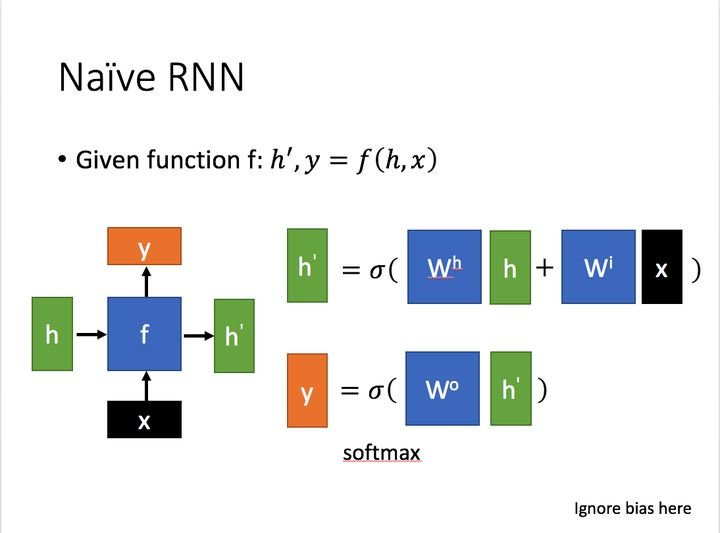
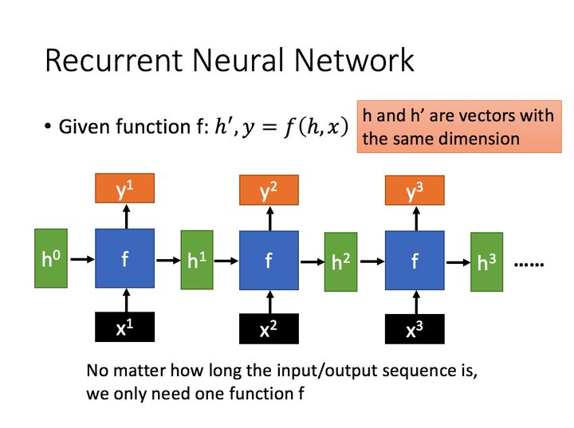
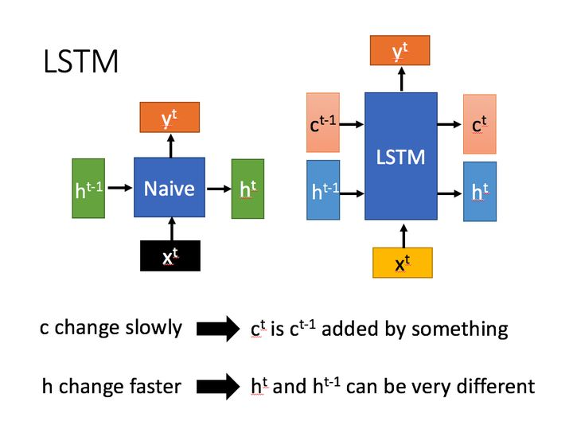
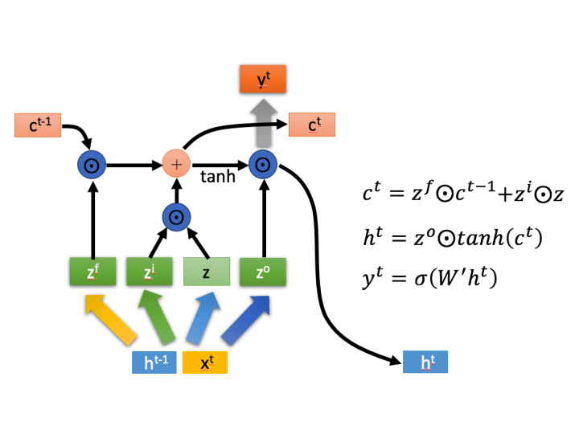
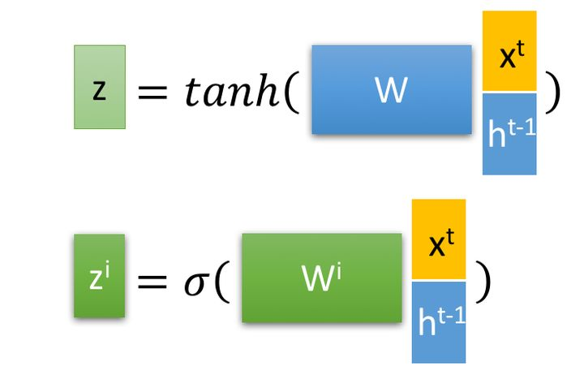
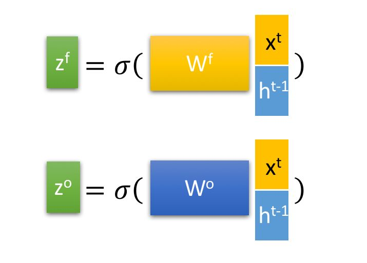
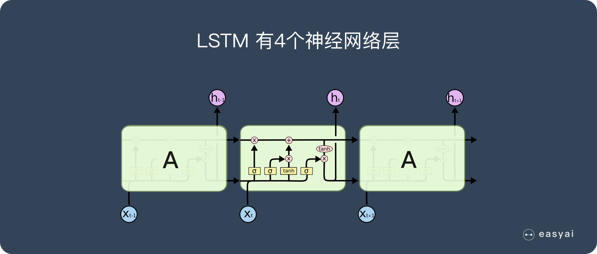
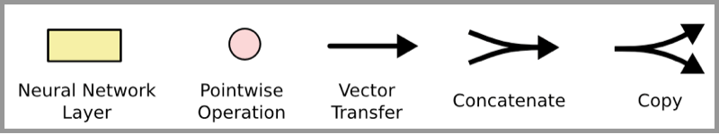
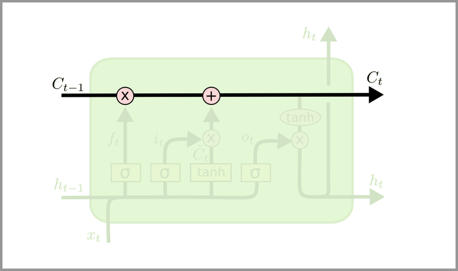
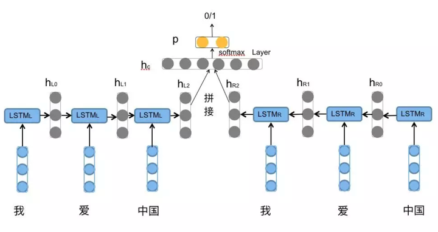

<head>
    
    
</head>

## LSTM

### RNN

x为当前状态下数据的输入，h表示接收到的上一个节点的输入。
y为当前节点状态下的输出，而h'为传递到下一个节点的输出。
通过上图的公式可以看到，输出 h' 与 x 和 h 的值都相关。
而 y 则常常使用 h' 投入到一个线性层（主要是进行维度映射）然后使用softmax进行分类得到需要的数据。
对这里的y如何通过 h' 计算得到往往看具体模型的使用方式。
通过序列形式的输入，我们能够得到如下形式的RNN。

### LSTM
长短期记忆（Long short-term memory, LSTM）是一种特殊的RNN，主要是为了解决长序列训练过程中的梯度消失和梯度爆炸问题。简单来说，就是相比普通的RNN，LSTM能够在更长的序列中有更好的表现。

相比RNN只有一个传递状态$h^t$，LSTM有两个传输状态，一个$c^t$cell state），和一个$h^t$（hidden state）。
其中对于传递下去的 $c^t$ 改变得很慢，通常输出的$c^t$是上一个状态传过来的$c^{t-1}$加上一些数值。

而$h^t$则在不同节点下往往会有很大的区别。

$\odot$是Hadamard Product，也就是操作矩阵中对应的元素相乘，因此要求两个相乘矩阵是同型的。
$\oplus$ 则代表进行矩阵加法。

LSTM内部主要有三个阶段：

1. 忘记阶段。这个阶段主要是对上一个节点传进来的输入进行选择性忘记。简单来说就是会 “忘记不重要的，记住重要的”。

具体来说是通过计算得到的 $z^f$ （f表示forget）来作为忘记门控，来控制上一个状态的 $c^{t-1}$ 哪些需要留哪些需要忘。

1. 选择记忆阶段。这个阶段将这个阶段的输入有选择性地进行“记忆”。主要是会对输入 $x^t$ 进行选择记忆。哪些重要则着重记录下来，哪些不重要，则少记一些。当前的输入内容由前面计算得到的 z 表示。而选择的门控信号则是由 $z^i$ （i代表information）来进行控制。

将上面两步得到的结果相加，即可得到传输给下一个状态的$c^t$。也就是上图中的第一个公式。
1. 输出阶段。这个阶段将决定哪些将会被当成当前状态的输出。主要是通过 $z^o$ 来进行控制的。并且还对上一阶段得到的$c^t$进行了放缩（通过一个tanh激活函数进行变化）。

与普通RNN类似，输出$y^t$往往最终也是通过$h^t$变化得到。

### LSTM的核心思路

LSTM 的关键是细胞状态，即图中上方的水平线。

细胞状态有点像传送带。它贯穿整个链条，只有一些次要的线性交互作用。信息很容易以不变的方式流过。

### LSTM如何来避免梯度弥散和梯度爆炸

“LSTM 能解决梯度消失/梯度爆炸”是对 LSTM 的经典误解。这里我先给出几个粗线条的结论，详细的回答以后有时间了再扩展：
1. 首先需要明确的是，RNN 中的梯度消失/梯度爆炸和普通的 MLP 或者深层 CNN 中梯度消失/梯度爆炸的含义不一样。MLP/CNN 中不同的层有不同的参数，各是各的梯度；而 RNN 中同样的权重在各个时间步共享，最终的梯度 g = 各个时间步的梯度 g_t 的和。
2. 由 1 中所述的原因，RNN 中总的梯度是不会消失的。即便梯度越传越弱，那也只是远距离的梯度消失，由于近距离的梯度不会消失，所有梯度之和便不会消失。RNN 所谓梯度消失的真正含义是，梯度被近距离梯度主导，导致模型难以学到远距离的依赖关系。
3. LSTM 中梯度的传播有很多条路径， $c_{t-1} \rightarrow c_{t}=f_{t} \odot c_{t-1}+i_{t} \odot \hat{c_{t}}$这条路径上只有逐元素相乘和相加的操作，梯度流最稳定；但是其他路径（例如$c_{t-1} \rightarrow h_{t-1} \rightarrow i_{t} \rightarrow c_{t}$）上梯度流与普通 RNN 类似，照样会发生相同的权重矩阵反复连乘。
4. LSTM 刚提出时没有遗忘门，或者说相当于$f_t=1$，这时候在$c_{t-1} \rightarrow c_{t}$直接相连的短路路径上，$dl/dc_t$可以无损地传递给$dl/dc_{t-1}$，从而这条路径上的梯度畅通无阻，不会消失。类似于 ResNet 中的残差连接。
5. 但是在其他路径上，LSTM 的梯度流和普通 RNN 没有太大区别，依然会爆炸或者消失。由于总的远距离梯度 = 各条路径的远距离梯度之和，即便其他远距离路径梯度消失了，只要保证有一条远距离路径（就是上面说的那条高速公路）梯度不消失，总的远距离梯度就不会消失（正常梯度 + 消失梯度 = 正常梯度）。因此 LSTM 通过改善一条路径上的梯度问题拯救了总体的远距离梯度。
6. 同样，因为总的远距离梯度 = 各条路径的远距离梯度之和，高速公路上梯度流比较稳定，但其他路径上梯度有可能爆炸，此时总的远距离梯度 = 正常梯度 + 爆炸梯度 = 爆炸梯度，因此 LSTM 仍然有可能发生梯度爆炸。不过，由于 LSTM 的其他路径非常崎岖，和普通 RNN 相比多经过了很多次激活函数（导数都小于 1），因此 LSTM 发生梯度爆炸的频率要低得多。实践中梯度爆炸一般通过梯度裁剪来解决。
7. 对于现在常用的带遗忘门的 LSTM 来说，6 中的分析依然成立，而 5 分为两种情况：其一是遗忘门接近 1（例如模型初始化时会把 forget bias 设置成较大的正数，让遗忘门饱和），这时候远距离梯度不消失；其二是遗忘门接近 0，但这时模型是故意阻断梯度流的，这不是 bug 而是 feature（例如情感分析任务中有一条样本 “A，但是 B”，模型读到“但是”后选择把遗忘门设置成 0，遗忘掉内容 A，这是合理的）。当然，常常也存在 f 介于 [0, 1] 之间的情况，在这种情况下只能说 LSTM 改善（而非解决）了梯度消失的状况。

### BILSTM

[参考文献](https://r2rt.com/written-memories-understanding-deriving-and-extending-the-lstm.html)

