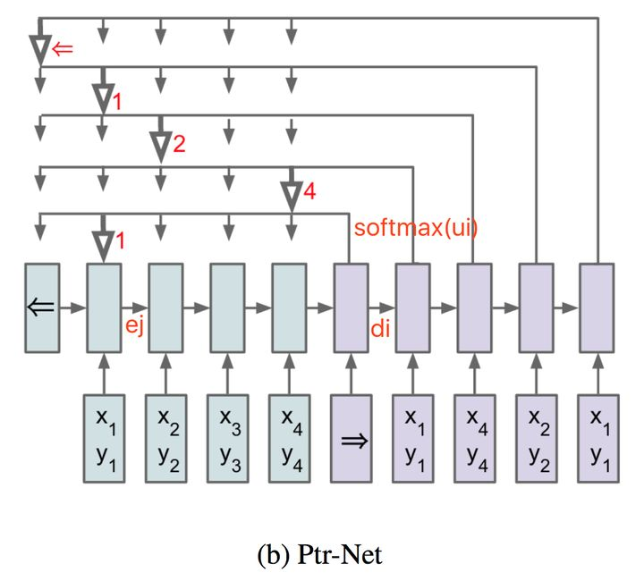

<head>
    
    
</head>

## Point net Work

Pointer network 主要用在解决组合优化类问题(TSP, Convex Hull等等)，实际上是Sequence to Sequence learning中encoder RNN和decoder RNN的扩展，主要解决的问题是输出的字典长度不固定问题（输出字典的长度等于输入序列的长度）。在传统的NLP问题中，采用Sequence to Sequence learning的方式去解决翻译问题，其输出向量的长度往往是字典的长度，而字典长度是事先已经订好了的（比如英语单词字典就定n=8000个单词）。而在组合优化类问题中，比如TSP问题，输入是城市的坐标序列，输出也是城市的坐标序列，而每次求解的TSP问题城市规模n是不固定的。每次decoder的输出实际上是每个城市这次可能被选择的概率向量，其维度为n，和encoder输入的序列向量长度一致。如何解决输出字典维度可变的问题？Pointer network的关键点在如下公式:
$$
\begin{gathered}
u_{j}^{i}=v^{T} \tanh \left(W_{1} e_{j}+W_{2} d_{i}\right) \quad j \in(1, \ldots, n) \\
p\left(C_{i} \mid C_{1}, \ldots, C_{i-1}, P\right)=\operatorname{softmax}\left(u^{i}\right)
\end{gathered}
$$
其中$e_j$是encoder的在时间序列j次的隐藏层输出，$d_i$是decoder在时间序列i次的隐藏状态输出，这里的$u^i=[u^i_1,u^i_2\cdots,u^i_n]$其维度为n维和输入保持一致，对$u^i$直接求softmax就可以得到输出字典的概率向量，其输出的向量维度和输入保持一致。其中$v^{T},W_{1},W_{2}$均为固定维度的参数，可被训练出来。
