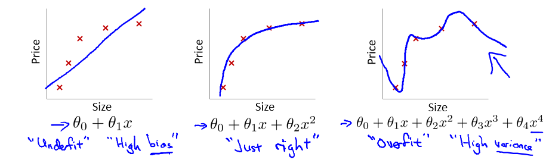
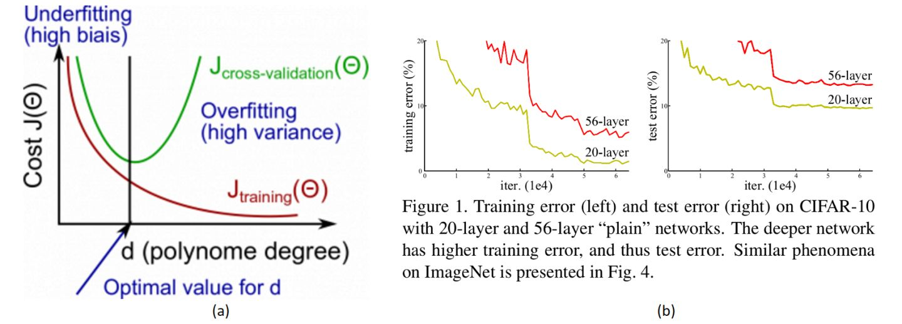
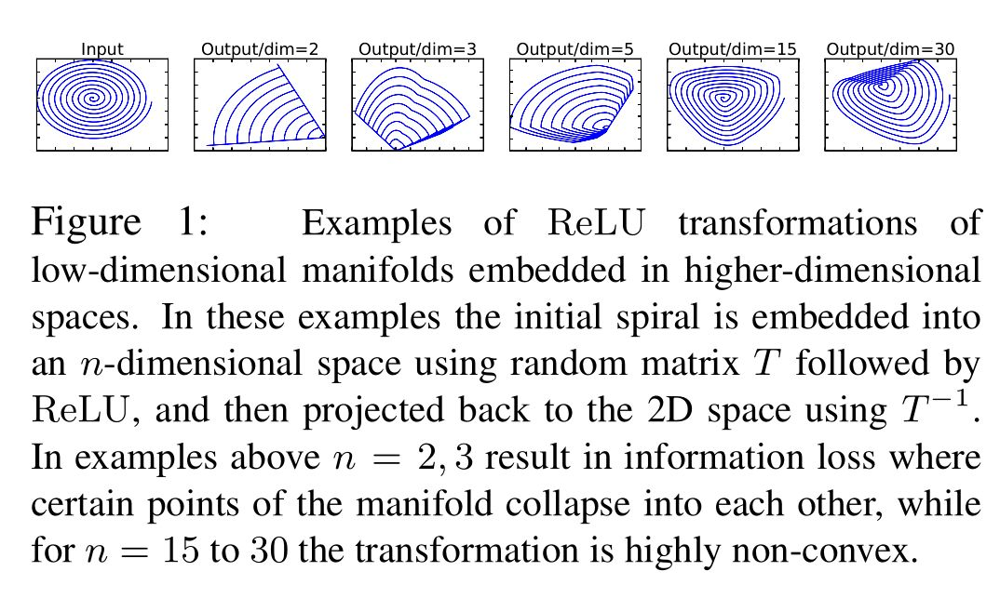

## Residual network

### 主要要解决的问题
#### 模型退化

模型退化与过拟合不同

在这个多项式回归问题中，左边的模型是欠拟合（under fit）的此时有很高的偏差（high bias），中间的拟合比较成功，而右边则是典型的过拟合（overfit），此时由于**模型过于复杂**，导致了高方差（high variance）。

然而，很明显当前CNN面临的效果退化不是因为过拟合，因为过拟合的现象是"高方差，低偏差"，即测试误差大而训练误差小。但实际上，深层CNN的训练误差和测试误差都很大。

##### 模型退化产生原因

理说，当我们堆叠一个模型时，理所当然的会认为效果会越堆越好。因为，假设一个比较浅的网络已经可以达到不错的效果，那么即使之后堆上去的网络什么也不做，模型的效果也不会变差。然而事实上，这却是问题所在。“什么都不做”恰好是当前神经网络最难做到的东西之一。MobileNet V2的论文[2]也提到过类似的现象，由于非线性激活函数Relu的存在，每次输入到输出的过程都几乎是不可逆的（信息损失）。我们很难从输出反推回完整的输入。

因此，可以认为Residual Learning的初衷，其实是让模型的内部结构至少有恒等映射的能力。以保证在堆叠网络的过程中，网络至少不会因为继续堆叠而产生退化！

#### 梯度爆炸/消失

除此之外，最受人认可的原因就是“梯度爆炸/消失（弥散）”了。

然而，有一些理论认为Bacth Normalization(简称BN)可以解决“梯度爆炸/消失(弥散)”的问题，而BN的作用本质上也是控制每层输入的模值。

### skip connect