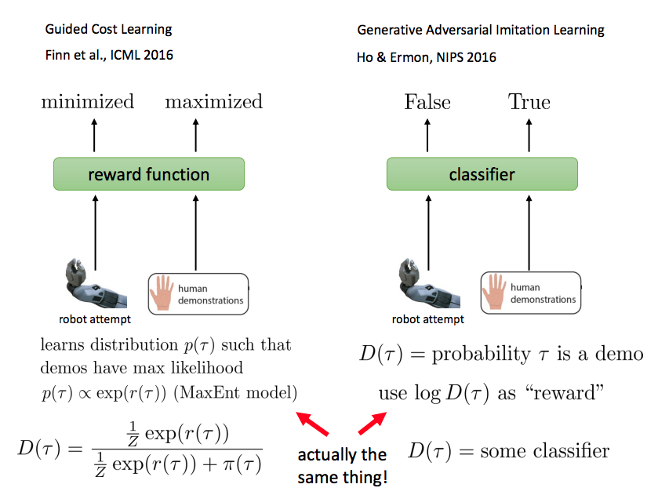
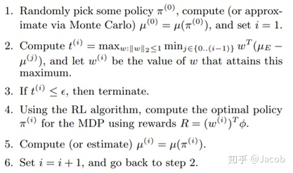
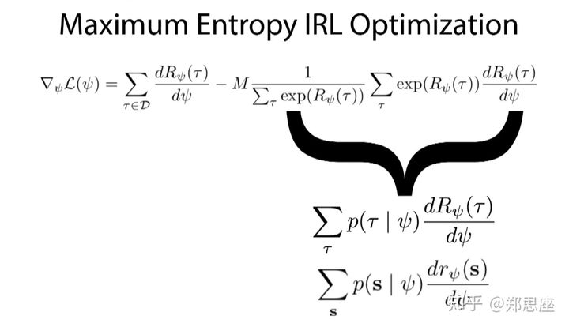
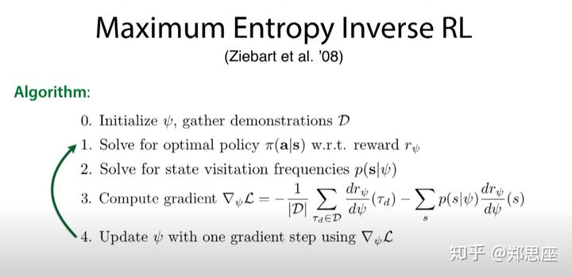

<head>
    <script src="https://cdn.mathjax.org/mathjax/latest/MathJax.js?config=TeX-AMS-MML_HTMLorMML" type="text/javascript"></script>
    <script type="text/x-mathjax-config">
    	MathJax.Hub.Config({tex2jax: {
             skipTags: ['script', 'noscript', 'style', 'textarea', 'pre'],
             inlineMath: [['$','$']],
             displayMath: [["\\(","\\)"],["\\[","\\]"]],
             processEscapes: true
           }
         });
    </script>
</head>

## 逆强化学习
### 定义

- 轨迹定义: $\tau=\{s_1,a_1,\cdots,s_t,a_t,\cdots\}$ 
- 专家轨迹: $D^e=\{\tau^e\}\sim\pi^e$ 
- state $s$的特征函数表示：$\phi({s})\in R^n$，n是特征函数个数 
- reward函数为: $r(s)=\psi(\phi({s}))\in R$ 
- 对于轨迹$\tau$的总回报为$R(\tau)=\sum_{t\in \tau}\gamma^{t-1}r(s_t)$ 

### 逆强化学习问题定义
逆强化学习的目标是找到reward函数为: $r(s)=\psi(\phi({s_t}))\in R$，使得专家轨迹的$R(\tau)=\sum_{t=1}\gamma^{t-1}r(s)$最优，即
$$
    \max_{\psi} E_{\tau \sim D^e}(\sum_{s_t \in \tau}\gamma^{t-1}r(s_t)) - E_{\pi}(\sum_{s_t \sim \pi}\gamma^{t-1}r(s_t)) \tag{1}
$$
其中,$\pi$是强化学习学到的策略。
下图是逆强化学习训练机器手臂的示意图：

**GAIL和逆强化学习本质是一样的**

### 求解
优化问题(1)要转化$\psi$的函数才能方便求解，即：
$$
    E_{\tau \sim D^e}(\sum_{s_t \in \tau}\gamma^{t-1}r(s_t)) - E_{\pi}(\sum_{s_t \sim \pi}\gamma^{t-1}r(s_t))\Rightarrow F(\psi)
$$
梯度为:
$$
    \frac{\partial F(\psi)}{\partial \psi} = E_{\tau \sim D^e}(\sum_{s_t \in \tau}\gamma^{t-1}\frac{\partial r(s_t)}{\partial \psi}) - E_{\pi}(\sum_{s_t \sim \pi}\gamma^{t-1}\frac{\partial r(s_t)}{\partial \psi})
$$
在$\gamma=1$的情况下
$$
    F(\psi)=\sum_{s_t} (\hat{\mu}^e(s_t) - \hat{\mu}_\pi (s_t))r(s_t)
$$
其中, $\hat{\mu}^e(s_t)$是状态$s_t$在专家轨迹上的平均出现次数, $\hat{\mu}_\pi$是是状态$s_t$在策略$\pi$上轨迹上的平均出现次数
$$
\frac{\partial F(\psi)}{\partial \psi} = \sum_{s_t} (\hat{\mu}^e(s_t) - \hat{\mu}_\pi (s_t))\frac{\partial r(s_t)}{\partial \psi} \tag{2}
$$
- 在有限状态空间中，该方法是自然有效的
  - $\hat{\mu}^e(s_t) > \hat{\mu}_\pi (s_t) \ge 0$, 梯度往$s_t$ reward 增大的方向
  - $0 \le \hat{\mu}^e(s_t) < \hat{\mu}_\pi (s_t)$,梯度往$s_t$ reward 减小的方向
- 在无限状态空间中，就要看$s_t\in D^e$和$s_t\sim \pi$是否是可分的。
  - $\hat{\mu}^e(s_t) > \hat{\mu}_\pi (s_t) \ge 0$, 梯度往$s_t$ reward 增大的方向
  - $0 \le \hat{\mu}^e(s_t) < \hat{\mu}_\pi (s_t)$,梯度往$s_t$ reward 减小的方向
  - 无限状态空间下$\hat{\mu}^e(s_t)$和$\hat{\mu}_\pi (s_t)$通常不同时$\gt0$，因此，当$s_t\in D^e$和$s_t\sim \pi$可分的时候，梯度更新是有意义的
  - 公式(2)实际和每个$s_t$单独更新差别不大

### 学徒学习
主要问题
```
* 学徒学习需要定义线性可加的特征函数，即轨迹特征可有状态特征相加得到
* 学徒学习假设Reward函数是特征函数的线性函数
```

定义Reward函数为：
$$
    r(s_t)=W^T\phi(s)
$$
因此有：
$$
    R(\tau) =\sum_{t\in \tau}\gamma^{t-1}r(s_t) = W^T \sum_{t\in \tau} \gamma^{t-1} \phi(s_t) 
$$
其中,$\sum_{t\in \tau} \gamma^{t-1} \phi(s_t)$是估计$\tau$的特征。
$$
     E_{\tau \sim D^e}(\sum_{s_t \in \tau}\gamma^{t-1}r(s_t)) = W^T E_{\tau \sim D^e}(\sum_{s_t \in \tau}\gamma^{t-1}\phi(s_t)) = W^T\hat{\mu}_E
$$
其中, $\hat{\mu}_{E}=\frac{1}{|D^e|}\sum_{\tau \in D^e} [\sum_{t=1}^{\infty}\gamma^{t-1} \phi({s_t^{\tau}})]$是专家轨迹的特征期望。

$$
    E_{\pi}(\sum_{s_t \sim \pi}\gamma^{t-1}r(s_t))=W^TE_{\pi}(\sum_{s_t \sim \pi}\gamma^{t-1}\phi(s_t)) = W^T \cdot \mu(\pi)
$$

其中，$\mu(\pi)=E_{\pi}(\sum_{s_t \sim \pi}\gamma^{t-1}\phi(s_t))$是策略$\pi$的特则期望。

**学徒学习的优化目标就是寻找一个$\tilde{\pi}$，使得特征期望在专家轨迹附近，并且专家轨迹的值函数比其他策略包括$\tilde{\pi}$要尽量大。**
问题可以进一步转化为：
$$
    \begin{split}
    \max\limits_{W}\min\limits_{j\in{\{0,1,\dots\}}}&W^T\cdot (\hat{\mu}_E-\mu(\pi^{(j)})) \\
    s.t. & ||W||_2 <=1
    \end{split}
$$
其中
- $\min$步骤是搜索已有策略中离专家轨迹最近的最近的策略，
- $\max$是调整优化值函数拉开专家轨迹与所求的策略的差距。

上述优化问题可以转化为如下形式：
$$
    \begin{split}
        \max\limits_{W}&\quad t \\
        s.t.\quad W^T\cdot \hat{\mu}_E>=  W^T\cdot\mu(\pi_j)+t&, j\in{\{0,1,\dots\}}\\
        ||W||_2 <=1&
    \end{split}
$$
即最大化专家Reward和策略Reward的距离。
其求解流程如下所示


### 最大熵逆强化学习
```
- 对于线性最大熵逆强化学，$r_{\psi}(s)$同学徒学习有一样的形式
- 对于深度逆强化学习，适用于有限状态空间
```

优化问题，即最大化专家轨迹上的概率
$$
\max\limits_{\psi} \sum_{\tau \in D^e} log p_{r_{\psi}}(\tau) \tag{3}
$$
其中，根据最大熵推导概率模型$p_{r_{\psi}}(\tau)$有如下形式：
$$
p_{\psi}(\tau)=\frac{1}{Z}exp(R_{\psi}(\tau))
$$

其中,

$$
\begin{split}
        R_{\psi}(\tau) &=\sum_j^n \lambda_j f_j(\tau) = \sum_j^n \lambda_j \sum_{s_i \in \tau}f_{j_{s_i}}=\sum_{s_i \in \tau}\sum_j^n \lambda_j f_{j_{s_i}}=\sum_{s_i \in \tau} r_{\psi}(s_i)\\
        Z&=\sum_{\tau} exp(R_{\psi}(\tau))
    \end{split}
$$

${\lambda_1,\cdots}$是函数$R_{\psi}(\tau)$的参数, $r_{\psi}(s_i)$是state $s_i$的reward。
式(3)关于$\psi$求梯度：
$$
  \frac{\partial \sum_{\tau \in D^e} log p_{r_{\psi}}(\tau)}{\partial \psi}=\sum_{\tau \in D^e} \frac{\partial R_{\psi}(\tau)}{\partial \psi}-M\frac{1}{\sum_{\tau} exp(R_{\psi}(\tau))} \sum_{\tau} exp(R_{\psi}(\tau)) \frac{\partial R_{\psi}(\tau)}{\partial \psi}
$$
其中，第一项是专家轨迹的梯度，减号后面的项是比较难优化的部分，其实它就是在该参数下轨迹出现的概率，也就是状态s被访问的概率。
可以这么理解，梯度的更新方向是让专家轨迹的Return变大，而学得策略轨迹的Return变小。



#### 梯度计算：
##### 线性Reward
- $\frac{\partial r_{\psi}}{\partial \psi}=\frac{\partial r_{\psi}}{\partial \lambda}=[f_i,\dots]\in R^n$
- $\triangledown_{\psi} L$ = $(E_D(f) - E_\pi (f))\cdot f$，即每个特征函数在专家轨迹和策略轨迹上平均值的差乘以它本身

##### 深度逆强化学习

Reward函数本质上是$f(s)\rightarrow r, f(s)\in R^n, r \in R$的函数映射，可以通过神经网络来学习该函数映射。即
$$
  r = g(\theta, f)
$$
梯度公式为：
$$\begin{aligned} \frac{\partial \mathcal{L}_{\mathcal{D}}}{\partial \theta} &=\frac{\partial \mathcal{L}_{\mathcal{D}}}{\partial r} \cdot \frac{\partial r}{\partial \theta} \\ &=\left(\mu_{\mathcal{D}}-\mathbb{E}[\mu]\right) \cdot \frac{\partial}{\partial \theta} g(f, \theta), \end{aligned}\tag{1}$$
$\mu_{\mathcal{D}}$和$\mathbb{E}[\mu]$分别是每个state在专家轨迹和策略轨迹上的平均值。
分析：
- $f(s)$表示状态$s$的特征，是预先设置，不需要训练
- 神经网络反向梯度更新是以($f(s), g(f,\theta)$）为单位
- 因此$\mu_{\mathcal{D}}$和$\mathbb{E}[\mu]$也需要以$f(s)$为单位，也就是说一个$f(s)$对应一个$\mu_{\mathcal{D}}-\mathbb{E}[\mu]$
- 因此$\mu_{\mathcal{D}}$和$\mathbb{E}[\mu]$统计的是表示每个state在专家轨迹和策略轨迹出现次数的平均值$[p_{s_1},p_{s_2}\cdots]$，适合有限状态空间
