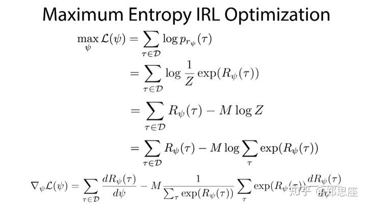
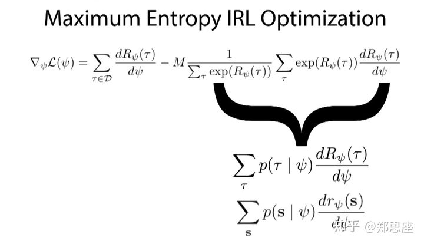

<head>
    <script src="https://cdn.mathjax.org/mathjax/latest/MathJax.js?config=TeX-AMS-MML_HTMLorMML" type="text/javascript"></script>
    <script type="text/x-mathjax-config">
    	MathJax.Hub.Config({tex2jax: {
             inlineMath: [['$','$']],
             displayMath: [["\\(","\\)"],["\\[","\\]"]],
             processEscapes: true
           }
         });
    </script>
</head>

## 最大熵逆强化学习（MaxEnt）

### 定义

- 轨迹定义: $\tau=\{s_1,a_1,\cdots,s_t,a_t,\cdots\}$
- 专家轨迹: $D=\{\tau\}\sim \pi^*$
- state $s_t$的特征函数表示：$f_{s_t}\in R^n$, n表示有n个特征函数
- 对于一条轨迹，它的特征函数表示为其轨迹上state的特征表示和：$f(\tau)=\sum f_{s_t}$
- 轨迹出现的概率: $P(\tau)$

### 问题定义

逆强化学习的一种训练策略就是使学习policy的特征函数均值和观察到的（专家的）policy特征函数均值匹配，即满足如下约束条件：

$$
\sum_{\tau \in \pi} P(\tau)f(\tau) =   \sum_{\tau \in D} P(\tau)f(\tau) = \tilde{f}
$$

$\pi$是学习到的policy，$D$是专家轨迹。除此，之外轨迹概率还需要满足归一化约束，即 $\sum_{\tau \in \pi} P(\tau) = 1$
最大熵就是在满足上述约束的前提下熵最大概率模型。问题定义如下：

$$
\max \limits_{P}  H(P)
$$

$$
s.t. \sum_{\tau \in \pi} P(\tau)f(\tau) = \tilde{f}, \sum_{\tau \in \pi} P(\tau) = 1 \tag{1}
$$

其中$H(p) = -\sum_{\tau \in \pi} P(\tau)logP(\tau)$
在概率论中，熵是不确定性的度量。不确定性越大，熵越大。比如，在区间固定时，所有的分布中均匀分布的熵最大。因为均匀分布在固定区间每一点取值的概率都相等，所以取哪个值的不确定性最大。

最大熵原理是指，在学习概率模型时，在所有满足约束的概率模型（分布）中，熵最大的模型是最好的模型。这是因为，通过熵最大所选取的模型，没有对未知（即除了约束已知外）做任何主观假设。也就是说，除了约束条件外，我们不知道任何其他信息。

### 求解

公式(1)可以取负号，改为求最小值。

$$
\min \limits_{P}  \sum_{\tau \in \pi} P(\tau)log P(\tau)
$$

$$
s.t. \sum_{\tau \in \pi} P(\tau)f(\tau) = \tilde{f}, \sum_{\tau \in \pi} P(\tau) = 1
$$

利用拉格朗日乘子法，该优化问题可转化为:

$$
\max \limits_{\lambda_0,\cdots} \min \limits_{p} L =  \sum_{\tau \in \pi} P(\tau)log P(\tau)-\sum_{j}^n \lambda_j( \sum_{\tau \in \pi} P(\tau)f_j(\tau) - \tilde{f_j}) - \lambda_0 {\sum_{\tau \in \pi} P(\tau) - 1}
$$

对概率$P(\tau)$求导,得：

$$
\frac{\partial L}{\partial P(\tau)} = \sum_{\tau \in \pi} (1+ log(P(\tau) - \sum_j^n \lambda_jf_j(\tau) - \lambda_0)
$$

在导数等于0的点，可得到满足最大熵的概率形式：

$$
P(\tau) = \frac{exp(\sum_j^n \lambda_j f_j(\tau))}{exp(1-\lambda_0)} = \frac{1}{Z}(exp(\sum_j^n \lambda_j f_j(\tau))) \tag{2}
$$

并且，归一化因子

$$
Z=exp(1-\lambda_0)=\sum_{\tau}  exp(\sum_j^n \lambda_j f_j(\tau)))
$$

将公式(2)带入到L中，并对${\lambda_1,\cdots}$求极大化等价于p构成的似然函数极大化（在专家样本上）

$$
\max\limits_{\lambda_1,\cdots} \sum_{\tau \in D} log P(\tau)
$$

${\lambda_1,\cdots}$也被成为reward weight，而$\sum_j^n \lambda_j f_j(\tau)$也可以看作路径$\tau$的Return, 公式(2)可以被进一步泛化为：

$$
p(\tau)=\frac{1}{Z}exp(R_{\psi}(\tau))
$$

其中,

$$
\begin{split}
        R_{\psi}(\tau) &=\sum_j^n \lambda_j f_j(\tau) = \sum_j^n \lambda_j \sum_{s_i \in \tau}f_{j_{s_i}}=\sum_{s_i \in \tau}\sum_j^n \lambda_j f_{j_{s_i}}=\sum_{s_i \in \tau} r_{\psi}(s_i)\\
        Z&=\sum_{\tau} exp(R_{\psi}(\tau))
    \end{split}
$$

${\lambda_1,\cdots}$是函数$R_{\psi}(\tau)$的参数, $r_{\psi}(s_i)$是state $s_i$的reward。
优化问题也变为如下形式:
$$
\max\limits_{\psi} \sum_{\tau \in D} log p_{r_{\psi}}(\tau)
$$
该优化问题是最大化专家轨迹在给定$p(\tau)$概率模型上的概率。展开式上式可得，
$$
\begin{split}
\sum_{\tau \in D} log p_{r_{\psi}}(\tau) &= \sum_{\tau \in D} \frac{1}{Z}exp(R_{\psi}(\tau)) \\
                                  &= \sum_{\tau \in D} R_{\psi}(\tau) - \sum_{\tau \in D} log Z \\
                                  & =\sum_{\tau \in D} R_{\psi}(\tau) - M log Z \\
                                  & =\sum_{\tau \in D} R_{\psi}(\tau) - M log \sum_{\tau} exp(R_{\psi}(\tau)) \\
\end{split}
$$
上式关于$\psi$求梯度：
$$
  \frac{\partial \sum_{\tau \in D} log p_{r_{\psi}}(\tau)}{\partial \psi}=\sum_{\tau \in D} \frac{\partial R_{\psi}(\tau)}{\partial \psi}-M\frac{1}{\sum_{\tau} exp(R_{\psi}(\tau))} \sum_{\tau} exp(R_{\psi}(\tau)) \frac{\partial R_{\psi}(\tau)}{\partial \psi}
$$
<!--  -->
其中，第一项是专家轨迹的梯度，减号后面的项是比较难优化的部分，其实它就是在该参数下轨迹出现的概率，也就是状态s被访问的概率。
可以这么理解，梯度的更新方向是让专家轨迹的Return变大，而学得策略轨迹的Return变小。




### 实际实现
其中`feature_expectations - feature_matrix.T.dot(expected_svf)`即为$\triangledown_{\psi} L$
- $\frac{\partial r_{\psi}}{\partial \psi}=\frac{\partial r_{\psi}}{\partial \lambda}=[f_i,\dots]\in R^n$
- $\triangledown_{\psi} L$ = $(E_D(f) - E_\pi (f))\cdot f$，即每个特征函数在专家轨迹和策略轨迹上平均值的差乘以它本身

可以这么理解梯度更新方向，
- 对于特征函数出次数专家轨迹大于策略轨迹的，让它的Reward变大
- 对于于特征函数出次数专家轨迹小于策略轨迹的，让它的Reward变小


```python
# state个数，state维度
# feature_matrix 每一行表示一个状态
n_states, d_states = feature_matrix.shape

# Initialise weights.
alpha = rn.uniform(size=(d_states,))

# Calculate the feature expectations \tilde{phi}(f).
# 求专家轨迹的平均特征表示
feature_expectations = find_feature_expectations(feature_matrix,
                                                  trajectories)

# Gradient descent on alpha.
for i in range(epochs):
    # print("i: {}".format(i))
    r = feature_matrix.dot(alpha)
    # 求策略轨迹的平均特征表示
    expected_svf = find_expected_svf(n_states, r, n_actions, discount,
                                      transition_probability, trajectories)
    grad = feature_expectations - feature_matrix.T.dot(expected_svf)

    alpha += learning_rate * grad


def find_svf(n_states, trajectories):
    """
    Find the state visitation frequency from trajectories.

    n_states: Number of states. int.
    trajectories: 3D array of state/action pairs. States are ints, actions
        are ints. NumPy array with shape (T, L, 2) where T is the number of
        trajectories and L is the trajectory length.
    -> State visitation frequencies vector with shape (N,).
    """

    svf = np.zeros(n_states)

    for trajectory in trajectories:
        for state, _, _ in trajectory:
            svf[state] += 1

    svf /= trajectories.shape[0]

    return svf

def find_feature_expectations(feature_matrix, trajectories):
    """
    Find the feature expectations for the given trajectories. This is the
    average path feature vector.

    feature_matrix: Matrix with the nth row representing the nth state. NumPy
        array with shape (N, D) where N is the number of states and D is the
        dimensionality of the state.
    trajectories: 3D array of state/action pairs. States are ints, actions
        are ints. NumPy array with shape (T, L, 2) where T is the number of
        trajectories and L is the trajectory length.
    -> Feature expectations vector with shape (D,).
    """

    feature_expectations = np.zeros(feature_matrix.shape[1])

    for trajectory in trajectories:
        for state, _, _ in trajectory:
            feature_expectations += feature_matrix[state]

    feature_expectations /= trajectories.shape[0]

    return feature_expectations

def find_expected_svf(n_states, r, n_actions, discount,
                      transition_probability, trajectories):
    """
    Find the expected state visitation frequencies using algorithm 1 from
    Ziebart et al. 2008.

    n_states: Number of states N. int.
    alpha: Reward. NumPy array with shape (N,).
    n_actions: Number of actions A. int.
    discount: Discount factor of the MDP. float.
    transition_probability: NumPy array mapping (state_i, action, state_k) to
        the probability of transitioning from state_i to state_k under action.
        Shape (N, A, N).
    trajectories: 3D array of state/action pairs. States are ints, actions
        are ints. NumPy array with shape (T, L, 2) where T is the number of
        trajectories and L is the trajectory length.
    -> Expected state visitation frequencies vector with shape (N,).
    """

    n_trajectories = trajectories.shape[0]
    trajectory_length = trajectories.shape[1]

    # policy = find_policy(n_states, r, n_actions, discount,
    #                                 transition_probability)
    policy = value_iteration.find_policy(n_states, n_actions,
                                         transition_probability, r, discount)

    start_state_count = np.zeros(n_states)
    for trajectory in trajectories:
        start_state_count[trajectory[0, 0]] += 1
    p_start_state = start_state_count/n_trajectories

    expected_svf = np.tile(p_start_state, (trajectory_length, 1)).T
    for t in range(1, trajectory_length):
        expected_svf[:, t] = 0
        for i, j, k in product(range(n_states), range(n_actions), range(n_states)):
            expected_svf[k, t] += (expected_svf[i, t-1] *
                                  policy[i, j] * # Stochastic policy
                                  transition_probability[i, j, k])

    return expected_svf.sum(axis=1)


```

