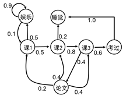

<head>
    
    
</head>

## 马尔可夫决策过程（Markov Decision Processes,MDPs）

MDPs 简单说就是一个智能体（Agent）采取行动（Action）从而改变自己的状态（State）获得奖励（Reward）与环境（Environment）发生交互的循环过程。

MDP 的策略完全取决于当前状态（Only present matters），这也是它马尔可夫性质的体现，即MDP的下一个状态只与当前状态有关。

马尔科夫过程示例图

### 基本概念
强化学习过程可以表示为$M=<S,A,P_{s,a},R,\lambda>$
* $S$表示Agent状态
* $A$表示Agent的动作
* $P_r(s'|s,a)$ 表示状态s下采取动作a转移到状态s'的概率
* $R(s,a)$ 表示状态s下采取动作获取到的奖励
* $\pi(s)\rightarrow a$ 表示策略$\pi$中，s状态下采取动作a的概率
* 回报$U(s_0,s_1,s_2,\cdots)$表示执行一组动作后奖励的累计值。但由于直接的 reward 相加在无限时间序列中会导致无偏向，而且会产生状态的无限循环。因此在这个 Utility 函数里引$\lambda$折扣率这一概念.

$$U(s_0,s_1,s_2,\cdots)=\sum_{t=0}^{\infty}\lambda^{t}R(s_t)$$

强化学习的目的是最大化长期未来奖励，即寻找最大的U。

### 值函数
当智能体采用策略$\pi$时，累积回报服从一个分布，累积回报在状态$s$处的期望值定义为状态-值函数

$$v_{\pi}(s)=E_{\pi}[\sum_{k=0}^{\infty}\lambda^{k}R_{t+k+1}|S_t=s]\tag{1}$$

相应的动作-行为值函数为:

$$q_{\pi}(s,a)=E_{\pi}[\sum_{k=0}^{\infty}\lambda^{k}R_{t+k+1}|S_t=s,A_t=a]\tag{2}$$

### 贝尔曼方程
公式(1)可以展开为：

$$
\begin{split}
v_{\pi}(S_t)&=E_{\pi}[\sum_{k=0}^{\infty}\lambda^{k}R_{t+k+1}|S_t=s] \\
         &=E_{\pi}[R_{t+1}+ \sum_{k=1}^{\infty}\lambda^{k}R_{t+k+1}|S_t=s] \\
         &=E_{\pi}[R_{t+1}+ \lambda v(S_{t+1})|S_t=s]
\end{split}
$$

同样我们可以得到状态-动作值函数的贝尔曼方程：

$$q_{\pi}(s,a)=E_{\pi}[R_{t+1}+\lambda q_{\pi}(S_{t+1},A_{t+1})|S_t=s,A_t=a]$$

### 动作值函数和状态值函数的关系

$$
v_{\pi}(s)=\sum_{a\in A}\pi(a|s)q_{\pi}(s,a)\tag{3}
$$

$$
q_{\pi}(s,a)=R_s^a+\lambda\sum_{s'}P_{ss'}^a v_{\pi}(s')\tag{4}
$$

联合公式(3)和g公式(4)我们可以进一步得到:

$$
v_{\pi}(s)=\sum_{a\in A}\pi(a|s)(R_s^a+\lambda\sum_{s'}P_{ss'}^a v_{\pi}(s'))
$$

$$
q_{\pi}(s,a)=R_s^a+\lambda\sum_{s'}P_{ss'}^a (\sum_{a'\in A}\pi(a'|s')q_{\pi}(s',a'))
$$
### 最优状态值函数
即所有策略$\pi$中值函数对应的最大值

$$v^*_{\pi}(s)=\max \limits_{\pi}v_{\pi}(s) $$

$$q^*_{\pi}(s,a)=\max \limits_{\pi}q_{\pi}(s,a) $$

在贪心策略下:

$$v^*_{\pi}(s)=\max \limits_{a}R_s^a+\lambda\sum_{s'}P_{ss'}^a v_{\pi}(s') $$

$$q^*_{\pi}(s,a)=R_s^a+\lambda\sum_{s'}P_{ss'}^a (\max \limits_{a'}q_{\pi}(s',a'))$$

