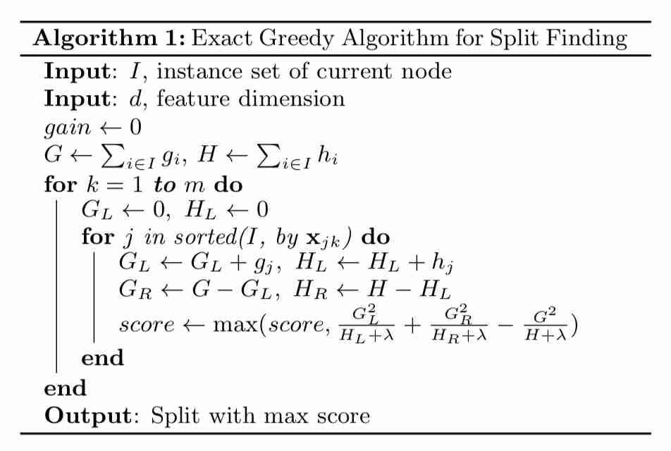
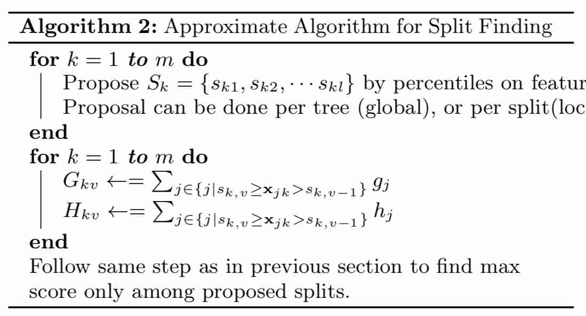
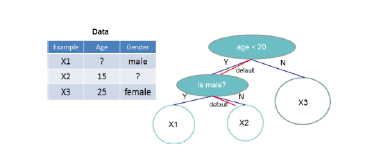
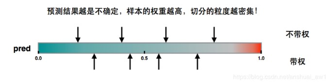
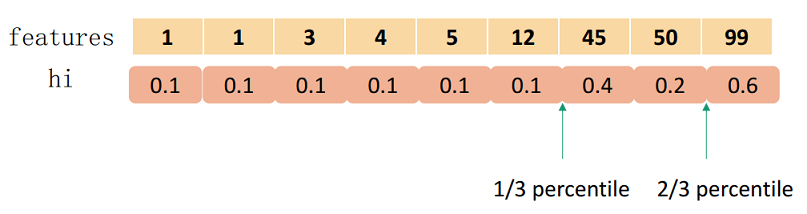

<head>
    
    
</head>

## XGBoost
XGBoost和[GBDT](./gbdt.md)类似，都是求解模型：
$$
    f_M(x)=\sum_{i=1}^M h_m(x)
$$
它与GBDT的主要不同之处在于：
- **XGBoost在求解子树的时候，对目标函数做了二阶泰勒展开**
- XGBoost目标函数显式的加入了正则项
- 在构造子树的时的目标即为最小化展开后的目标函数，而GBDT是用子树首先拟合目标函数梯度，然后求解最优的叶子节点值。

### XGBoost 的损失函数
首先，定义求解第m课子树的损失函数为：
$$
    L_m = \sum_{i=1}^n L(y_i, f_{m-1}(x) + h_m(x_i)) + \gamma J + \frac{\lambda}{2}\sum_{j=1}^J w_{jm}^2
$$
其中, $n$是样本个数, $h_m(x)$是要求解的子树, $J$是$h_m$叶子节点个数, $w_{jm}$是叶子节点的值。
其中$\gamma J + \frac{\lambda}{2}\sum_{j=1}^J w_{jm}^2$是正则项。
我们可以将损失函数的第一行进行二阶泰勒展开，即为：
$$
    L_m \approx \sum_{i=1}^{n}\left(L\left(y_{i}, f_{m-1}\left(x_{i}\right)\right)+\frac{\partial L\left(y_{i}, f_{m-1}\left(x_{i}\right)\right.}{\partial f_{m-1}\left(x_{i}\right)} h_{m}\left(x_{i}\right)+\frac{1}{2} \frac{\partial^{2} L\left(y_{i}, f_{m-1}\left(x_{i}\right)\right.}{\partial f_{m-1}^{2}\left(x_{i}\right)} h_{m}^{2}\left(x_{i}\right)\right)+\gamma J+\frac{\lambda}{2} \sum_{j=1}^{J} w_{m j}^{2}
$$
为了方便，我们把第i个样本在第m个弱学习器的一阶和二阶导数分别记为：
$$
    g_{mi} = \frac{\partial L\left(y_{i}, f_{m-1}\left(x_{i}\right)\right.}{\partial f_{m-1}\left(x_{i}\right)}, h_{mi}=\frac{\partial^{2} L\left(y_{i}, f_{m-1}\left(x_{i}\right)\right.}{\partial f_{m-1}^{2}\left(x_{i}\right)}
$$
则我们的损失函数现在可以表达为：
$$
L_m \approx \sum_{i=1}^{n}\left(L\left(y_{i}, f_{m-1}\left(x_{i}\right)\right) + g_{mi} h_m(x_i) + h_{mt}h_{m}^{2}(x_{i}) \right) +\gamma J+\frac{\lambda}{2} \sum_{j=1}^{J} w_{m j}^{2}
$$
损失函数里面$L\left(y_{i}, f_{m-1}\left(x_{i}\right)\right)$是常数，对最小化无影响，可以去掉，同时由于每个决策树的第$js$个叶子节点的取值最终会是同一个值$w_{mj}$,因此我们的损失函数可以继续化简。
$$
\begin{aligned}
L_{m} & \approx \sum_{i=1}^{n} \left( g_{m i} h_{m}\left(x_{i}\right)+\frac{1}{2} h_{m i} h_{m}^{2}\left(x_{i}\right)\right)+\gamma J+\frac{\lambda}{2} \sum_{j=1}^{J} w_{m j}^{2} \\
&=\sum_{j=1}^{J}\left(\sum_{x_{i} \in R_{m j}} g_{m i} w_{m j}+\frac{1}{2} \sum_{x_{i} \in R_{m j}} h_{m i} w_{m j}^{2}\right)+\gamma J+\frac{\lambda}{2} \sum_{j=1}^{J} w_{m j}^{2} \\
&=\sum_{j=1}^{J}\left[\left(\sum_{x_{i} \in R_{m j}} g_{m i}\right) w_{m j}+\frac{1}{2}\left(\sum_{x_{i} \in R_{m j}} h_{m i}+\lambda\right) w_{m j}^{2}\right]+\gamma J
\end{aligned}
$$
我们把每个叶子节点区域样本的一阶和二阶导数的和单独表示如下：
$$
    G_{mj}=\sum_{x_{i} \in R_{m j}} g_{m i}, H_{mj}=\sum_{x_{i} \in R_{m j}} h_{m i}
$$
最终损失函数的形式可以表示为：
$$
    L_m = \sum_{j=1}^{J} \left[G_{mj}w_{mj}+\frac{1}{2}\left(H_{mj}+\lambda\right)w_{mj}^2\right]+\gamma J \tag{1}
$$
XGBoost构建子树的目的就是最小化上述函数。

### 求解
最小化公式(1)需要：
- 构建一颗最优子树结构
- 优化该最优子树结构叶子节点的值

实际上，在构造子树的过程中，我们需要一个指标用来挑选分裂特征和分裂节点。这里，因为我们要最小化公式(1)，因此可以将公式(1)直接作为指标。然而，使用公式(1)作为指标的时候，我们需要先求解当前节点分裂后子节点对应的最优值$w_{mj}$，带入公式(1). **因此，我们首先要求解任意分裂节点的最优节点值。**

这个问题实际很简单，对于第一个问题，其实是比较简单的，我们直接基于损失函数对$w_{mj}$求导并令导数为0即可:
$$
    \frac{L_m}{w_{mj}}=G_{mj}+(H_{mj}+\lambda)w_{mj} = 0
$$
因此,对$w_{mj}$的最优解为：
$$
    w_{mj} = -\frac{G_{mj}}{H_{mj}+\lambda}
$$
**有了叶子节点的最优值，我们将进一步看如何挑选分裂特征和分裂点**
将最优$w_{mj}$带入到式(1)中，有：
$$
    L_m= -\frac{1}{2}\sum_{j=1}^{J}\frac{G_{mj}^2}{H_{mj}+\lambda}+\gamma J
$$
如果我们每次做左右子树分裂时，可以最大程度的减少损失函数的损失就最好了。也就是说，假设当前节点左右子树的一阶二阶导数和为$G_L,H_L,G_R,H_L$, 则我们期望最大化下式：
$$
-\frac{1}{2} \frac{\left(G_{L}+G_{R}\right)^{2}}{H_{L}+H_{R}+\lambda}+\gamma J-\left(-\frac{1}{2} \frac{G_{L}^{2}}{H_{L}+\lambda}-\frac{1}{2} \frac{G_{R}^{2}}{H_{R}+\lambda}+\gamma(J+1)\right)
$$
整理下上式后，我们期望最大化的是：
$$
\max \frac{1}{2} \frac{G_{L}^{2}}{H_{L}+\lambda}+\frac{1}{2} \frac{G_{R}^{2}}{H_{R}+\lambda}-\frac{1}{2} \frac{\left(G_{L}+G_{R}\right)^{2}}{H_{L}+H_{R}+\lambda}-\gamma
$$
因此XGBoost的挑选分裂特征和分裂点就是枚举待选特征和特征的分裂点以最大化上式。

### 分裂点的选取
#### 精确贪婪算法（Basic Exact Greedy Algorithm）
`排序后便利所有可能值`

#### 近似算法（Approximate Algorithm）

精确贪婪算法由于列举了所有可能的分裂点，在数据量很大不能全部写入内存时会导致不是那么高效。所以提出近似算法。对于每个特征，只考察分位点，减少计算复杂度。 近似算法存在两个变种：
- global: 学习每棵树前，提出候选分裂点
- local: 每次分裂前，重新提出候选分裂点

### Shrinkage and Column Subsampling
这一节讲到了两种防止过拟合的tricks，Shrinkage和Column Subsampling。

- Shrinkage：权值收缩，主要针对叶子节点，在每一次的Tree Boosting后，收缩叶子节点的权重，降低了每棵独立树的影响，为将来的优化留出一些空间。
- Column Subsampling：这种技术出现在RF中，这种做法不仅可以防止过拟合，还能提升一部分训练效率。
### 缺失值处理
XGBoost对缺失值会分配默认的分支，在选取分支时，会比较那条分支上效果会更好一些。在预测时，直接走在训练时学到的默认分支。

#### 加权分位数图（Weighted Quantile Sketch）
在创建第m棵树的时候已经知道数据集在前面 m−1棵树的偏差，所以采样的时候是须要考虑偏差，对于偏差大的特征值采样粒度要加大，偏差小的特征值采样粒度能够减少，也就是说采样的样本是须要权重的。那么Xgboost用样本点的二阶导数$h_{mi}$表示样本的权重。
**首先为什么选择二阶导数$h_{mi}$呢？**
$$
\begin{aligned}
L_{m} & \approx \sum_{i=1}^{n} \left( g_{m i} h_{m}\left(x_{i}\right)+\frac{1}{2} h_{m i} h_{m}^{2}\left(x_{i}\right)\right)+\gamma J+\frac{\lambda}{2} \sum_{j=1}^{J} w_{m j}^{2} \\
    & = \sum_{i=1}^{n} \frac{h_{mi}}{2}(h_m(x_i) - (-\frac{g_{mi}}{h_{mi}}))^2 -  \sum_{i=1}^{n} \frac{g_{mi}^2}{2h_{mi}}  +\gamma J+\frac{\lambda}{2} \sum_{j=1}^{J} w_{m j}^{2} \\
     & = \sum_{i=1}^{n} \frac{h_{mi}}{2}(h_m(x_i) - (-\frac{g_{mi}}{h_{mi}}))^2  +\gamma J+\frac{\lambda}{2} \sum_{j=1}^{J} w_{m j}^{2} + constant
\end{aligned}
$$
所以能够将该目标仍是看做是关于标签为$-\frac{g_{mi}}{h_{mi}}$和权重为$h_{mi}$​的平方偏差形式。$h_{mi}$为样本的二阶导数。因此，Xgboost用样本点的二阶导数$h_{mi}$表示样本的权重。
**那么如何用二阶导数$h_{mi}$来生成切分点呢？**
**对于带权重的切分方式，目标是权重大的特征点附近切分点密集，而权重小的附近切分点稀疏，如下图所示**

对于数据集：
$$
\mathcal{D}_{k}=\left\{\left(x_{1 k}, h_{1}\right),\left(x_{2 k}, h_{2}\right) \cdots\left(x_{n k}, h_{n}\right)\right\}
$$
定义个排序函数：
$$
r_{k}(z)=\frac{1}{\sum_{(x, h) \in \mathcal{D}_{k}} h} \sum_{(x, h) \in \mathcal{D}_{k}, x<z} h
$$
**表示特征的值小于$z$得样本以$h_{mi}$的权重所占比例**。
在这个排序函数下，咱们找到一组点$\{s_{k1},s_{k2},\cdots,s_{kl}\}$, 满足：
$$
    |r_{z}(s_{kj}) - r_{z}(s_{kj+1})| \lt \epsilon, \quad s_{k1}=\min_{i} x_{ik}, s_{kl} = \max_{i} x_{ik}
$$
按照该方法得到的分裂点有如下性质：
- 一共可选出$\frac{1}{\epsilon}$个候选点
- 在二阶导$h_{mi}$较大的特征值附近，由于样本占权重较大，因此分裂点会更为密集点，相反$h_{mi}$较小的区域，则会少一些，如下图所示：

然而大规模数据集，分位点算法需要对**全量数据排序，这个对内存和时间的消耗很大**。解决该问题，对于不带权重的分位点生成算法有[$\phi-quantiles$算法](http://www.mathcs.emory.edu/~cheung/Courses/584/Syllabus/08-Quantile/Greenwald.html)。**而对于带权重的分位点生成算法，Xgboost提出了Weighted Quantile Sketch算法**。详细可以看Xgboost论文的附录。

### 系统设计
#### Column Block for Parallel Learning
即按列分块并行化学习，XGBoost会对每个特征的值进行排序，使用CSC结构存储到块（block）中，训练过程对特征分枝点计算采用并行处理，寻找合适的分裂点。所以我们常说的XGBoost的并行计算指的是不是树的学习上，而是在特征上的并行处理。

所以，这里XGBoost在设计系统的时候，预留额外的空间（Block）来储存排序好的数据，这里的排序，是按照每列的值排序，所以索引在不同特征之间是不一样的。

所以，特征预排序只需要在开始的时候做一次即可，后续可以重复调用，大大减少了每次排序的耗时，所以也可以实现并行化学习，计算每个特征的信息增益。

#### Cache-aware Access
即缓存感知访问，对于有大量数据或者说分布式系统来说，我们不可能将所有的数据都放进内存里面。因此我们都需要将其放在外存上或者分布式存储。但是这有一个问题，这样做每次都要从外存上读取数据到内存，这将会是十分耗时的操作。

因此我们使用预读取（prefetching）将下一块将要读取的数据预先放进内存里面。其实就是多开一个线程，该线程与训练的线程独立并负责数据读取。此外，还要考虑Block的大小问题。如果我们设置最大的block来存储所有样本在k特征上的值和梯度的话，cache未必能一次性处理如此多的梯度做统计。如果我们设置过少block size，这样不能充分利用的多线程的优势，也就是训练线程已经训练完数据，但是prefetching thread还没把数据放入内存或者cache中。

经过测试，作者发现block size设置为2^16个examples最好。

#### Blocks for Out-of-core Computation
因为XGBoost是要设计一个高效使用资源的系统，所以各种机器资源都要用上，除了CPU和内存之外，磁盘空间也可以利用来处理数据。为了实现这个功能，我们可以将数据分成多个块并将每个块储存在磁盘上。

在计算过程中，使用独立的线程将Block预提取到主内存缓冲区，这样子数据计算和磁盘读取可以同步进行，但由于IO非常耗时，所以还有2种技术来改善这种核外计算：

Block Compression： 块压缩，并当加载到主内存时由独立线程动态解压缩；
Block Sharding： 块分片，即将数据分片到多个磁盘，为每个磁盘分配一个线程，将数据提取到内存缓冲区，然后每次训练线程的时候交替地从每个缓冲区读取数据，有助于在多个磁盘可用时，增加读取的吞吐量。

### XGBoost 和 GBDT的区别
- 基分类器的选择： 传统GBDT以CART作为基分类器，XGBoost还支持线性分类器，这个时候XGBoost相当于带L1和L2正则化项的逻辑斯蒂回归（分类问题）或者线性回归（回归问题）。
- 梯度信息： 传统GBDT只引入了一阶导数信息，Xgboost引入了一阶导数和二阶导数信息，其对目标函数引入了二阶近似，求得解析解, 用解析解作为Gain来建立决策树, 使得目标函数最优（Gain求到的是解析解）。另外，XGBoost工具支持自定义损失函数，只要函数可一阶和二阶求导。
- 正则项： Xgboost引入了正则项部分，这是传统GBDT中没有的。加入正则项可以控制模型的复杂度，防止过拟合。
- 特征采样： Xgboost引入了特征子采样，像随机森林那样，既可以降低过拟合，也可以减少计算。
- 节点分裂方式：GBDT是用的基尼系数，XGBoost是经过优化推导后的。
- 并行化： 传统GBDT由于树之间的强依赖关系是无法实现并行处理的，但是Xgboost支持并行处理，XGBoost的并行不是在模型上的并行，而是在特征上的并行，将特征列排序后以block的形式存储在内存中，在后面的迭代中重复使用这个结构。这个block也使得并行化成为了可能，其次在进行节点分裂时，计算每个特征的增益，最终选择增益最大的那个特征去做分割，那么各个特征的增益计算就可以开多线程进行。
- 除此之外，Xgboost实现了分裂点寻找近似算法、缺失值处理、列抽样（降低过拟合，还能减少计算）等包括一些工程上的优化，LightGBM是Xgboost的更高效实现。
