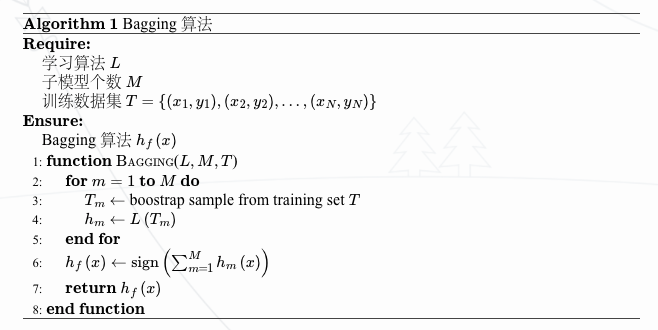

<head>
    
    
</head>

## Ensemble Learning

成学习就是组合这里的多个弱监督模型以期得到一个更好更全面的强监督模型，集成学习潜在的思想是即便某一个弱分类器得到了错误的预测，其他的弱分类器也可以将错误纠正回来。集成学习可以分为 Bagging，Boosting和Stacking三种。

### Bagging
Bagging是bootstrap aggregating的简写。
它是一种有放回的抽样方法，的为了得到统计量的分布以及置信区间，具体步骤如下：
- 采用重抽样方法（有放回抽样）从原始样本中抽取一定数量的样本
- 根据抽出的样本计算想要得到的统计量T
- 重复上述N次（一般大于1000），得到N个统计量T
- 根据这N个统计量，即可计算出统计量的置信区间

在Bagging方法中，利用bootstrap方法从整体数据集中采取有放回抽样得到N个数据集，在每个数据集上学习出一个模型，最后的预测结果利用M个模型的输出得到，具体地：
- 每次采用有放回的抽样从训练集中取出N个训练样本组成新的训练集。
- 利用新的训练集，训练得到M个子模型。
- 对于分类问题，采用投票的方法，得票最多子模型的分类类别为最终的类别；对于回归问题，采用简单的平均方法得到预测值。

具体算法如下图所示：

假设对于一个包含N个样本的数据集T，利用自助采样，则一个样本始终不被采用的概率是$(1-\frac{1}{N})^N$，取极限有：
$$
    \lim_{N\rightarrow \infty} (1-\frac{1}{N})^N = \frac{1}{e} \approx 36.8\%
$$
即每个学习器仅用到了训练集中的数据集63.2\%，剩余的36.8\%的训练集样本可以用作验证集对于学习器的泛化能力进行包外估计 (out-of-bag estimate)。典型的Bagging算法是[随机森林](./rf.md)。

### Boosting

Boosting 是一种提升算法，可以将弱的学习算法提升 (boost) 为强的学习算法。基本思路如下：

- 利用初始训练样本集训练得到一个基学习器。
- **提高被基学习器误分的样本的权重，使得那些被错误分类的样本在下一轮训练中可以得到更大的关注，利用调整后的样本训练得到下一个基学习器。**
- 重复上述步骤，直至得到$M$个学习器。
- 对于分类问题，采用有权重的投票方式；对于回归问题，采用加权平均得到预测值。

典型的Boost算法是Adaboost。原始的 Adaboost 算法用于解决二分类问题，因此对于一个训练集
$$
    T = \{(x_1, y_1),(x_2, y_2)\cdots,(x_N, y_N)\}
$$
其中$x\in R^d,y\in \{-1,+1\}$，首先初始化训练集的权重
$$
\begin{aligned}
D_{1} &=\left(w_{11}, w_{12}, \ldots, w_{1 N}\right) \\
w_{1 i} &=\frac{1}{N}, i=1,2, \ldots, N
\end{aligned}
$$
根据每一轮训练集的权重$D_m$，对训练集数据进行抽样得到$T_m$，再根据$T_m$训练得到每一轮的基学习器$h_m$。通过计算可以得出基学习器$h_m$的误差为$\epsilon_m$，根据基学习器的误差计算得出该基学习器在最终学习器中的权重系数
$$
    \alpha_m = \frac{1}{2} ln \frac{1-\epsilon_m}{\epsilon_m}
$$
更新训练集的权重
$$
\begin{aligned}
D_{m+1} &=\left(w_{m+1,1}, w_{m+1,2}, \ldots, w_{m+1, N}\right) \\
w_{m+1, i} &=\frac{w_{m, i}}{Z_{m}} \exp \left(-\alpha_{m} y_{i} h_{m}\left(x_{i}\right)\right)
\end{aligned}
$$
其中$Z_m$为规范化因子
$$
Z_{m}=\sum_{i=1}^{N} w_{m, i} \exp \left(-\alpha_{m} y_{i} h_{m}\left(x_{i}\right)\right)
$$
从而保证$D_{m+1}$为一个概率分布。最终根据构建的$M$个基学习器得到最终的学习器：
$$
    h_f(x) = sign(\sum_{m=1}^M \alpha_m h_m(x))
$$
除此之外, GBDT，XGBoost, LightGBM, CatBoost也都是典型的Boost算法

### Stacking
Stacking方法又称为 Stacked Generalization，是一种基于分层模型组合的集成算法。Stacking 算法的基本思想如下：
- 利用初级学习算法对原始数据集进行学习，同时生成一个新的数据集。
- 根据从初级学习算法生成的新数据集，利用次级学习算法学习并得到最终的输出。

对于初级学习器，可以是相同类型也可以是不同类型的。在新的数据集中，初级学习器的输出被用作次级学习器的输入特征，初始样本的标记仍被用作次级学习器学习样本的标记。Stacking 算法的流程如下图所示：

### Bagging与Boosting对比
Bagging和Boosting采用的都是采样-学习-组合的方式，但在细节上有一些不同，如
- Bagging中每个训练集互不相关，也就是每个基分类器互不相关，而Boosting中训练集要在上一轮的结果上进行调整，也使得其不能并行计算
- Bagging中预测函数是均匀平等的，但在Boosting中预测函数是加权的

在算法学习的时候，通常在bias和variance之间要有一个权衡。bias与variance的关系如下图，因而模型要想达到最优的效果，必须要兼顾bias和variance，也就是要采取策略使得两者比较平衡。
- Bagging 算法主要降低的是方差
- Boosting 算法降低的主要是偏差