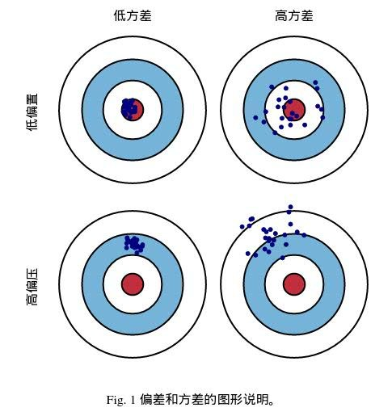
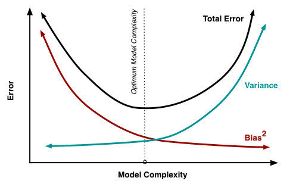

<head>
    
    
</head>

## 泛化误差、偏差、方差

在机器学习中，我们用训练数据集去训练一个模型，通常的做法是定义一个误差函数，通过将这个误差的最小化过程，来提高模型的性能。然而我们学习一个模型的目的是为了解决训练数据集这个领域中的一般化问题，单纯地将训练数据集的损失最小化，并不能保证在解决更一般的问题时模型仍然是最优，甚至不能保证模型是可用的。这个训练数据集的损失与一般化的数据集的损失之间的差异就叫做泛化误差（generalization error）。

而泛化误差可以分解为**偏差（Bias）、方差（Variance）和噪声（Noise）。**

### 概念

如果我们能够获得所有可能的数据集合，并在这个数据集合上将损失最小化，那么学习得到的模型就可以称之为“真实模型”。当然，在现实生活中我们不可能获取并训练所有可能的数据，所以“真实模型”肯定存在，但是无法获得。我们的最终目的是学习一个模型使其更加接近这个真实模型。

- Bias和Variance分别从两个方面来描述我们学习到的模型与真实模型之间的差距。
- Bias是用所有可能的训练数据集训练出的所有模型的输出的平均值与真实模型的输出值之间的差异。**偏差度量的是学习算法预测误差和真实误差的偏离程度，即刻画学习算法本身的学习能力**
- Variance是不同的训练数据集训练出的模型输出值之间的差异。**即刻画数据扰动所造成的影响。**
- 噪声的存在是学习算法所无法解决的问题，数据的质量决定了学习的上限。假设在数据已经给定的情况下，此时上限已定，我们要做的就是尽可能的接近这个上限。**噪声刻画了学习问题本身的难度**

### 符号定义

- $x$：测试样本集
- $D$：训练数据集
- $y_D$：测试数据集$x$的标记
- $y$：测试数据集$x$的真实标记
- $f$：由训练集$D$学习到的模型
- $f(x,D)$：模型$f$对$x$的预测输出
- $\bar{f}(x)$：模型$f$对$x$预测输出的均值，即期望预测输出

### 推导
我们以回归任务为例，学习算法的平方差泛化误差损失：
$$
\begin{aligned}
E(f ; D)=& \mathbb{E}_{D}\left[\left(f(\boldsymbol{x} ; D)-y_{D}\right)^{2}\right] \\
=& \mathbb{E}_{D}\left[\left(f(\boldsymbol{x} ; D)-\bar{f}(\boldsymbol{x})+\bar{f}(\boldsymbol{x})-y_{D}\right)^{2}\right] \\
=& \mathbb{E}_{D}\left[(f(\boldsymbol{x} ; D)-\bar{f}(\boldsymbol{x}))^{2}\right]+\mathbb{E}_{D}\left[\left(\bar{f}(\boldsymbol{x})-y_{D}\right)^{2}\right] \\
&+\mathbb{E}_{D}\left[2(f(\boldsymbol{x} ; D)-\bar{f}(\boldsymbol{x}))\left(\bar{f}(\boldsymbol{x})-y_{D}\right)\right] \\
=& \mathbb{E}_{D}\left[(f(\boldsymbol{x} ; D)-\bar{f}(\boldsymbol{x}))^{2}\right]+\mathbb{E}_{D}\left[\left(\bar{f}(\boldsymbol{x})-y_{D}\right)^{2}\right] \\
=& \mathbb{E}_{D}\left[(f(\boldsymbol{x} ; D)-\bar{f}(\boldsymbol{x}))^{2}\right]+\mathbb{E}_{D}\left[\left(\bar{f}(\boldsymbol{x})-y+y-y_{D}\right)^{2}\right] \\
=& \mathbb{E}_{D}\left[(f(\boldsymbol{x} ; D)-\bar{f}(\boldsymbol{x}))^{2}\right]+\mathbb{E}_{D}\left[(\bar{f}(\boldsymbol{x})-y)^{2}\right]+\mathbb{E}_{D}\left[\left(y-y_{D}\right)^{2}\right] \\
&+2 \mathbb{E}_{D}\left[(\bar{f}(\boldsymbol{x})-y)\left(y-y_{D}\right)\right] \\
=& \mathbb{E}_{D}\left[(f(\boldsymbol{x} ; D)-\bar{f}(\boldsymbol{x}))^{2}\right]+(\bar{f}(\boldsymbol{x})-y)^{2}+\mathbb{E}_{D}\left[\left(y-y_{D}\right)^{2}\right]
\end{aligned}
$$
其中，方差为：
$$
var(x) = \mathbb{E}_{D}\left[(f(\boldsymbol{x} ; D)-\bar{f}(\boldsymbol{x}))^{2}\right]
$$
偏差为：
$$
bias^2(x) = (\bar{f}(\boldsymbol{x})-y)^{2}
$$
噪声为：
$$
\epsilon^2 = \mathbb{E}_{D}\left[\left(y-y_{D}\right)^{2}\right]
$$
也就是说泛化误差可以写成如下形式：
$$
    Err(x) = var(x) + bias^2(x) + \epsilon^2 
$$
并且有如下性质：
- 一般噪声是无法解决的。
- 偏差很大说明模型欠拟合，或者模型本身学习能力不行
- 方差较大说明模型对数据集抖动很敏感，一般在过拟合的情况下会这样。

### 模型偏差高 or 方差高

在实际的应用中，如果一个模型对于测试集的预测不理想，那如何判断是由于高偏差导致还是高方差导致呢，这个判断对于后续模型优化至关重要。

参考方法：通过训练集误差和测试集误差来看高偏差 or 高方差

我们以猫狗分类模型为背景来看具体如何判断，对于猫狗分类首先我们有一个前提假设就是该数据本身能够达到很高的正确率，例如99%的正确率，看下面四种情况：

- 训练集错误率：1%、测试集错误率：11%低偏差高方差

- 训练集错误率：15%、测试集错误率：16%高偏差低方差

- 训练集错误率：15%、测试集错误率：30%高偏差高方差

- 训练集错误率：0.5%、测试集错误率：1%低偏差低方差

因此在实际工程中我们便可以通过比较训练集误差和测试集误差来看模型是由何种原因导致，然后采取相应的错误，下一节介绍如何优化模型

### 高偏差高方差时优化模型
#### 高偏差(模型欠拟合)时模型优化方法

(1) 添加特征数

当特征不足或者选取的特征与标签之间相关性不强时，模型容易出现欠拟合，通过挖掘上下文特征、ID类特征、组合特征等新特征，往往可以达到防止欠拟合的效果，在深度学习中，有很多模型可以帮助完成特征工程，如因子分解机、梯度提升决策树、Deep-crossing等都可以称为丰富特征的方法

(2) 增加模型复杂度

模型过于简单则学习能力会差，通过增加模型的复杂度可以使得模型拥有更强的你和能力，例如在线性模型中添加高此项，在神经网络模型中增加隐层层数或增加隐层神经元个数

(3) 延长训练时间

在决策树、神经网络中，通过增加训练时间可以增强模型的泛化能力，使得模型有足够的时间学习到数据的特征，可达到更好的效果

(4) 减小正则化系数

正则化是用来方式过拟合的，但当模型出现欠拟合时则需要有针对的较小正则化系数，如xgboost算法

(5) 集成学习方法Boosting

Boosting算法是将多个弱分类串联在一起，如Boosting算法训练过程中，我们计算弱分类器的错误和残差，作为下一个分类器的输入，这个过程本身就在不断减小损失函数，减小模型的偏差

(6) 选用更合适的模型

有时候欠拟合的原因是因为模型选的不对，如非线性数据使用线性模型，拟合效果肯定不够好，因此有时需要考虑是否是模型使用的不合适

### 高方差(模型过拟合)时模型优化方法

(1) 增加数据集

增加数据集是解决过拟合问题最有效的手段，因为更多的数据能够让模型学到更多更有效的特征，减小噪声的影响度。当然数据是很宝贵的，有时候并没有那么多数据可用或者获取代价太高，但我们也可以通过一定的规则来扩充训练数据，比如在图像分类问题上，可以通过图像的平移，旋转，缩放、模糊以及添加噪音等方式扩充数据集，在我的这篇文章中有介绍，更一步，可使用生成式对抗网络来合成大量的新数据

(2) 降低模型的复杂度

数据集少时，模型复杂是过拟合的主要因素，适当降低模型复杂度可以避免模型拟合过多的采样噪音，例如在决策树算法中降低树深度、进行剪枝；在深度网络中减少网络层数、神经元个数等

(3) 正则化防止过拟合

正则化思想：由于模型过拟合很大可能是因为训练模型过于复杂，因此在训练时，在对损失函数进行最小化的同时，我们要限定模型参数的数量，即加入正则项，即不是以为的去减小损失函数，同时还考虑模型的复杂程度

(4) 集成学习方法Bagging

集成学习Bagging是把多个模型集成在一起，来降低单一模型的过拟合风险

(5) 选用更合适的模型

在上诉方法都没有达到很好的效果时可以考虑选择使用其他模型处理数据

### 谈偏差和Boosting、方差和Bagging

1、Bagging和方差

Bagging算法对数据重采样，然后在每个样本集训练出来的模型上取平均值

假设有n个随机变量，方差记为$\sigma^2$，两两变量之间的相关性是$\rho$，则n个随机变量的均值的方差为：
$$
\begin{aligned}
\operatorname{var} &=n^{2} * \gamma^{2} * \delta^{2} * \rho+m * \gamma^{2} * \delta^{2} *(1-\rho) \\
&=n^{2} * \frac{1}{n^{2}} * \delta^{2} * \rho+m * \frac{1}{n^{2}} * \delta^{2} *(1-\rho) \\
&=\rho * \delta^{2}+(1-\rho) * \frac{\delta^{2}}{n}
\end{aligned}
$$
在随机变量完全独立的情况下，n个随机变量的方差是原来的1/n
Bagging算法对n个独立不相关的模型的预测结果取平均，方差是原来单个模型1/n，上述描述不严谨因为在实际问题中，模型不可能完全独立，但为了追求模型的独立性，Bagging的方法做了不同的改进，比如随机森林算法中，每次选取节点分裂属性时，会随机抽取一个属性子集，而不是从所有的属性中选最有属性，这就为了避免弱分类器之间过强的关联性，通过训练集的重采样也能够带来弱分类器之间的一定独立性，这样多个模型学习数据，不会因为一个模型学习到数据某个特殊特性而造成方差过高

### Boosting和偏差

Boosting算法训练过程中，我们计算弱分类器的错误和残差，作为下一个分类器的输入，这个过程本身就在不断减小损失函数，其bias自然逐步下降。但由于是采取这种sequential、adaptive的策略，各子模型之间是强相关的，于是子模型之和并不能显著降低variance。所以说boosting主要还是靠降低bias来提升预测精度

### 偏差方差平衡(Bias-Variance Tradeoff)

在实际的问题中噪音是数据自带的，没有办法优化，因此为了优化模型，降低模型的泛化误差，我们便从降低偏差和方差入手，但是方差和偏差存在权衡问题，即在优化一个时便会导致另一个升高，下图给出了泛化误差和偏差、方差的变化关系：

在训练不足时，模型的拟合能力不强，此时偏差主导着总体误差(泛化误差)，随着训练程度的加深，模型的拟合能力已经很强，训练数据发生的噪音扰动也被模型学到，方差逐渐主导总体误差。因此我们在实际工程中需要找到一个合适的方式来权衡模型的偏差和方差
