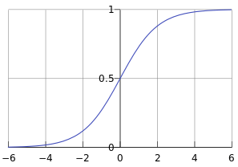

<head>
    
    
</head>

## 逻辑回归

### 定义
逻辑回归假设数据服从伯努利分布,通过极大化似然函数的方法，运用梯度下降来求解参数，来达到将数据二分类的目的。

### 逻辑回归的基本假设

- 逻辑回归假设数据服从[伯努利分布](../statics/bernoulli_distribution.md)，伯努利分布有一个简单的例子是抛硬币，抛中为正面的概率是𝑝,抛中为负面的概率是1−𝑝.在逻辑回归这个模型里面是假设$h_\theta(x)$ 为样本为正的概率，1−$h_\theta(x)$为样本为负的概率。那么整个模型可以描述为:
$$
    \begin{split}
    P(Y=1|x)&=p=h_\theta(x) \\
    P(Y=0|x)&=1-p=1-h_\theta(x) \\
    \end{split}
$$
即
$$
    P(Y|x) =p=h_\theta(x)^Y(1-h_\theta(x))^{1-Y} 
$$

- 考虑二分类问题，给定数据集
$$
    D=\{(x_1,y_1),(x_2,y_2),\dots,(x_N,y_N)\},x_i\in R^n,y\in \{0,1\}
$$
在给定参数$\theta$下的概率为:
$$
    P(D|\theta)=\prod_{1}^N h_\theta(x_i)^{y_i}(1-h_\theta(x_i))^{1-y_i}
$$

-  逻辑回归中采用sigmoid的函数表征$x\rightarrow p$的映射,即
$$
    p=h_\theta(x)=\frac{1}{1+e^{-\theta^T x}}
$$
其函数图如下图所示: 

### 最大似然估计
**极大似然估计就是求解参数$\theta$使得概率$P(D|\theta)$最大**。通常，我们可以对似然函数取log变换为
$$
     L(\theta)=log(P(D|\theta))=\sum_{i=1}^N y_i log h_\theta(x_i) + (1-y_i)log(1-h_\theta(x_i))
$$
在机器学习中我们有损失函数的概念，其衡量的是模型预测错误的程度。如果取整个数据集上的平均对数似然损失，我们可以得到:
$$
    J(\theta)=-\frac{1}{N}\sum_{i=1}^N y_i log h_\theta(x_i) + (1-y_i)log(1-h_\theta(x_i))\tag{1}
$$
在逻辑回归模型中，我们最大化似然函数和最小化损失函数实际上是等价的。上式也被成为交叉熵(Cross Entropy)损失函数。

### 求解
求解逻辑回归，优化目标是求得式(1)的极小值对应的$\theta$,可采用梯度下降法来进行求解。
$J(\theta)$关于$\theta$的梯度计算公式为
$$
\frac{\partial J}{\partial \theta} = -\frac{1}{N}\sum_{i=1}^N (y_i \frac{1}{h_\theta(x_i)} + (1-y_i)\frac{1}{1-h_\theta(x_i)})\frac{\partial h_\theta(x_i)}{\partial \theta}
$$
对于sigmoid函数$h_\theta(x_i)$,其关于$x_i$的倒数为：
$$
\frac{\partial h_\theta(x_i)}{\partial \theta}=h_\theta(x_i)(1-h_\theta(x_i))x_i
$$
带入上式可得
$$
\frac{\partial J}{\partial \theta}=-\frac{1}{N}\sum_{i=1}^N (y_i-h_\theta(x_i))x_i
$$
梯度下降更新公式为:
$$
    \theta = \theta - \alpha \frac{\partial J}{\partial \theta}=\theta + \alpha \frac{1}{N}\sum_{i=1}^N (y_i-h_\theta(x_i))x_i
$$
这里$\alpha$是学习率。梯度方式是函数$J(\theta)$增大最快的方向，反向则为减小最快的方向。