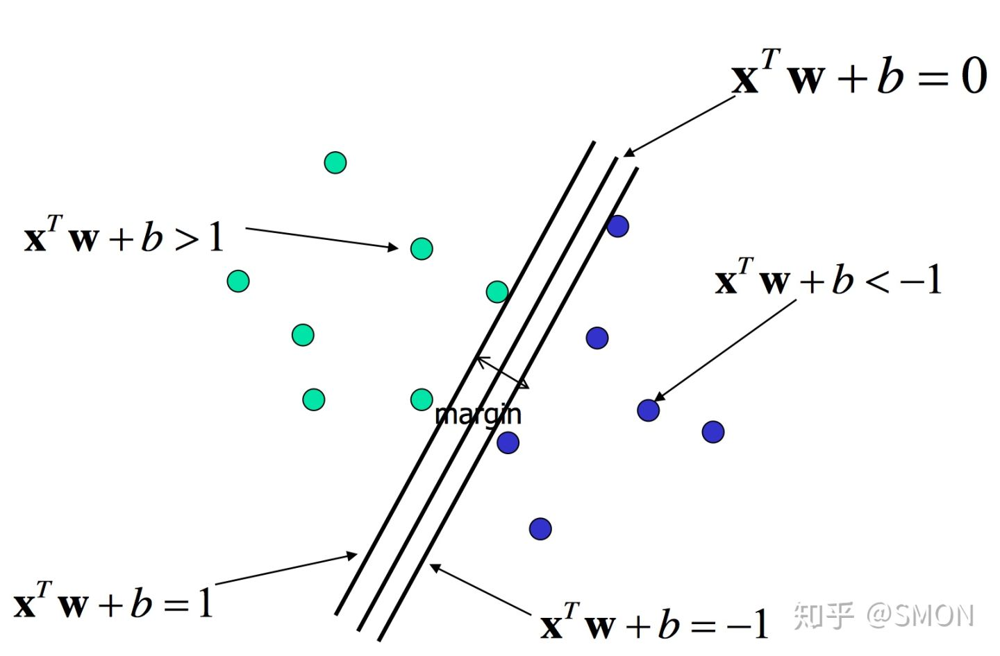
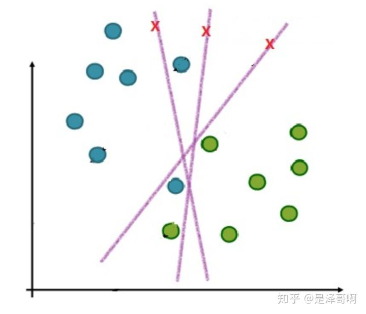
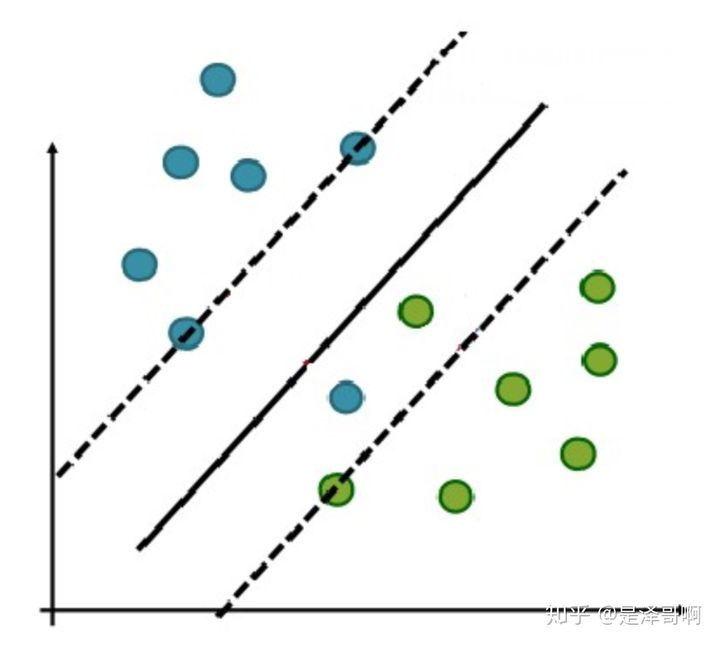
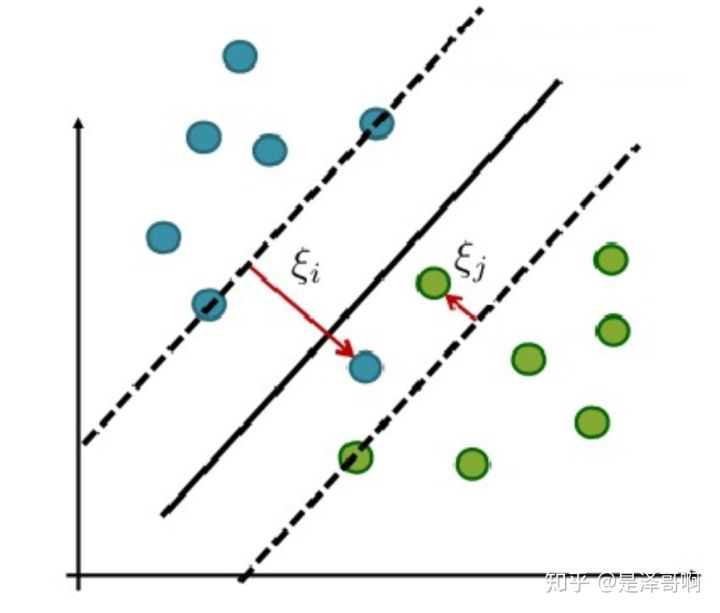
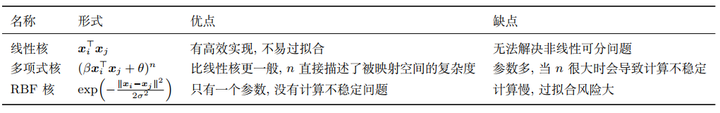

## 支持向量机(SVM)

SVM 是一种二类分类模型。它的基本思想是在特征空间中寻找间隔最大的分离超平面使数据得到高效的二分类.支持向量机学习方法有一些由简至繁的模型:
- 当训练样本线性可分时，通过硬间隔最大化，学习一个线性分类器，即线性可分支持向量机；
- 当训练数据近似线性可分时，引入松弛变量，通过软间隔最大化，学习一个线性分类器，即线性支持向量机；
- 当训练数据线性不可分时，通过使用核技巧及软间隔最大化，学习非线性支持向量机。

### 定义
数据集：$\{x_i,y_i|i=1,2,\cdots,m\}$,$x_i\in R^d$,$y_i \in \{-1,1\}$

### 优化问题推导
从最简单的线性可分的情况下开始，在该前提下，可以找出如下超平面切分正例和反例：
$$
    W^TX+b=0
$$
并且有如下条件：
$$
\left\{\begin{matrix}
    W^Tx_i+b >=1 & y_i = 1 \\ 
    W^Tx_i+b <=-1 & y_i = -1 
\end{matrix}\right.
$$
即如下图所示：

其中,$\frac{2}{\|W\|^{2}}$是$W^Tx_i+b ==1$和$W^Tx_i+b ==-1$之间的垂直距离。
SVM的优化目标就是找出这两个超平面，使得他们之间的垂直距离最大。该优化问题可以表述为：
$$
\begin{split}
    \max\limits_{W,B} &\frac{2}{\|W\|^{2}} \\
    s.t. & y_i(W^Tx_i+b) >= 1, \forall i
\end{split}
$$
该问题等价于：
$$
\begin{split}
    \min\limits_{W,B} &\frac{\|W\|^{2}}{2} \\
    s.t.&y_i(W^Tx_i+b) >= 1,\forall i
\end{split} \tag{1}
$$

### 求解
优化问题(1)是带约束的优化问题，用拉格朗日函数来解决。
$$
\begin{split}
\min_{w, b} \max_{\alpha}& L(W, b, \alpha)=\frac{1}{2}\|W\|^{2}+\sum_{i=1}^{m} \alpha_{i}\left(1-y_{i}\left(W^{T} x_{i}+b\right)\right) \\
    s.t.& \alpha_{i} \geq 0, \forall i
\end{split}
$$
在满足Slater定理的时候，且过程满足KKT条件的时候，原问题转换成对偶问题：
$$
\begin{split}
\max_{\alpha}\min_{w, b} & L(W, b, \alpha)=\frac{1}{2}\|W\|^{2}+\sum_{i=1}^{m} \alpha_{i}\left(1-y_{i}\left(W^{T} x_{i}+b\right)\right) \\
    s.t.& \alpha_{i} \geq 0, \forall i
\end{split}\tag{2}
$$
先求内部最小值，对$W$和$b$求偏导并令其等于0可得：
$$
\begin{aligned}
W &=\sum_{i=1}^{m} \alpha_{i} y_{i} x_{i} \\
0 &=\sum_{i=1}^{m} \alpha_{i} y_{i}
\end{aligned}
$$
将上式带入到拉格朗日函数中，可得
$$
\begin{aligned}
\max _{\alpha} L(W, b, \alpha)=& \sum_{i=1}^{m} \alpha_{i}-\frac{1}{2} \sum_{i=1}^{m} \sum_{j=1}^{m} \alpha_{i} \alpha_{j} y_{i} y_{j} x_{i}^{T} x_{j} \\
& \text { s.t. } \sum_{i=1}^{m} \alpha_{i} y_{i}=0 \quad\left(\alpha_{i} \geq 0, i=1,2, \ldots, m\right)
\end{aligned}\tag{2}
$$
**此时需要求解$\alpha$，利用SMO（序列最小优化）算法.SMO算法的基本思路是每次选择两个变量$\alpha_i$和$\alpha_j$，选取的两个变量所对应的样本之间间隔要尽可能大，因为这样更新会带给目标函数值更大的变化。SMO算法之所以高效，是因为仅优化两个参数的过程实际上仅有一个约束条件，其中一个可由另一个表示，这样的二次规划问题具有闭式解。**
由于
$$
y_i(W^Tx_i+b) >= 1, \forall i
$$
因此
$$
    1-y_i(W^Tx_i+b) <=0, \forall i
$$
那么要使(2)最大化, 其最优解需要满足如下条件：
$$
\left\{\begin{matrix}
    \alpha_i = 0, y_i(W^Tx_i+b) > 1 \\
    \alpha_i >= 0,  y_i(W^Tx_i+b) = 1
\end{matrix}\right.
$$
其中，满足$y_i(W^Tx_i+b)=1$的点被称为支持向量，即落在超平面上的点。求得支持向量后，我们可以进一步得到$b$的值:
$$
\begin{aligned}
        W^Tx_{j} +b=y_j, y_j \in \{-1,1\} \\
     b=\frac{1}{|S|}\sum_{j\in S}(y_j - W^Tx_{j})
\end{aligned}
$$
$j\in S$表示用多个支持向量上的均值，这样鲁棒性更强。
求解最优$\alpha$后，模型的预测结果可由如下方式求得：
$$
    y_{j_{predict}}=W^Tx_i+b=\sum_{i=1}^{m}  \alpha_{i}  y_{i} x_{i}^{T} x_{j} + b
$$

### 软间隔
#### 问题
在实际应用中，完全线性可分的样本是很少的，如果遇到了不能够完全线性可分的样本，我们应该怎么办？比如下面这个：

于是我们就有了软间隔，相比于硬间隔的苛刻条件，我们允许个别样本点出现在间隔带里面，比如：

我们允许部分样本点不满足约束条件：
$$
 1-y_i(W^Tx_i+b) \le0
$$
为了度量这个间隔软到何种程度，我们为每个样本引入一个松弛变量$\xi_{i}$,令$\xi_{i}\ge0$，且$ 1-y_i(W^Tx_i+b)-\xi_{i} \le0$，如下图所示：

####  优化目标及求解
增加软间隔后我们的优化目标变成了：
$$
\begin{array}{cc}
\min _{w} \frac{1}{2}\|W\|^{2}+C \sum_{i=1}^{m} \xi_{i} \\
\text { s.t. } \quad1-y_{i}\left(W^{T} x_{i}+b\right)-\xi_{i} \leq 0, \quad \xi_{i} \geq 0, \quad i=1,2, \ldots, m
\end{array}
$$
其中 C 是一个大于 0 的常数，可以理解为错误样本的惩罚程度，若 C 为无穷大，$\xi_{i}$必然无穷小，如此一来线性 SVM 就又变成了线性可分 SVM；当 C 为有限值的时候，才会允许部分样本不遵循约束条件。
上述问题也可以通过朗格朗日函数法求解，如下：
$$
\begin{gathered}
\min _{W, b, \xi} \max _{\alpha, \beta} L(W, b, \alpha, \xi, \beta)=\frac{1}{2}\|W\|^{2}+C \sum_{i=1}^{n} \xi_{i}+\sum_{i=1}^{m} \alpha_{i}\left(1-y_{i}\left(W^{T} x_{i}+b\right)-\xi_{i}\right)-\sum_{i=1}^{n} \beta_{i} \xi_{i} \\
\text { s.t. } \alpha_{i} \geq 0 \text { 且 } \beta_{i} \geq 0, \forall i
\end{gathered}
$$
在满足Slater定理的时候，且过程满足KKT条件的时候，原问题转换成对偶问题：
$$
\begin{gathered}
\max _{\alpha, \beta}\min _{W, b, \xi} L(W, b, \alpha, \xi, \beta)=\frac{1}{2}\|W\|^{2}+C \sum_{i=1}^{n} \xi_{i}+\sum_{i=1}^{m} \alpha_{i}\left(1-y_{i}\left(W^{T} x_{i}+b\right)-\xi_{i}\right)-\sum_{i=1}^{n} \beta_{i} \xi_{i} \\
\text { s.t. } \alpha_{i} \geq 0 \text { 且 } \beta_{i} \geq 0, \forall i
\end{gathered}
$$
先求内部最小值，对$W$,$b$和$\xi$求偏导并令其等于0可得：
$$
\begin{gathered}
W=\sum_{i=1}^{m} \alpha_{i} y_{i} x_{i} \\
0=\sum_{i=1}^{m} \alpha_{i} y_{i} \\
C=\alpha_{i}+\beta_{i}
\end{gathered}
$$
将其代入到上式中去可得到，注意$\beta$被消掉了：
$$
\begin{aligned}
\max _{\alpha, \beta} L(W, b, \alpha, \xi, \beta)=& \sum_{i=1}^{m} \alpha_{i}-\frac{1}{2} \sum_{i=1}^{m} \sum_{j=1}^{m} \alpha_{i} \alpha_{j} y_{i} y_{j} x_{i}^{T} x_{j} \\
& \text { s.t. } \sum_{i=1}^{m} \alpha_{i} y_{i}=0 \quad\left(0 \leq \alpha_{i} \leq C, i=1,2, \ldots, m\right)
\end{aligned}
$$
此时需要求解$\alpha$，**同样利用SMO（序列最小优化）算法。**

### 核函数
为什么要引入核函数：
`
当样本在原始空间线性不可分时，可将样本从原始空间映射到一个更高维的特征空间，使得样本在这个特征空间内线性可分。而引入这样的映射后，所要求解的对偶问题的求解中，无需求解真正的映射函数，而只需要知道其核函数。
`
#### 核函数的定义
$$
    \kappa(x,y)=<\phi(x),\phi(y)>
$$
一方面数据变成了高维空间中线性可分的数据，另一方面不需要求解具体的映射函数，只需要给定具体的核函数即可，这样使得求解的难度大大降低。其中$\phi(x)$是$x\rightarrow\phi(x)$高维空间的映射。核函数可以省掉这个映射的过程。下面，我们以RBF kernel为例。定义映射$\phi$为如下形式，
$$
\phi: x \mapsto \exp \left(-x^{2}\right)\left[\begin{array}{c}
1 \\
\sqrt{\frac{2}{1}} x \\
\sqrt{\frac{2^{2}}{2 !}} x^{2} \\
\vdots
\end{array}\right]
$$
对应如下核函数形式：
$$
\kappa\left(x_{i}, x_{j}\right):=\exp \left(-\left(x_{i}-x_{j}\right)^{2}\right)
$$
证明：
$$
\begin{aligned}
\kappa\left(x_{i}, x_{j}\right) &=\exp \left(-\left(x_{i}-x_{j}\right)^{2}\right) \\
&=\exp \left(-x_{i}^{2}\right) \exp \left(-x_{j}^{2}\right) \exp \left(2 x_{i} x_{j}\right) \\
&=\exp \left(-x_{i}^{2}\right) \exp \left(-x_{j}^{2}\right) \sum_{k=0}^{\infty} \frac{\left(2 x_{i} x_{j}\right)^{k}}{k !} \\
&=\sum_{k=0}^{\infty}\left(\exp \left(-x_{i}^{2}\right) \sqrt{\frac{2^{k}}{k !}} x_{i}^{k}\right)\left(\exp \left(-x_{j}^{2}\right) \sqrt{\frac{2^{k}}{k !}} x_{j}^{k}\right) \\
&=\phi\left(x_{i}\right)^{\top} \boldsymbol{\phi}\left(x_{j}\right)
\end{aligned}
$$
**核函数就是一个函数，接收两个变量，这两个变量是在低维空间中的变量，而核函数求的值等于将两个低维空间中的向量映射到高维空间后的内积。**

#### 如何确定一个函数是核函数
根据内积的性质，它要满足
- 交换律
- 内积大于等于0

因此核函数也要满足上述性质即
- $\kappa(x_i,x_j)=\kappa(x_j,x_i)$
- $\kappa(x_i,x_j)\ge0,\forall x_i, x_j$

常用的核函数及其特性如下表所示：

#### 如何选择核函数

- 当特征维数 d 超过样本数 m 时 (文本分类问题通常是这种情况), 使用线性核;
- 当特征维数 d 比较小. 样本数 m 中等时, 使用RBF核;
- 当特征维数 d 比较小. 样本数 m 特别大时, 支持向量机性能通常不如深度神经网络

### 知识点
