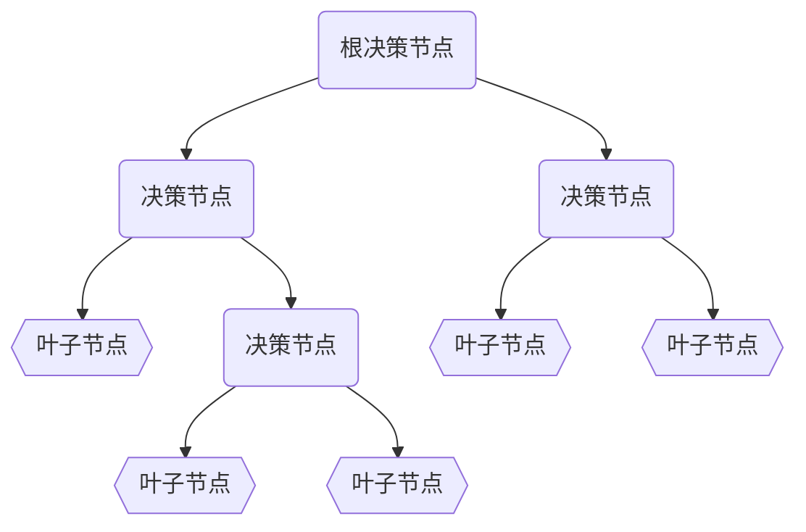

## 树模型

一个典型的树结构如下图所示，自顶向下，根据每个决策节点将输入样本分类到对应的叶子节点。其中:
- 决策节点的决策依据包括：
  - 连续变量大小，例如`工资`，$\le$或者$\ge$某个$threshold$
  - 类别变量属于哪个类，例如`性别`，是`男`还是`女`
- 叶子节点的值根据任务而定：
  - 分类任务中，叶子节点的值是分入的某个类
  - 回归任务中，叶子节点的值是回归估计的值
- 对于单树模型而言，主要的区别在决策节点分裂特征和分裂点的选取方式上不同
  - ID3 --- 信息增益 最大的准则
  - C4.5 --- 信息增益比 最大的准则
  - CART
    - 回归树: 平方误差 最小 的准则
    - 分类树: 基尼系数 最小的

### 定义
- 设训练数据集$D$, $|D|$表示样本个数。
- 设有K个类$C_k$,k=1,2,...,K , 有:  $\sum_{k} |C_k| = |D|$
- 设特征A有n个不同的取值 $\{a_1, a_2, \cdots, a_n\}$ , 根
- 据特征A的取值将$D$划分为n个子集$D_1,D_2,\cdots,D_n$  ,有: $\sum_i |D_i|=|D|$
- 记子集中$D_i$属于类$C_k$的样本的集合为$D_{ik}$

### ID3 和 信息增益
信息熵：随机变量不确定性的度量, 数据集$D$的信息熵定义如下 :
$$
    H(D) = - \sum_{k=1}^{K}\frac{|C_k|}{|D|}log(\frac{|C_k|}{|D|})
$$
条件信息熵：在特征A给定的条件下对数据集D分类的不确定性：
$$
  H(D|A) = \sum_{i=1}^n \frac{|D_i|}{|D|}H(D_i) 
$$
其中$H(D_i)=-\sum_{k=1}^{K}\frac{|D_{ik}|}{|D_i|}log(\frac{|D_{ik}|}{|D_i|})$
计算特征A的信息增益
$$
  g(D,A)=H(D)-H(D|A)
$$
**选择信息增益最大的特征作为当前的分裂特征**