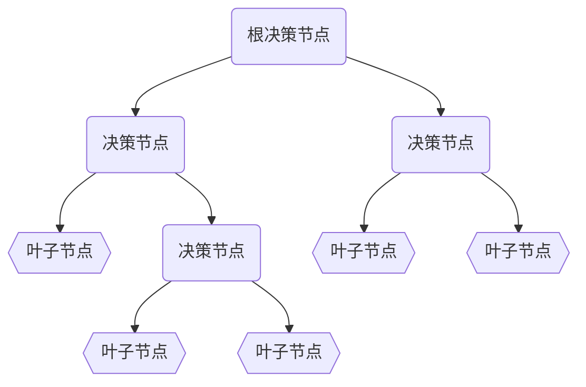

<head>
    
    
</head>

## 树模型

一个典型的树结构如下图所示，自顶向下，根据每个决策节点将输入样本分类到对应的叶子节点。其中:
- 决策节点的决策依据包括：
  - 连续变量大小，例如`工资`，$\le$或者$\ge$某个$threshold$
  - 类别变量属于哪个类，例如`性别`，是`男`还是`女`
- 叶子节点的值根据任务而定：
  - 分类任务中，叶子节点的值是分入的某个类
  - 回归任务中，叶子节点的值是回归估计的值
- 对于单树模型而言，主要的区别在决策节点分裂特征和分裂点的选取方式上不同
  - ID3 --- 信息增益 最大的准则
  - C4.5 --- 信息增益比 最大的准则
  - CART
    - 回归树: 平方误差 最小 的准则
    - 分类树: 基尼系数 最小的

### 定义
- 设训练数据集$D$, $|D|$表示样本个数。
- 设有K个类$C_k$,k=1,2,...,K , 有:  $\sum_{k} |C_k| = |D|$
- 设特征A有n个不同的取值 $\{a_1, a_2, \cdots, a_n\}$ , 根
- 据特征A的取值将$D$划分为n个子集$D_1,D_2,\cdots,D_n$  ,有: $\sum_i |D_i|=|D|$
- 记子集中$D_i$属于类$C_k$的样本的集合为$D_{ik}$

### ID3 和 信息增益
信息熵：随机变量不确定性的度量, 数据集$D$的信息熵定义如下 :
$$
    H(D) = - \sum_{k=1}^{K}\frac{|C_k|}{|D|}log(\frac{|C_k|}{|D|})
$$
条件信息熵：在特征A给定的条件下对数据集D分类的不确定性：
$$
  H(D|A) = \sum_{i=1}^n \frac{|D_i|}{|D|}H(D_i) 
$$
其中$H(D_i)=-\sum_{k=1}^{K}\frac{|D_{ik}|}{|D_i|}log(\frac{|D_{ik}|}{|D_i|})$
计算特征A的信息增益
$$
  g(D,A)=H(D)-H(D|A)
$$
**选择信息增益最大的特征作为当前的分裂特征**
#### ID3的缺点
- **ID3原始方法不支持对连续特征做处理，可以讲连续特征离散化后用ID3处理**
- ID3算法没有剪枝，即没有对过拟合处理
- ID3算法对于缺失值没有进行考虑
- **信息增益的缺点是倾向于选择取值较多的属性，在有些情况下这类属性可能不会提供太多有价值的信息。**

#### 信息增益倾向于选择取值较多的属性
- 根据大数定律，只有当样本量足够的时候，频率才可以准确的近似概率。样本数越少，所估计的概率方差就会越大。概率方差越大，条件熵就越大。
- 所以信息增益不是倾向于选择取值较多的属性，而是在数据不足和客观存在的大数定律的前提下导致取值多的特征在计算条件熵的时候容易估计偏小的条件熵。
- 极端情况就是某个特征么个样本取值各不相同，则按照它分裂后的条件熵为0。

### C4.5 和 信息增益率
信息增益率定义:
$$
  g_{R}(D,A)=\frac{g(D,A)}{H_A(D)}
$$
其中,$H_A(D)$的定义如下:
$$
  H_A(D) = \sum_{i=1}^n\frac{|D_i|}{|D|} log (\frac{|D_i|}{|D|})
$$
通常，属性A的可能取值数越多（即K越大），则$H_A(D)$的值通常会越大。
**信息增益率准则对可取值数目较少的属性有所偏好**。所以，C4.5算法不是直接选择信息增益率最大的候选划分属性，而是先从候选划分属性中找出信息增益高于平均水平的属性，再从中选择信息增益率最高的。

#### 对连续特征的处理

当属性类型为连续型，则需要对数据进行离散化处理。具体思路如下：

具体思路：

m个样本的连续特征A有m个值，从小到大排列$a_1,a_2\cdots a_m$，取相邻两样本值的平均数做划分点，一共有m-1个，其中第i个划分点$T_i$表示为$T_i=\frac{a_i+a_{i+1}}{2}$。
分别计算以这m-1个点作为二元切分点时的信息增益率。选择信息增益率最大的点为该连续特征的最佳切分点。比如取到的信息增益率最大的点为 $a_t$ ，则小于 $a_t$ 的值为类别1，大于 $a_t$ 的值为类别2，这样就做到了连续特征的离散化。

#### 对缺失值的处理

ID3算法不能处理缺失值，而C4.5算法可以处理缺失值（常用概率权重方法），主要有三种情况，具体如下：

1. 在有缺失值的特征上如何计算信息增益率？
**根据缺失比例，折算信息增益（无缺失值样本所占的比例乘以无缺失值样本子集的信息增益）和信息增益率**

2. 选定了划分属性，若样本在该属性上的值是缺失的，那么如何对这个样本进行划分？
**将样本以不同概率同时划分到不同节点中，概率是根据其他非缺失属性的比例来得到的**

3. 对新的样本进行分类时，如果测试样本特性有缺失值如何判断其类别？
**走所有分支，计算每个类别的概率，取概率最大的类别赋值给该样本**

#### 剪枝
**为什么要剪枝**?因为过拟合的树在泛化能力的表现非常差。
剪枝又分为前剪枝和后剪枝，前剪枝是指在构造树的过程中就知道哪些节点可以剪掉 。 后剪枝是指构造出完整的决策树之后再来考查哪些子树可以剪掉。

##### 前剪枝

在节点划分前确定是否继续增长，及早停止增长的主要方法有：

* 节点内数据样本数小于切分最小样本数阈值；
* 所有节点特征都已分裂；
* 节点划分前准确率比划分后准确率高。

前剪枝不仅可以降低过拟合的风险而且还可以减少训练时间，但另一方面它是基于“贪心”策略，会带来欠拟合风险。

##### 后剪枝
在已经生成的决策树上进行剪枝，从而得到简化版的剪枝决策树。

C4.5算法采用悲观剪枝方法。根据剪枝前后的误判率来判定是否进行子树的修剪， 如果剪枝后与剪枝前相比其误判率是保持或者下降，则这棵子树就可以被替换为一个叶子节点。 因此，不需要单独的剪枝数据集。C4.5 通过训练数据集上的错误分类数量来估算未知样本上的错误率。

把一颗子树（具有多个叶子节点）的剪枝后用一个叶子节点来替代的话，在训练集上的误判率肯定是上升的，但是在新数据上不一定。于是我们需要把子树的误判计算加上一个经验性的惩罚因子。定义如下,表示该子树的误判率:
$$
  e=\frac{\sum_i E_i + 0.5 * L}{\sum_i N_i}
$$
其中，$N_i$表示该子树叶子节点$i$的样本个数,$E_i$表示叶子节点$i$的错误个数, $L$是叶子节点个数。
将该子树替换成一个叶子节点后，其指标更新为:
$$
  e_{T} = \frac{E_T + 0.5}{N_T}
$$
其中$E_T$是替换后该叶子节点的误判率，$N_T=\sum_i N_i$是该叶子节点对应的样本数。
这里假设误判次数服从伯努利分布，我们可以估计出该子树的误判次数的均值和标准差：
$$
  \begin{split}
    \mu(e) &= N_Te \\
    \sigma(e)&= \sqrt{N_Te(1-e)}
  \end{split}
$$
将该子树替换成一个叶子节点后，误判次数的均值为:
$$
  \mu(e_T)=N_T e_T
$$
则有如下剪枝条件：
$$
\left\{\begin{matrix}
\mu(e) + \sigma(e) >=  \mu(e_T) & 剪掉该子树\\ 
\mu(e) + \sigma(e) <  \mu(e_T) & 保留该子树
\end{matrix}\right.
$$

### CART
CART假设决策树是二叉树，内部结点特征的取值为“是”和“否”，左分支是取值为“是”的分支，右分支是取值为“否”的分支。这样的决策树等价于递归地二分每个特征，将输入空间即特征空间划分为有限个单元，并在这些单元上确定预测的概率分布，也就是在输入给定的条件下输出的条件概率分布。

#### CART 分类树
CART分类树采用基尼系数作为切分指标，定义如下：
$$
  Gini(D) = 1- \sum_{k=1}^K (\frac{|C_k|}{|D|})^2
$$
如果数据集D根据特征A在某一取值$a_t$上进行分割，得到$D_1$,$D_2$两部分后，那么在特征A下集合D的基尼系数如下所示。
$$
  Gain\_Gini(D,A, a_t) = \frac{|D_1|}{|D|}Gini(D_1)+\frac{|D_2|}{|D|}Gini(D_2)
$$
对于属性A，分别计算任意属性值将数据集划分为两部分之后的Gain_Gini，选取其中的最小值，作为属性A得到的最优二分方案。然后对于训练集S，计算所有属性的最优二分方案，选取其中的最小值，作为样本及S的最优二分方案。
$$
 \min_{A\in Field}\min_{a_t \in A}  Gain\_Gini(D,A, a_t)
$$
#### CART 回归树
回归树选用平方误差作为指标，定义如下:
$$
\sigma(D) = \sqrt(\sum(y_i - \mu)^2))
$$
其中, $\mu$是数据集D上预测结果的均值, $y_k$是第k个样本的预测结果。
同Gini系数一样，回归树会根据特征A的第t个属性值$a_t$，将数据集划分成两个部分，划分后的$Gain\_\sigma$计算如下:
$$
  Gain\_\sigma(D,A, a_t) = \frac{|D_1|}{|D|}\sigma(D_1)+\frac{|D_2|}{|D|}\sigma(D_2)
$$
对于样本集D，计算所有属性的最优二分方案，选取其中的最小值，作为样本集D的最优二分方案
$$
 \min_{A\in Field}\min_{a_t \in A}  Gain\_\sigma(D,A, a_t)
$$
#### 剪枝
CART采用CCP（代价复杂度）剪枝方法。代价复杂度选择节点表面误差率增益值最小的非叶子节点，删除该非叶子节点的左右子节点，若有多个非叶子节点的表面误差率增益值相同小，则选择非叶子节点中子节点数最多的非叶子节点进行剪枝。

可描述如下
令决策树的非叶子节点为$\_1,T_2\cdots T_n\}$。
表面误差率增益值的计算公式
$$
  \alpha = \frac{R(t) - R(T)}{N(T) - 1}
$$
其中,$R(t)=r(t)p(t)$是子树被替换成节点后误差代价，是错误率r(t)和样本占比p(t)的乘积， 
$R(T)=\sum_i^m r(t_i)p(t_i)$是子数的误差代价（子树叶子节点误差代价和）
$N(T)$表示子节点个数

剪枝的过程如下：
1. 计算所有非叶子节点的表面误差率增益值$\{\alpha_1,\alpha_2\cdots\alpha_n\}$
2. 选择表面误差率增益值最小的非叶子节点（若多个非叶子节点具有相同小的表面误差率增益值，选择节点数最多的非叶子节点）
3. 对进行剪枝
