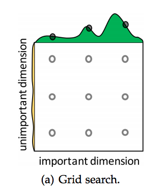
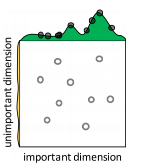
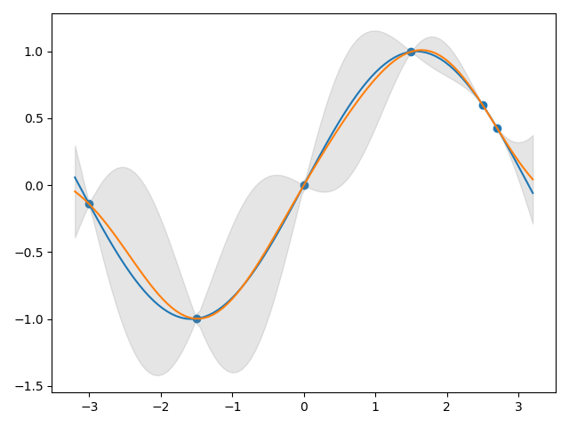
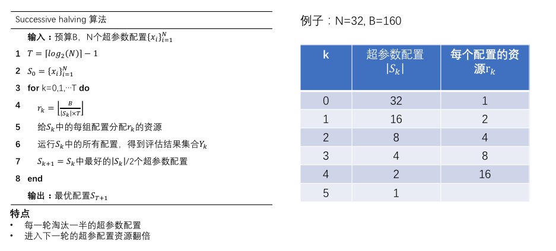
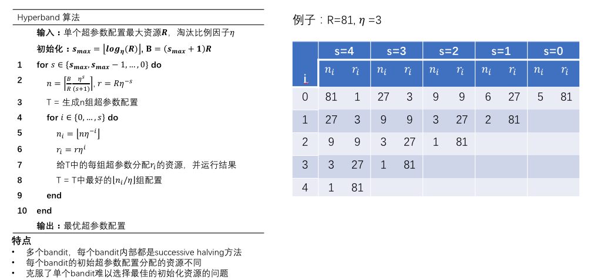

<head>
    
    
</head>

## 调参数(Tune)
调参数大致可以分为两个大类：
- **(Search Algorithm)** 根据已有结果，进一步搜索出更优的超参数，例如贝叶斯算法，根据已有配置及其对应结果，估算下一个最优配置点。
- **(Scheduler)** 从当前给定配置候选集中，通过有效的资源分配，在尽量小的代价下找出最优的配置，例如Successive halving，通过逐轮筛选找出最优配置。

实际上，上述两种方式的目标是是一致的，都是在尽量小的代价下找出较优的配置。

常见的Search Algorithm 包括：
- Grid Search
- Random Search
- Bayesian Optimization
- HyperOpt
- 遗传算法

常见的Scheduler有：
- Successive halving
- Hyperband

下面我将简要介绍上述调参数算法。

### Grid Search
Grid Search就是对超参数的组合进行枚举
- 其中连续性超参数可使用等步长采样
- 离散型超参数直接枚举

### Random Search
Random Search 即随机搜索超参数空间

### Bayesian Optimization
**首先，原始的BO的Kernel只适用于连续性空间**
BO假设$(X,Y)$是高斯过程，即
- 在每个X点上， Y的取值是一个高斯分布$N(\mu(X), K(X,X))$
- 不同的X点上，他们之间的相关性用kernel函数来表示，可以这么理解，靠得越近的点，他们之间的相关性越大。
- 空间中多个点可以组成一个多元高斯分布, kernel函数表示他们之间的协方差，如下：
$$
\left[\begin{array}{c}
Y \\
f\left(X^{*}\right)
\end{array}\right] \sim N\left(\left[\begin{array}{c}
\mu(X) \\
\mu\left(X^{*}\right)
\end{array}\right], \quad\left[\begin{array}{cc}
k(X, X) & k\left(X, X^{*}\right) \\
k\left(X^{*}, X\right) & k\left(X^{*}, X^{*}\right)
\end{array}\right]\right)
$$
在已知部分点$(X, Y)$，目标是估计在未知点$X^*$上的值的分布。其中
$$
    f(X^*)\sim N(\mu(X^*|X,Y, k), \sigma^2(X^*|X,Y, k))
$$
$$
\begin{aligned}
&\mu(X^*|X,Y, k)=k\left(X^{*}, X\right) k(X, X)^{-1}(Y-\mu(X))+\mu\left(X^{*}\right) \\
&\sigma^2(X^*|X,Y, k)=k\left(X^{*}, X^{*}\right)-k\left(X^{*}, X\right) k(X, X)^{-1} k\left(X, X^{*}\right)
\end{aligned}
$$
在高斯过程中一般会有一个前提假设即每个点在没有其他条件下服从$\mu(X)=0,\sigma^2(X)=1$，因此上式可以被简化为：
$$
\begin{aligned}
&\mu(X^*|X,Y, k)=k\left(X^{*}, X\right) k(X, X)^{-1}Y \\
&\sigma^2(X^*|X,Y, k)=k\left(X^{*}, X^{*}\right)-k\left(X^{*}, X\right) k(X, X)^{-1} k\left(X, X^{*}\right)
\end{aligned}\tag{1}
$$
根据上式，我们就可以得到未知$f(X^*)$高斯分布的均值和方差，如下图所示。

BO就是基于(1)来选择下一个采样点的位置。

#### 采集函数
* Probability of Improvement 
即相对最好结果提升的概率，定义为
$$
    \alpha_{PI}(x) = P(Y(x)>Y(x^\dotplus))
$$
$Y(x^\dotplus)$表示已探测点中的最好结果，则下一个点的位置为：
$$
x_{t+1}=\arg \max _{x} \Phi\left(\frac{\mu_{t}(x)-Y\left(x^{+}\right)-\epsilon}{\sigma_{t}(x)}\right)
$$
* Expected Improvement
即相对最好结果平均能提升多少性能，定义为:
$$
    \alpha_{EI} = \int^\infty_{Y(x^\dotplus)} (Y(x) - Y(x^\dotplus))P(Y(x)) d P(Y(x))
$$
$P(Y(x))$服从(1)中推导的高斯分布。
Expected Improvement就是取$\alpha_{EI}$最大的点。

### HyperOpt (TPE)
BO最大的问题是需要定义好的kernal function，对于离散空间，这是非常困难的。
因此，我们可以采用TPE来解决上述问题。TPE也是采用BO的思想，但是没有用到高斯过程的前提假设。
其中，主要是简化了$p(x \mid y)$的计算方式：
$$
p(x \mid y)= \begin{cases}\ell(x) & \text { if } y<y^{*} \\ g(x) & \text { if } y \geq y^{*}\end{cases}
$$
$y^{*}$是观察到的y的$\gamma-quantile$。很明显，y实际是连续值，上式是一种简单的近似。
有了上式之后，我们可以得到
$$
EI_{y^{*}}(x)=\int_{-\infty}^{y^{*}}\left(y^{*}-y\right) p(y \mid x) d y=\int_{-\infty}^{y^{*}}\left(y^{*}-y\right) \frac{p(x \mid y) p(y)}{p(x)} d y \tag{2}
$$
这里注意一下，**TPE原论文中是要最小化原目标**，因此这里定义$EI$是往减小的方向。
公式(2)中$p(y),p(x)$都可以从数据集中统计得到，带入(1)到$p(x\mid y)$中可得,
$$
\int_{-\infty}^{y^{*}}\left(y^{*}-y\right) p(x \mid y) p(y) d y=\ell(x) \int_{-\infty}^{y^{*}}\left(y^{*}-y\right) p(y) d y=\gamma y^{*} \ell(x)-\ell(x) \int_{-\infty}^{y^{*}} p(y) d y
$$
最终
$$
E I_{y^{*}}(x)=\frac{\gamma y^{*} \ell(x)-\ell(x) \int_{-\infty}^{y^{*}} p(y) d y}{\gamma \ell(x)+(1-\gamma) g(x)} \propto\left(\gamma+\frac{g(x)}{\ell(x)}(1-\gamma)\right)^{-1}
$$

### Successive halving

### Hyperband
