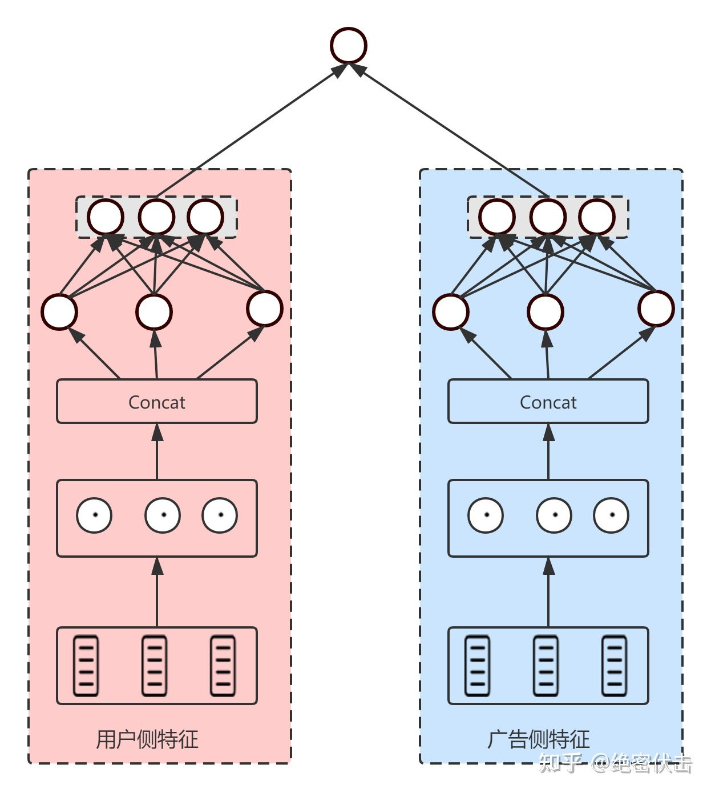
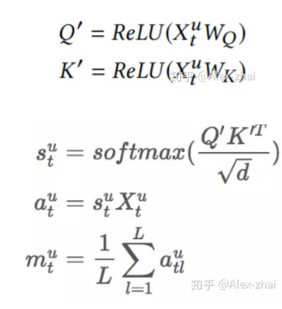

<head>
    
    
</head>

## 推荐系统——召回

图1显示了推荐系统中的4个主要阶段，其中召回阶段负责从海量数据中快速筛选出部分数据，供后面排序阶段使用。本质上，召回和后面的粗排、精排、重排都属于排序，之所以分成召回阶段和后面3个排序阶段，主要原因之一是基于工程上的考虑。在精排阶段，一般会使用复杂的模型和特征，比如模型使用深层神经网络，特征filed上千个，如果精排对上百万的候选集排序，耗时肯定扛不住。因此加入召回过程，利用少量的特征和简单的模型或规则对候选集快速筛选，减少后面排序阶段的时间开销。另外一个原因是出于业务上的考虑，排序阶段主要考虑单一目标，比如ctr，而有时候我们希望给用户多展现热点新闻或者时效性数据，这时候可以多加两路召回。总结起来，召回和排序有如下特点：
- 召回层：候选集规模大、模型和特征简单、速度快，尽量保证用户感兴趣数据多召回。
- 排序层：候选集不大，目标是保证排序的精准，一般使用复杂和模型和特征。

在设计召回层时，需要同时考虑召回率和计算速度，前面提到既要召回用户感兴趣数据，又要召回热点和时效性数据，如果一次同时召回，那么时间开销会是问题。这时候，一般考虑多路召回，图2显示了多路召回方法。

### 召回模型演化

### 传统召回算法

#### 协同过滤
协同过滤算法中，基于用户相似性推荐的叫UserCF，基于物品相似度推荐的叫ItemCF。
- UserCF
- ItemCF
下图所UserCF的例子：

#### 矩阵分解
协同过滤具有简单、可解释性强的优点，在推荐系统早期广泛应用。但是协同过滤也有泛化能力弱、热门物品头部效应强的弱点。为了解决上述问题，后来矩阵分解技术被提出来。矩阵分解的过程如下图所示：

求解:
- SVD:
$$
\mathbf{M} \approx \mathbf{U}_{m \times k} \Sigma_{k \times k} \mathbf{V}_{k \times n}^{T}
$$
SVD应用在推荐系统中，用户矩阵表示为$\mathbf{U}_{m \times k}$，物品矩阵表示为$\mathbf{V}_{n \times k}$。这样就可以计算用户和物品的相似度
-梯度下降法:
$$
\min _{\mathbf{p}^{*}, \mathbf{q}^{*}} \sum_{(u, i) \in K}\left(r_{u, i}-\mathbf{p}_{u} \cdot \mathbf{q}_{i}\right)^{2}
$$

### Embedding召回基本框架

#### i2i

#### u2i

#### DSSM——经典的双塔召回模型

#### Youtobe

### 多embedding向量召回

#### Multi-Interest Network with Dynamic Routing模型

$$
\begin{aligned}
\vec{v}_{u} &=\text { Attention }\left(\vec{e}_{i}, \mathrm{~V}_{u}, \mathrm{~V}_{u}\right) \\
&=\mathrm{V}_{u} \operatorname{softmax}\left(\operatorname{pow}\left(\mathrm{V}_{u}^{\mathrm{T}} \vec{e}_{i}, p\right)\right)
\end{aligned}
$$
$\vec{e}_{i}$是item 的 embedding, $\mathrm{~V}_{u}$表示Multi-Interest抽取层输出的用户多个兴趣向量embedding
然后使用$\vec{v}_{u}$和待推荐item embedding，计算用户u和商品i交互的概率
$$
\operatorname{Pr}(i \mid u)=\operatorname{Pr}\left(\vec{e}_{i} \mid \vec{v}_{u}\right)=\frac{\exp \left(\vec{v}_{u}^{\mathrm{T}} \overrightarrow{\boldsymbol{e}}_{i}\right)}{\sum_{j \in I} \exp \left(\vec{v}_{u}^{\mathrm{T}} \vec{e}_{j}\right)}
$$

### Graph Embedding
#### 阿里Graph Embedding with Side information

该模型的亮点是考虑了不同的side information在最终的aggregated embeddings中所占的权重是不同的，最后aggregated embeddings计算公式如下，其中分母用来归一化。
$$
\mathbf{H}_{v}=\frac{\sum_{j=0}^{n} e^{a_{v}^{j}} \mathbf{W}_{v}^{j}}{\sum_{j=0}^{n} e^{a_{v}^{j}}}
$$

#### GraphSAGE
学习一个node节点的信息是怎么通过其邻居节点的特征聚合而来的。 算法如下：

大致流程是：对于一个node需要聚合K次，每次都通过聚合函数aggregator将上一层中与当前node有邻接关系的多个nodes聚合一次，如此反复聚合K次，得到该node最后的特征。 最下面一层的node特征就是输入的node features。

###  结合用户长期和短期兴趣建模

#### SDM: Sequential Deep Matching Model for Online Large-scale Recommender System
背景：在电商场景中，用户都会有短期兴趣和长期兴趣，比如在当前的浏览session内的一个点击序列，用户的需求往往是明确的，这属于用户短期的兴趣。另外用户还有一些长期的兴趣表达，比如品牌、店铺的偏好。因此通过模型分别建模用户的长、短期兴趣是有意义的。

上图中$\boldsymbol{p}^{u}$表示用户长期兴趣向量，$\odot s_{t}^{u}$表示用户的短期兴趣向量，这里需要注意的是，在求长期和短期用户兴趣向量时都使用了Attention机制，Attention的Query向量$e_u$表示user 的embedding，用的是基本的用户画像，如年龄区间、性别、职业等。得到长期和短期用户向量后，通过gru中的gate机制去融合两者：
$$
\boldsymbol{o}_{t}^{u}=\left(1-G_{t}^{u}\right) \odot \boldsymbol{p}^{u}+G_{t}^{u} \odot s_{t}^{u}
$$
上面的公式输出表示用户的embedding表示，而item的embedding表示和YouTube DNN一样，可以拿softmax层的权重。其实也可用graph embedding先离线训练好item的embedding表示。

线上预测：通过user id找到相应的user embedding，然后使用KNN方法（比如faiss）找到相似度最高的top-N条候选结果返回。

#### Next Item Recommendation with Self-Attention

本文亮点是同时建模用户短期兴趣（由self-attention结构提取）和用户长期兴趣。其短期兴趣建模过程：使用用户最近的L条行为记录来计算短期兴趣。可使用X表示整个物品集合的embedding，那么，用户u在t时刻的前L条交互记录所对应的embedding表示如下：

中每个item的embedding维度为d，将$\bm{X}_t^u$作为transformer中一个block的输入：

self-attention模块只使用用户最近的L个交互商品作为用户短期的兴趣。那么怎么建模用户的长期兴趣呢？可认为用户和物品同属于一个兴趣空间，用户的长期兴趣可表示成空间中的一个向量，而某物品也可表示为成该兴趣空间中的一个向量。那如果一个用户对一个物品的评分比较高，说明这两个兴趣是相近的，那么它们对应的向量在兴趣空间中距离就应该较近。这个距离可用平方距离表示：
$$
\left\|U_{u}=V_{i}\right\|_{Z^{2}}^{2}
$$
综合短期兴趣和长期兴趣，可得到用户对于某个物品的推荐分，推荐分越低，代表用户和物品越相近，用户越可能与该物品进行交互。
$$
y_{t+1}^{u}=\omega\left\|U_{u}-V_{\mathcal{H}_{t+1}^{u}}\right\|_{2}^{2}+(1-\omega)\left\|m_{t}^{u}-X_{t+1}^{u}\right\|_{2}^{2}
$$

### TDM深度树匹配召回
TDM算法整体流程大致分为四个部分：构建兴趣最大堆树->计算候选项的embedding向量表示->优化重建树->训练模型->推荐预测。

构建兴趣最大堆树是从跟节点到叶子节点对全量数据库的分类过程，叶子节点表示候选项，而非叶子节点可以看成表征着一个类别。从根节点到叶子节点，每一层都代表全量数据，但粒度逐渐变细，即全量数据库->大类类别->小类类别->小小类类别->…->候选项（例如：全量商品->有机物->食物->膨化食品->薯片->乐事薯片表示从根节点到叶子节点的一条路径）。

在最开始构建时，由于不知道候选项的向量表示，只能通过候选项的固有类别进行分类建树。将类别相同的候选项放在一起，再将所有类别的全量数据放在一排作为根节点中的数据，每次从中间划分，即从根节点划分为两个数据量差不多的孩子节点，按照这个步骤不断向下划分，直到仅有一个候选项作为叶子节点（注意：TDM框架本身并不要求树必须是二叉结构）。

训练模型前首先需要确定正负例样本。用户若对某候选项（候选项对应叶子节点）感兴趣，则该叶子节点及其所有祖先节点都是正例，即在上图右下角中，节点13若为正例，则1、3、6节点都为正例（图中绿色节点），而任意采样同一层的其他节点都是负例（图中的红色节点就是一种负例采样方式）。这种采样方式具体原因如下。

根据兴趣最大堆树中各层的序我们进行负样本采样，对每一层单独建模（特别说明的是虽然每一层的TopK候选集由上层父亲决定，但该层TopK的排序选取本身并不受父辈的影响，也即每一层的TopK排序都是独立的，父辈的排序分数不参与子辈的排序计算，这一点也是兴趣最大堆树与概率连乘树在计算形式上的不同。这种设计使得训练得到的模型在单层分类上有更好的判别能力，即使在上层分类发生偏差的情况下，在当前层的分类也具备“去伪存真”的能力），用深度学习模型基于这个采样去学习极大似然估计，以逼近兴趣最大堆树上每层的序。

则该模型对应的损失函数为：

$$
-\sum_{u} \sum_{n \in \mathcal{y}_{u}^{+} \cup y_{u}^{-}} y_{u}(n) \log P\left(\hat{y}_{u}(n)=1 \mid n, u\right)+\left(1-y_{u}(n)\right) \log P\left(\hat{y}_{u}(\bar{r})=0 \|n, u\right).
$$