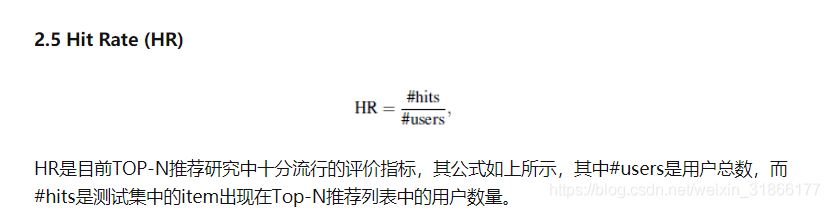
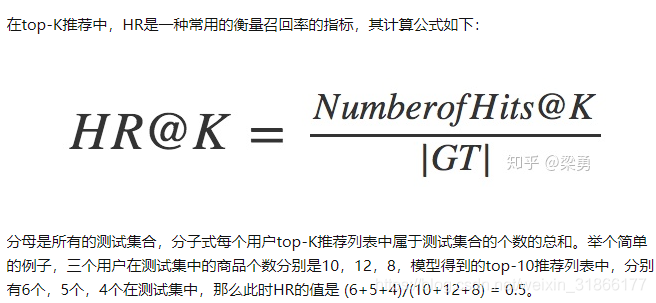
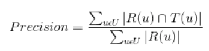
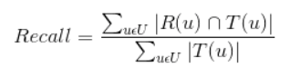
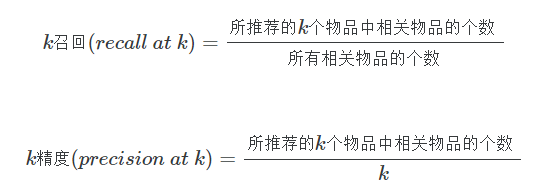
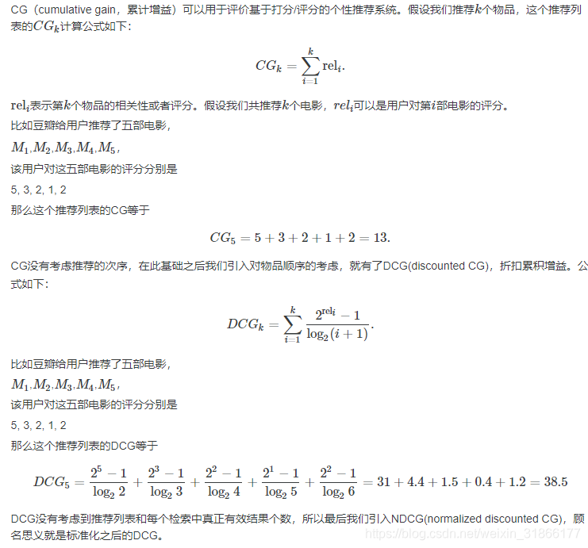
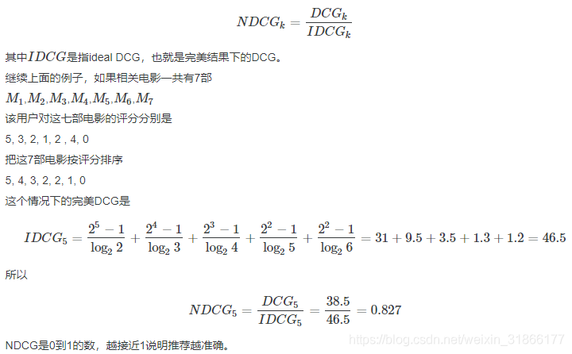

## 召回指标

### Hit Rate（HR）
1. 

2. hit rate = 命中数/点击数

3. hit的定义为：看这召回的N个item中是否包含用户后续会点击的item（即hit），如果有则记为1，否则记为0，最后求sum(hit)/总用户数。
4. 

### TopN推荐

Precision
推荐系统的准确率定义为：

Recall
推荐系统的召回率定义为：

比如有一个训练集为（苹果，香蕉，橘子，草莓，哈密瓜，西红柿，黄瓜），用户选中其中几样，以此训练，

测试集为（梨子，菠萝，龙眼，黑莓，白菜，冬瓜）

根据用户在训练集上的行为：

给用户做出的推荐列表为R(u) =（梨子，菠萝，龙眼），用户在测试集上的实际行为列表T(u) =（梨子，黑莓，白菜，冬瓜）

那么R(u)和T(u)的交集为1，R(u)=3，T(u)=4，故准确率为1/3，召回率为1/4。

再举个例子

推荐系统往往只推荐有限个（如k个）物品给某个用户。真正相匹配的物品我们称之为相关物品（也就是二元分类中的阳性）。

k召回(recall at k)=所推荐的k个物品中相关物品的个数所有相关物品的个数k召回(recall at k)=所推荐的k个物品中相关物品的个数所有相关物品的个数。

k精度(precision at k)=所推荐的k个物品中相关物品的个数k精度(precision at k)=所推荐的k个物品中相关物品的个数k。

比如说，根据你的喜好，我们推荐了10个商品，其中真正相关的是5个商品。在所有商品当中，相关的商品一共有20个，那么
k召回 = 5 / 20

k精度 = 5 / 10

### NDCG

说到NDCG就需要从CG开始说起。

