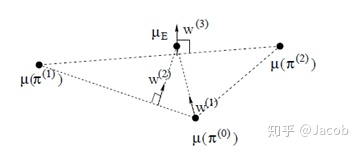
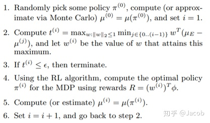

<head>
    
    
</head>

## 学徒学习
学徒学习指的是从专家示例中学到reward函数，使得在该回报函数下所得的最优策略在专家示例策略附近。

### 定义

- 轨迹定义: $\tau=\{s_1,a_1,\cdots,s_t,a_t,\cdots\}$
- 专家轨迹: $D^*=\{\tau\}\sim \pi^*$
- state $s$的特征函数表示：$\phi({s})\in R^n$，n是特征函数个数
- 未知的reward函数为: $R(s)=w \phi({s})$

### 问题定义
根据上述定义，策略$\phi$的的值函数为：
$$
    \begin{split}
    E_{s_0\sim D}V_\pi (s_0) &= E_{s_0\sim D}[\sum_{t=0}^{\infty}\gamma^tR(s_t)|\pi] \\
                            &= E_{s_0\sim D}[\sum_{t=0}^{\infty}\gamma^t w \phi({s_t})|\pi] \\
                            & = w \cdot E_{s_0\sim D}[\sum_{t=0}^{\infty}\gamma^t \phi({s_t})|\pi]
    \end{split}
$$
其中：
$$
    \mu(\pi)=E_{s_0\sim D}[\sum_{t=1}^{\infty}\gamma^{t-1} \phi({s_t})|\pi]
$$ 
是策略$\phi$的特征期望。策略$\phi$的的值函数，可以简化为：
$$
    E_{s_0\sim D}V_\pi (s_0) = w \cdot \mu(\pi)
$$
给定m条专家轨迹，我们可以估计专家轨迹的特征期望为：
$$
    \hat{\mu}_E=\frac{1}{|D^*|}\sum_{\tau \in D^*} [\sum_{t=1}^{\infty}\gamma^{t-1} \phi({s_t^{\tau}})]
$$
**学徒学习的优化目标就是寻找一个$\tilde{\pi}$，使得特征期望在专家轨迹附近，并且专家轨迹的值函数比其他策略包括$\tilde{\pi}$要尽量大。**
问题可以进一步转化为：
$$
    \begin{split}
    \max\limits_{w}\min\limits_{j\in{\{0,1,\dots\}}}&w\cdot (\mu_E-\mu(\pi^{(j)})) \\
    s.t. & ||w||_2 <=1
    \end{split}
$$
其中$\min$步骤是搜索已有策略中离专家轨迹最近的最近的策略，$\max$是调整优化值函数拉开专家轨迹与所求的策略的差距。上述优化问题可以转化为如下形式：
$$
    \begin{split}
        \max\limits_{w}&\quad t \\
        s.t.\quad w\cdot\mu_E>= w\cdot\mu(\pi_j)+t&, j\in{\{0,1,\dots\}}\\
        ||w||_2 <=1&
    \end{split}
$$
为max-margin形式。
算法集合描述，如下图所示是专家轨迹和几个策略的特征函数图

- 第一次：随机选择$\pi^{(0)}$ ，计算$\mu(\pi^{(0)})$，令i=1；然后根据算法第二步计算 $w^{(1)}$ ；判断是否到达第三步的终止条件，如果否，则使用RL算法和奖励函数 $R(s)=w^{(1)} \phi({s})$ 计算最优策略 $\pi^{(1)}$ ；计算$\mu(\pi^{(1)})$ 。
- 第二次：使用$\mu(\pi^{(0)})$和$\mu(\pi^{(1)})$，根据第二步计算 $w^{(2)}$，同第一次一样计算新的最优策略$\pi^{(2)}$ ；计算 $w^{(3)}$ 。
- 第三次：同上。

这里以$w^{(2)}$计算为例，当$w^{(2)}$垂直与$\mu(\pi^{(0)})$和$\mu(\pi^{(1)})$构成的直线时$ w\cdot\mu_E$和$w\cdot\mu(\pi_j)$之间差距最大（**可以看作将与$\mu(\pi^{(0)})$和$\mu(\pi^{(1)})$构成的直线平移到$\mu_E$上的距离**）。

下图是学徒学习的具体流程。
