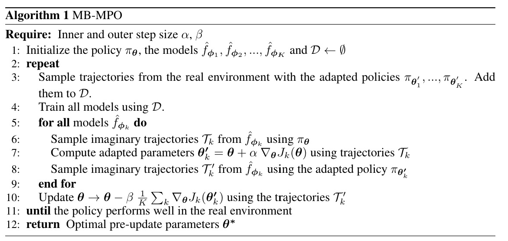

<head>
    
    
</head>

## PPO
对策略梯度进行截断保证步长不会太大

$$
L\left(s, a, \theta_{k}, \theta\right)=\min \left(\frac{\pi_{\theta}(a \mid s)}{\pi_{\theta_{k}}(a \mid s)} A^{\pi_{\theta_{k}}}(s, a), \operatorname{clip}\left(\frac{\pi_{\theta}(a \mid s)}{\pi_{\theta_{k}}(a \mid s)}, 1-\epsilon, 1+\epsilon\right) A^{\pi_{\theta_{k}}}(s, a)\right)
$$

