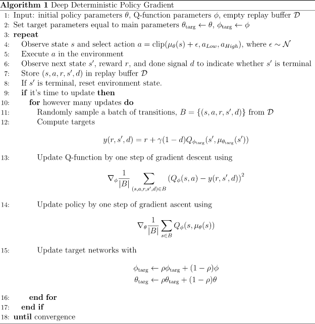

<head>
    
    
</head>

## DDPG

**Trick Two: Target Networks.** Q-learning algorithms make use of **target networks**. The term 

$$
    r + \gamma (1 - d) \max_{a'} Q_{\phi}(s',a')
$$
is called the **target**, because when we minimize the MSBE loss, we are trying to make the Q-function be more like this target. Problematically, the target depends on the same parameters we are trying to train: :math:`\phi`. This makes MSBE minimization unstable. The solution is to use a set of parameters which comes close to :math:`\phi`, but with a time delay---that is to say, a second network, called the target network, which lags the first. The parameters of the target network are denoted :math:`\phi_{\text{targ}}`. 

In DQN-based algorithms, the target network is just copied over from the main network every some-fixed-number of steps. In DDPG-style algorithms, the target network is updated once per main network update by polyak averaging:

$$
    \phi_{\text{targ}} \leftarrow \rho \phi_{\text{targ}} + (1 - \rho) \phi,
$$
where :math:`\rho` is a hyperparameter between 0 and 1 (usually close to 1). (This hyperparameter is called ``polyak`` in our code).

**DDPG Detail: Calculating the Max Over Actions in the Target.** As mentioned earlier: computing the maximum over actions in the target is a challenge in continuous action spaces. DDPG deals with this by using a **target policy network** to compute an action which approximately maximizes :math:`Q_{\phi_{\text{targ}}}`. The target policy network is found the same way as the target Q-function: by polyak averaging the policy parameters over the course of training. 

Putting it all together, Q-learning in DDPG is performed by minimizing the following MSBE loss with stochastic gradient descent:

$$
    L(\phi, {\mathcal D}) = \underset{(s,a,r,s',d) \sim {\mathcal D}}{{\mathrm E}}\left[
        \Bigg( Q_{\phi}(s,a) - \left(r + \gamma (1 - d) Q_{\phi_{\text{targ}}}(s', \mu_{\theta_{\text{targ}}}(s')) \right) \Bigg)^2
        \right],
$$
where :math:`\mu_{\theta_{\text{targ}}}` is the target policy.

The Policy Learning Side of DDPG
^^^^^^^^^^^^^^^^^^^^^^^^^^^^^^^^

Policy learning in DDPG is fairly simple. We want to learn a deterministic policy :math:`\mu_{\theta}(s)` which gives the action that maximizes :math:`Q_{\phi}(s,a)`. Because the action space is continuous, and we assume the Q-function is differentiable with respect to action, we can just perform gradient ascent (with respect to policy parameters only) to solve

$$
    \max_{\theta} \underset{s \sim {\mathcal D}}{{\mathrm E}}\left[ Q_{\phi}(s, \mu_{\theta}(s)) \right].
$$
Note that the Q-function parameters are treated as constants here.

