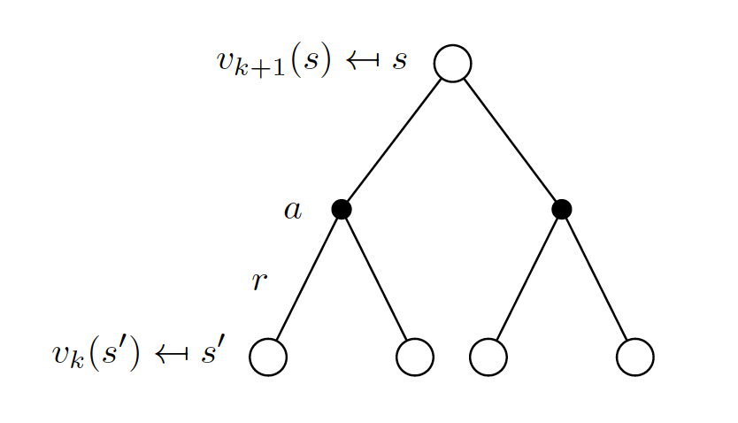
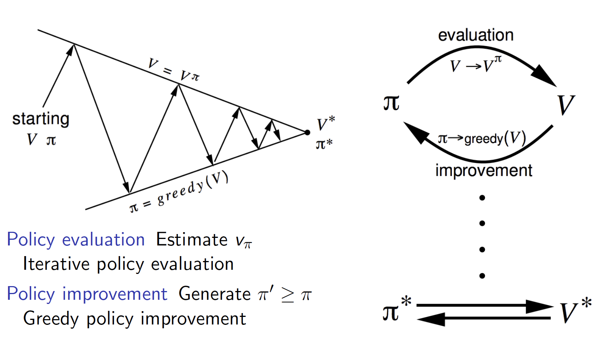
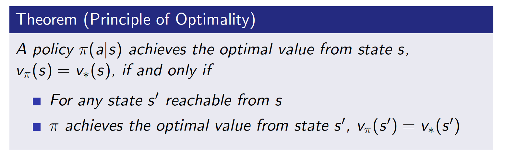
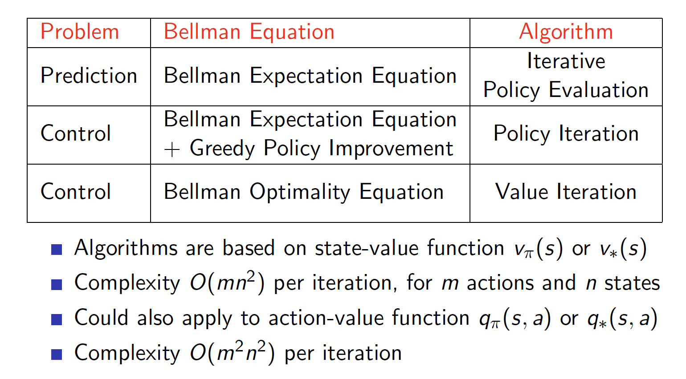

<head>
    <script src="https://cdn.mathjax.org/mathjax/latest/MathJax.js?config=TeX-AMS-MML_HTMLorMML" type="text/javascript"></script>
    <script type="text/x-mathjax-config">
    	MathJax.Hub.Config({tex2jax: {
             inlineMath: [['$','$']],
             displayMath: [["\\(","\\)"],["\\[","\\]"]],
             processEscapes: true
           }
         });
    </script>
</head>

## 动态规划 Planning by Dynamic Programming

* 动态规划首先假设是全信息的MDP过程
* For predition
  * 对于 $\langle\mathcal{S}, \mathcal{A}, \mathcal{P}, \mathcal{R}, \gamma\rangle$ 和 策略 $\pi$
  * 或者$\langle\mathcal{S}, \mathcal{P}^\pi, \mathcal{R}^\pi, \gamma\rangle$
  * 求解value function $v_\pi$
* For Control
  * 对于 $\langle\mathcal{S}, \mathcal{A}, \mathcal{P}, \mathcal{R}, \gamma\rangle$
  * 求解 最优策略 $\pi_*$和 最优 value function $v_*$

### Policy Evaluation
* 计算策略 $\pi$的value function $v_\pi$
#### Iterative Policy Evaluation
* 迭代调用Bellman expectation backup
* Using synchronous backups

$$
\begin{aligned}
v_{k+1}(s) &=\sum_{a \in \mathcal{A}} \pi(a \mid s)\left(\mathcal{R}_{s}^{a}+\gamma \sum_{s^{\prime} \in \mathcal{S}} \mathcal{P}_{s s^{\prime}}^{a} v_{k}\left(s^{\prime}\right)\right) \\
\mathbf{v}^{k+1} &=\mathcal{R}^{\pi}+\gamma \mathcal{P}^{\pi} \mathbf{v}^{k}
\end{aligned}
$$



[Test Case: Evaluating a Random Policy in the Small Gridworld](../demos/reinforcement/smallgrid.ipynb)

```python
import numpy as np
size = 4
reward = -1
action_prob = 0.25

v = np.zeros((size, size))

action_index = np.zeros((size, size, 4, 2), dtype=int)

dire = [(1,0), (-1, 0), (0,1), (0, -1)]

def get_next(i, j, dire):
    next_i, next_j = i + dire[0], j + dire[1]
    if next_i < 0 or next_i >= size or next_j < 0 or next_j >= size:
        return i,j
    return next_i, next_j

for i in range(size):
    for j in range(size):
        for k, di in enumerate(dire):
            next_i, next_j = get_next(i, j, di)
            action_index[i][j][k][0] = next_i
            action_index[i][j][k][1] = next_j

# Policy Evaluation`
while True:
    cur_v = v.copy()
    v = reward + action_prob * v[action_index[:,:,:,0], action_index[:,:,:,1]].sum(axis=-1)
    v[-1][-1] = 0
#     v[0][0] = 0
    if np.abs(cur_v - v).max() < 1e-4:
        break
```

### Policy Iteration



[Test Case: Car rent](../demos/reinforcement/car_rent.ipynb)

```python

value= np.zeros((MAX_CARS + 1, MAX_CARS + 1))
policy = np.zeros(value.shape, dtype=np.int)
iterations = 0
while True:
    # Policy Evalution
    while True:
        old_value = value.copy()
        for i in range(MAX_CARS + 1):
            for j in range(MAX_CARS + 1):
                returns = expected_return([i,j], policy[i,j], old_value, True)
                value[i,j] = returns
        max_value_change = abs(old_value - value).max()
        print('max value change {}'.format(max_value_change))
        if max_value_change < 1e-4:
            break
    
    
    # policy improvement
    policy_stable = True
    for i in range(MAX_CARS + 1):
        for j in range(MAX_CARS + 1):
            old_action = policy[i, j]
            action_returns = []
            for action in actions:
                if -j <= action <= i:
                    action_returns.append(expected_return([i,j], action, value, True))
                else:
                    action_returns.append(-np.inf)
            new_action = actions[np.argmax(action_returns)]
            policy[i,j] = new_action
            if policy_stable and new_action != old_action:
                policy_stable = False
    if policy_stable:
        break
    iterations += 1

```

### Value Iteration


$$
v_{*}(s) \leftarrow \max _{a \in \mathcal{A}} \mathcal{R}_{s}^{a}+\gamma \sum_{s^{\prime} \in \mathcal{S}} \mathcal{P}_{s s^{\prime}}^{a} v_{*}\left(s^{\prime}\right)
$$

$$
\begin{aligned}
v_{k+1}(s) &=\max _{a \in \mathcal{A}}\left(\mathcal{R}_{s}^{a}+\gamma \sum_{s^{\prime} \in \mathcal{S}} \mathcal{P}_{s s^{\prime}}^{a} v_{k}\left(s^{\prime}\right)\right) \\
\mathbf{v}_{k+1} &=\max _{a \in \mathcal{A}} \mathcal{R}^{a}+\gamma \mathcal{P}^{a} \mathbf{v}_{k}
\end{aligned}
$$


Test Case: Shortest Path
```python
import numpy as np
size = 4
reward = -1
v = np.zeros((size, size))

action_index =[[[] for _ in range(size)]  for _ in range(size)]

dire = [(1,0), (-1, 0), (0,1), (0, -1)]

def get_next(i, j, dire):
    next_i, next_j = i + dire[0], j + dire[1]
    if next_i < 0 or next_i >= size or next_j < 0 or next_j >= size:
        return i,j
    return next_i, next_j

for i in range(size):
    for j in range(size):
        arr_index = []
        for k, di in enumerate(dire):
            next_i, next_j = get_next(i, j, di)
            if next_i != i or next_j != j:
                arr_index.append([next_i, next_j])
        action_index[i][j] = np.array(arr_index)

# value iteration
while True:
    cur_v = v.copy()
#     v = reward + action_prob * v[action_index[:,:,:,0], action_index[:,:,:,1]].sum(axis=-1)
    for i in range(size):
        for j in range(size):
            v[i][j] = reward + cur_v[action_index[i][j][:,0], action_index[i][j][:,1]].max()

#     v[-1][-1] = 0
    v[0][0] = 0
    if np.abs(cur_v - v).max() < 1e-4:
        break
```

### Summary of DP



### Asynchronous Dynamic Programming
* In-place dynamic programming
* Prioritised sweeping
* Real-time dynamic programming