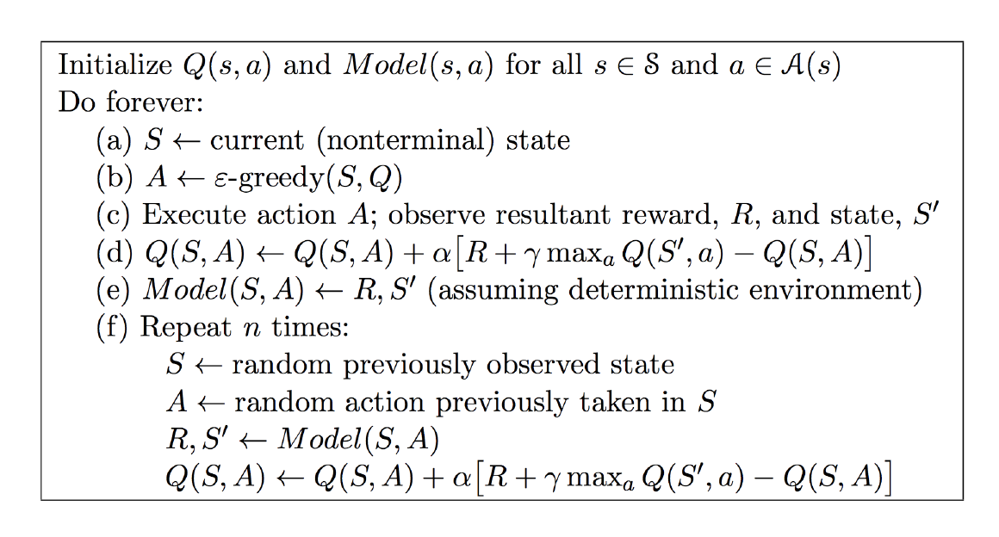
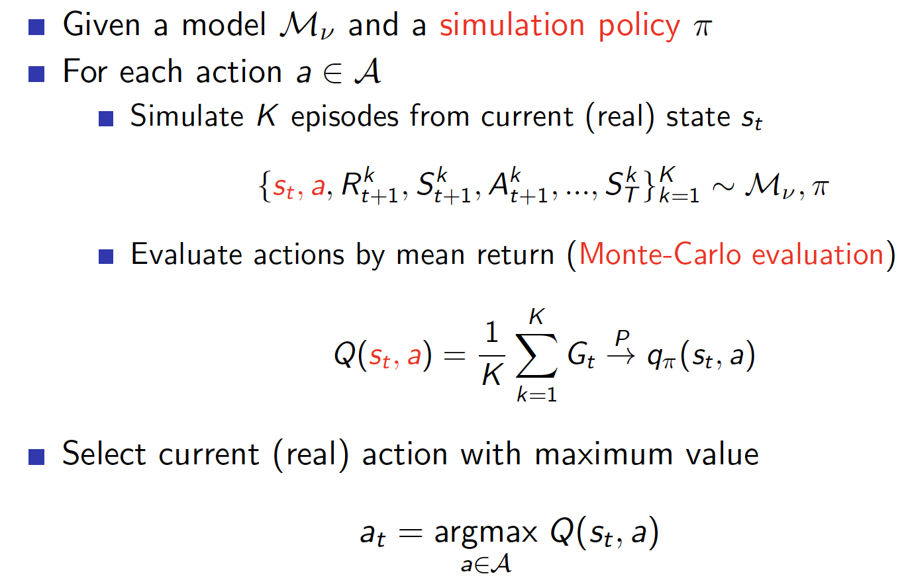
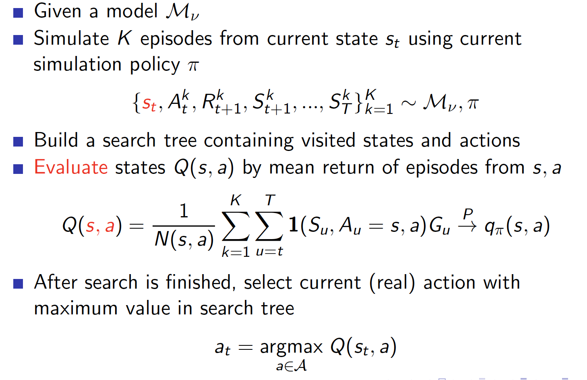
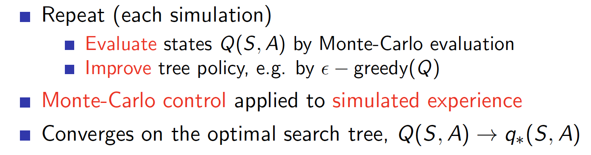
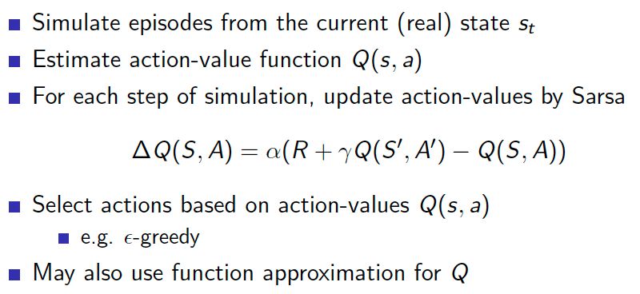
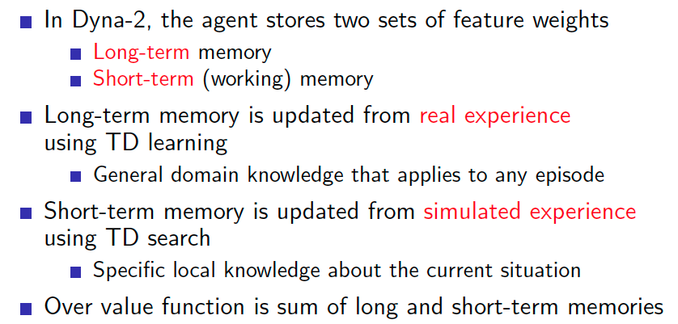

<head>
    
    
</head>

## Integrating Learning and Planning

### Advantages of Model-Based RL
- Advantages:
  - Can effciently learn model by supervised learning methods
  - Can reason about model uncertainty
- Disadvantages:
  - First learn a model, then construct a value function

### What is a Model
- A model M is a representation of an MDP <S,A,P,R> parametrized by $\eta$
- We will assume state space S and action space A are known
- A model M is generically represented as $<P_\eta, R_{\eta}>$:
$$
    S_{t+1}\sim P_\eta(S_{t+1}|S_{t},A_t) \\
    R_{t+1} = R_\eta(S_{t+1}|S_{t},A_t)
$$
- Typically assume conditional independence between state
transitions and rewards
$$
P[S_{t+1},R_{t+1}|S_t,A_t]=P[S_{t+1}|S_t,A_t]P[R_{t+1}|S_t,A_t]
$$
* learning $s,a\rightarrow r$ is a regression problem
* Learning $s,a\rightarrow s'$ is a density estimation problem

### Planning with a Model
* Given a model $M_{\eta}=<P_\eta,R_\eta>$
* Solve the MDP $<S,A,P_\eta,R_\eta>$
* Using favourite planning algorithm
  * Value iteration
  * Policy iteration
  * Tree search
  * ...

#### Sample-Based Planning
* Use the model only to generate samples
* Sample experience from model
  *  $S_{t+1}\sim P_{t+1}(S_{t+1}|S_t,A_t)$
  * $R_{t+1} = R_\eta(S_t,A_t)$
* Apply model-free RL to samples,
  * Monte-Carlo control
  * Sarsa
  * Q-learning
* Sample-based planning methods are often more efficient

### Integrated Architectures
#### Dyna
- We consider two sources of experience
  - Real experience Sampled from environment
$$
    S'\sim P_{S,S'}^a \\
    R=R_{a}^s
$$
  - Simulated experience Sampled from model
$$
    S'\sim P_\eta(S'|S,A) \\
    R = R_\eta(R|S,A) \\
$$

### Simulation-Based Search
#### Simple Monte-Carlo Tree Search

#### Monte-Carlo Tree Search (Evaluation)

#### Monte-Carlo Tree Search (Simulation)

#### Advantages of MC Tree Search
* Highly selective best-first search
* Evaluates states dynamically (unlike e.g. DP)
* Uses sampling to break curse of dimensionality
* Works for "black-box" models (only requires samples)
* Computationally efficient, anytime, parallelisable

#### Temporal-Difference Search
* MC tree search applies MC control to sub-MDP from now
* TD search applies Sarsa to sub-MDP from now
* For simulation-based search, bootstrapping is also helpful
  * TD search reduces variance but increases bias
  * TD search is usually more efficient than MC search
  * TD($\lambda$) search can be much more efficient than MC search

