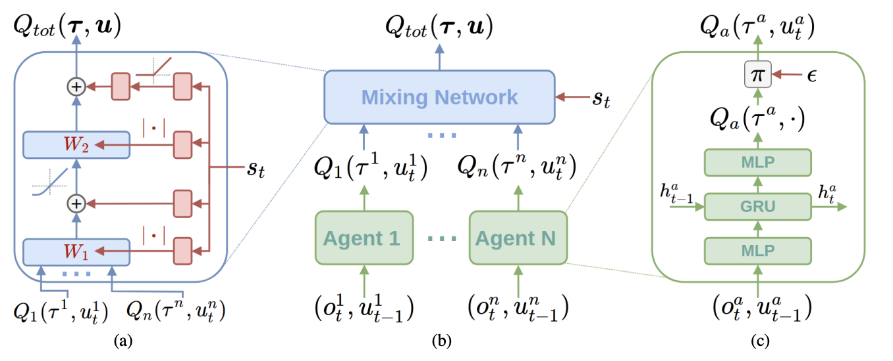

<head>
    
    
</head>

## QMIX
* Q-learning
* LOSS
$$
\mathcal{L}(\theta)=\sum_{i=1}^{b}\left[\left(y_{i}^{t o t}-Q_{t o t}(\boldsymbol{\tau}, \mathbf{u}, s ; \theta)\right)^{2}\right]
$$
where
$$
y^{\text {tot }}=r+\gamma \max _{\mathbf{u}^{\prime}} Q_{\text {tot }}\left(\boldsymbol{\tau}^{\prime}, \mathbf{u}^{\prime}, s^{\prime} ; \theta^{-}\right)
$$
