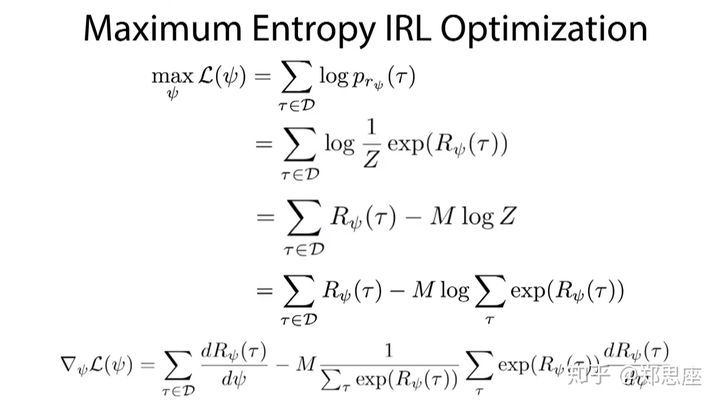
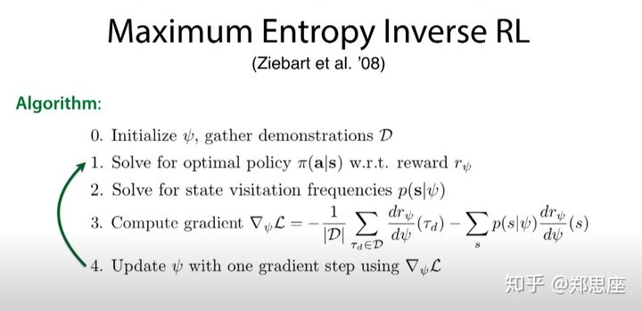

<head>
    
    
</head>

## 最大熵逆强化学习（MaxEnt）

### 问题
轨迹定义: $\tau=\{s_1,a_1,\cdots,s_t,a_t,\cdots\}$
专家轨迹: $D=\{\tau_i\}\sim \pi^*$

求解Reward: $R_{\psi}=\sum_{t}r_{\psi}(s_t,a_t)$

### 最大熵
在概率论中，熵是不确定性的度量。不确定性越大，熵越大。比如，在区间固定时，所有的分布中均匀分布的熵最大。因为均匀分布在固定区间每一点取值的概率都相等，所以取哪个值的不确定性最大。

最大熵原理是指，在学习概率模型时，在所有满足约束的概率模型（分布）中，熵最大的模型是最好的模型。这是因为，通过熵最大所选取的模型，没有对未知（即除了约束已知外）做任何主观假设。也就是说，除了约束条件外，我们不知道任何其他信息。

假设有特征函数$f(\tau)$来表征轨迹

$$
    \max \limits_{P}  H(P) 
$$

$$
    s.t. \sum P(\tau_i)f(\tau_i) = \tilde{f}, \sum P(\tau_i) = 1 \tag{1}
$$

其中$H(p) = -plog(p)$

利用拉格朗日乘子法，该优化问题可转化为:

$$
    \max \limits_{\lambda_0,\cdots} \min \limits_{p} L = p Log(p)-\sum_{j}^n \lambda_j(p f_j - \tilde{f_j}) - \lambda_0 {\sum p - 1}
$$

对概率p求导,在导数等于0的点，可得到满足最大熵的概率形式：
$$
    p = \frac{exp(\sum_j^n \lambda_j f_j)}{exp(1-\lambda_0)} = \frac{1}{Z}(exp(\sum_j^n \lambda_j f_j)) \tag{2}
$$
并且
$$
Z=exp(1-\lambda_0)=\sum_{\tau}  exp(\sum_j^n \lambda_j f_j))
$$

将公式(2)带入到L中，并对${\lambda_1,\cdots}$求极大化等价于p构成的似然函数极大化（在专家样本上）

$$
    \max\limits_{\lambda_1,\cdots} \sum_{\tau \in D} log p(\tau)
$$

${\lambda_1,\cdots}$也被成为reward weight,而$\sum_j^n \lambda_j f_j$也可以看作路径$\tau$的Return, 公式(2)可以被进一步泛化为：

$$
p(\tau)=\frac{1}{Z}exp(R_{\psi}(\tau))
$$
其中$S=\int R_{\psi}(\tau) d\tau$

优化问题也变为如下形式:

$$
    \max\limits_{\psi} \sum_{\tau \in D} log p_{r_{\psi}}(\tau)
$$

其中减号后面的项是比较难优化的部分，其实它就是在该参数下轨迹出现的概率，也就是状态s被访问的概率

