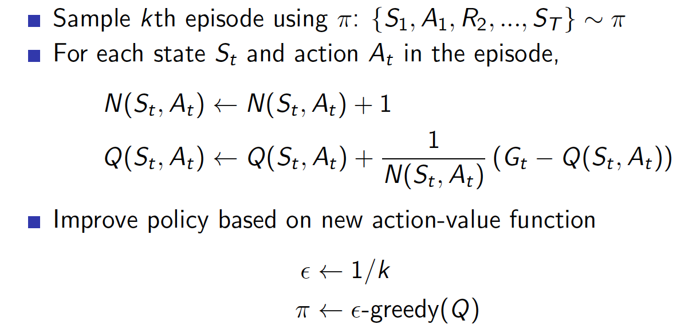
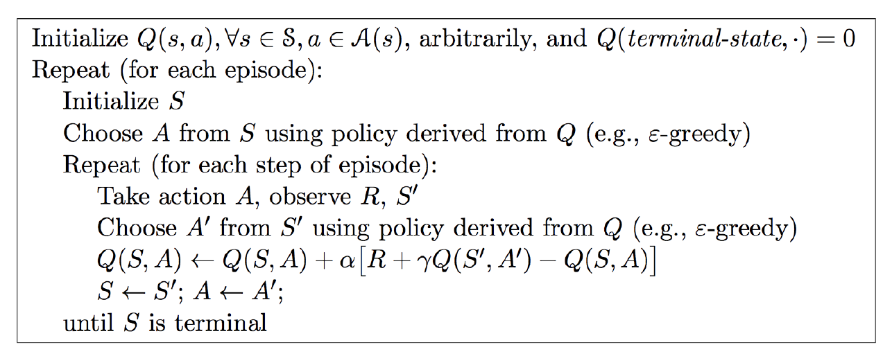
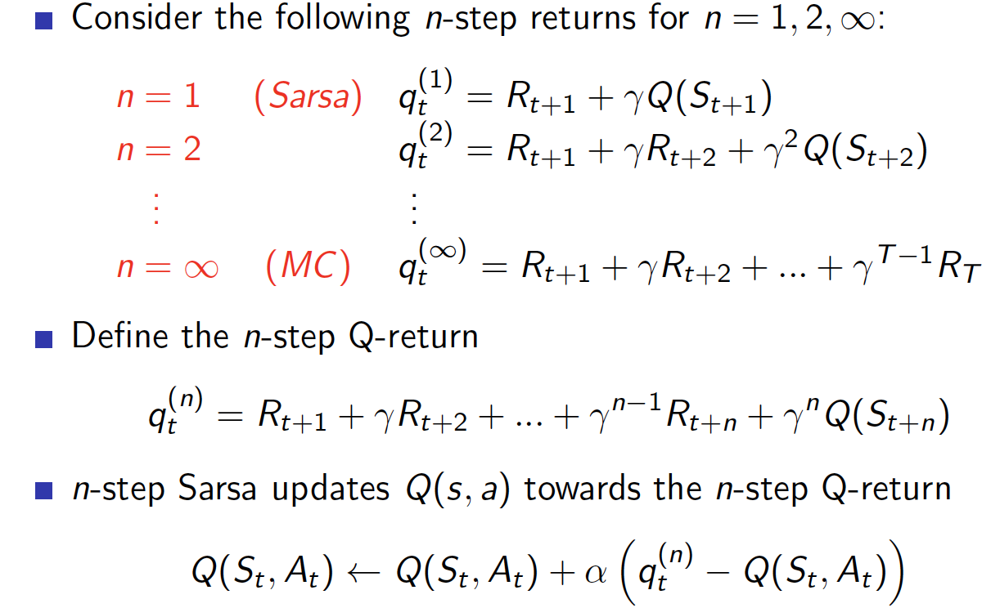
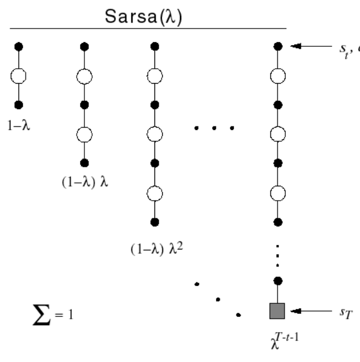
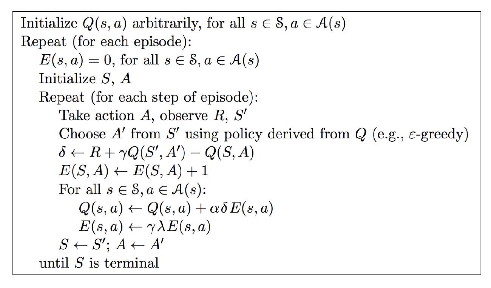
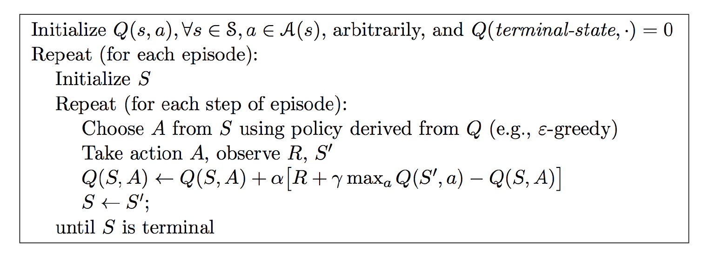
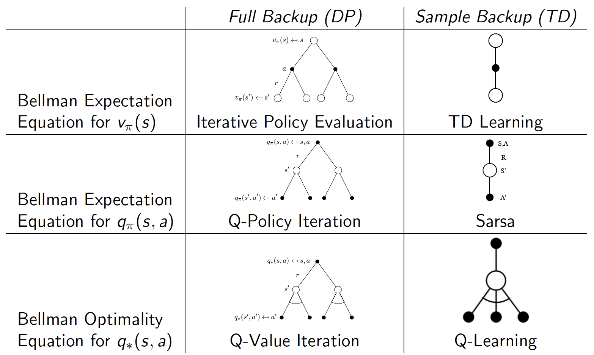
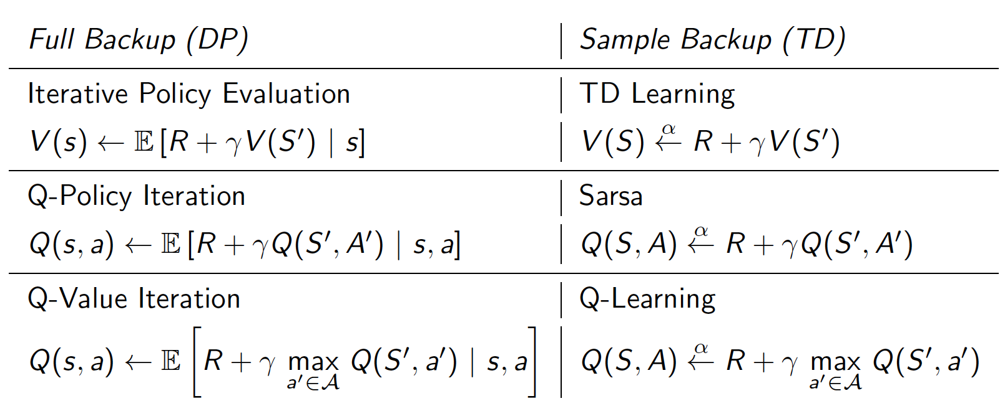

<head>
    <script src="https://cdn.mathjax.org/mathjax/latest/MathJax.js?config=TeX-AMS-MML_HTMLorMML" type="text/javascript"></script>
    <script type="text/x-mathjax-config">
    	MathJax.Hub.Config({tex2jax: {
             inlineMath: [['$','$']],
             displayMath: [["\\(","\\)"],["\\[","\\]"]],
             processEscapes: true
           }
         });
    </script>
</head>

## Model Free Control

* On-Policy
  * Learn about policy $\pi$ from experience sampled from $\pi$
* Off-Policy
  * Learn about policy $\pi$ from experience sampled from $\mu$


### On-Policy Monte-Carlo Control
Greedy policy improvement over Q(s; a) is model-free
$$
\pi^{\prime}(s)=\underset{a \in \mathcal{A}}{\operatorname{argmax}} Q(s, a)
$$

#### Greedy in the Limit with Innite Exploration (GLIE)
* All state-action pairs are explored innitely many times,
$$
\lim _{k \rightarrow \infty} N_{k}(s, a)=\infty
$$
* The policy converges on a greedy policy
$$
\lim _{k \rightarrow \infty} \pi_{k}(a \mid s)=\mathbf{1}\left(a=\underset{a^{\prime} \in \mathcal{A}}{\operatorname{argmax}} Q_{k}\left(s, a^{\prime}\right)\right)
$$
* For example, $\epsilon$-greedy is GLIE if $\epsilon$ reduces to zero at $\epsilon_k = \frac{1}{k}$
* GLIE Monte-Carlo Control


[Test Case: Blackjack](../demos/reinforcement/blackjack.ipynb)
### On-Policy Temporal-Difference Learning
#### Sarsa


[Test Case: Clff Walk](../demos/reinforcement/cliff_walk.ipynb)
```python
def sarsa(q_value, expected=False, step_size=ALPHA):
    state = START
    action = choose_action(state, q_value)
    rewards = 0.0
    while state != GOAL:
        next_state, reward = step(state, action)
        next_action = choose_action(next_state, q_value)
        rewards += reward
        if not expected:
            target = q_value[next_state[0], next_state[1], next_action]
        else:
            # calculate the expected value of new state
            target = 0.0
            q_next = q_value[next_state[0], next_state[1], :]
            best_actions = np.argwhere(q_next == np.max(q_next))
            for action_ in ACTIONS:
                if action_ in best_actions:
                    target += ((1.0 - EPSILON) / len(best_actions) + EPSILON / len(ACTIONS)) * q_value[next_state[0], next_state[1], action_]
                else:
                    target += EPSILON / len(ACTIONS) * q_value[next_state[0], next_state[1], action_]
        target *= GAMMA
        q_value[state[0], state[1], action] += step_size * (
                reward + target - q_value[state[0], state[1], action])
        state = next_state
        action = next_action
    return rewards
```

#### n-Step Sarsa


#### Forward Sarsa($\lambda$)
* The $q_{t}^{\lambda}$ return combines all n-step Q-returns q(n)
$$
q_{t}^{\lambda}=(1-\lambda) \sum_{n=1}^{\infty} \lambda^{n-1} q_{t}^{(n)}
$$


#### Backward Sarsa($\lambda$)
* Sarsa($\lambda$) has one eligibility trace for each state-action pair
$$
\begin{aligned}
&E_{0}(s, a)=0 \\
&E_{t}(s, a)=\mid \gamma \lambda E_{t-1}(s, a)+\mathbf{1}\left(S_{t}=s, A_{t}=a\right)
\end{aligned}
$$
* Q(s; a) is updated for every state s and action a
* In proportion to TD-error $\delta_{t}$ and eligibility trace $E_{t}(s, a)$
$$
\begin{aligned}
&\delta_{t}=R_{t+1}+\gamma Q\left(S_{t+1}, A_{t+1}\right)-Q\left(S_{t}, A_{t}\right) \\
&Q(s, a) \leftarrow Q(s, a)+\alpha \delta_{t} E_{t}(s, a)
\end{aligned}
$$


### Off-Policy Learning
* Learn from observing humans or other agents
* Re-use experience generated from old policies $\pi_1,\pi_2,\cdots,\pi_{t-1}$
* Learn about optimal policy while following exploratory policy
* Learn about multiple policies while following one policy

#### Importance Sampling for Off-Policy Monte-Carlo
* Use returns generated from $\mu$ to evaluate $\pi$
* Multiply importance sampling corrections along whole episode
$$
G_{t}^{\pi / \mu}=\frac{\pi\left(A_{t} \mid S_{t}\right)}{\mu\left(A_{t} \mid S_{t}\right)} \frac{\pi\left(A_{t+1} \mid S_{t+1}\right)}{\mu\left(A_{t+1} \mid S_{t+1}\right)} \ldots \frac{\pi\left(A_{T} \mid S_{T}\right)}{\mu\left(A_{T} \mid S_{T}\right)} G_{t}
$$
Update value towards corrected return
$$
V(S_t)\leftarrow V(S_t) + \alpha(G_{t}^{\pi / \mu} - V(S_t))
$$
* Importance sampling can dramatically increase variance

#### Importance Sampling for Off-Policy TD
* Only need a single importance sampling correction
$$
\begin{aligned}
V\left(S_{t}\right) & \leftarrow V\left(S_{t}\right)+\\
& \alpha\left(\frac{\pi\left(A_{t} \mid S_{t}\right)}{\mu\left(A_{t} \mid S_{t}\right)}\left(R_{t+1}+\gamma V\left(S_{t+1}\right)\right)-V\left(S_{t}\right)\right)
\end{aligned}
$$
* Much lower variance than Monte-Carlo importance sampling
* Policies only need to be similar over a single step
#### Q-Learning
* No importance sampling is required
* Next action is chosen using behaviour policy $A_{t+1} \sim\mu(\cdot|S_t )$
* But we consider alternative successor action $A' \sim\pi(\cdot|S_t )$


[Test Case: Clff Walk](../demos/reinforcement/cliff_walk.ipynb)
```python
def q_learning(q_value, step_size=ALPHA):
    state = START
    rewards = 0.0
    while state != GOAL:
        action = choose_action(state, q_value)
        next_state, reward = step(state, action)
        rewards += reward
        # Q-Learning update
        q_value[state[0], state[1], action] += step_size * (
                reward + GAMMA * np.max(q_value[next_state[0], next_state[1], :]) -
                q_value[state[0], state[1], action])
        state = next_state
    return rewards
```

### Summary


