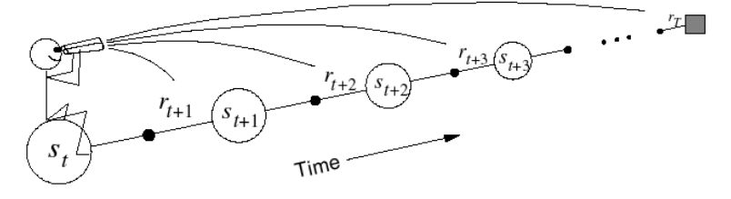
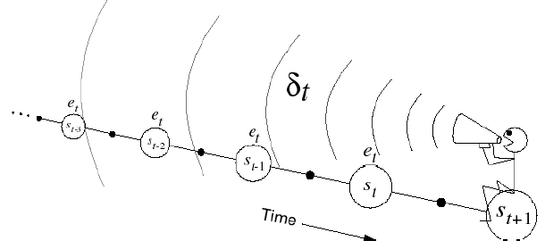

<head>
    <script src="https://cdn.mathjax.org/mathjax/latest/MathJax.js?config=TeX-AMS-MML_HTMLorMML" type="text/javascript"></script>
    <script type="text/x-mathjax-config">
    	MathJax.Hub.Config({tex2jax: {
             inlineMath: [['$','$']],
             displayMath: [["\\(","\\)"],["\\[","\\]"]],
             processEscapes: true
           }
         });
    </script>
</head>

## Model Free Prediction

* Estimate the value function of an unknown MDP

### Monte-Carlo Reinforcement Learning

* 目标, 从历史回放中学习$v_\pi$, $S_1,A_1,R_2,\cdots,S_k\sim \pi$
* return $G_t=R_{t+1}+\gamma R_{t+2}+\cdots+\gamma^{T-1}R_{t+T}$
* $v_\pi(s)=E[G_t|S_t=s]$
* Monte-Carlo policy evaluation uses empirical mean return instead of expected return

#### First-Visit Monte-Carlo Policy Evaluation

#### Every-Visit Monte-Carlo Policy Evaluation

#### Incremental Monte-Carlo Updates
$$
\begin{aligned}
&N\left(S_{t}\right) \leftarrow N\left(S_{t}\right)+1 \\
&V\left(S_{t}\right) \leftarrow V\left(S_{t}\right)+\frac{1}{N\left(S_{t}\right)}\left(G_{t}-V\left(S_{t}\right)\right)
\end{aligned}
$$
In non-stationary problems,
$$
V\left(S_{t}\right) \leftarrow V\left(S_{t}\right)+\alpha\left(G_{t}-V\left(S_{t}\right)\right)
$$

[Test Case: Blackjack](../demos/reinforcement/blackjack.ipynb)

```python
# Monte Carlo Sample with On-Policy
def monte_carlo_on_policy(episodes):
    states_usable_ace = np.zeros((10, 10))
    # initialze counts to 1 to avoid 0 being divided
    states_usable_ace_count = np.ones((10, 10))
    states_no_usable_ace = np.zeros((10, 10))
    # initialze counts to 1 to avoid 0 being divided
    states_no_usable_ace_count = np.ones((10, 10))
    for i in tqdm(range(0, episodes)):
        _, reward, player_trajectory = play(target_policy_player)
        for (usable_ace, player_sum, dealer_card), _ in player_trajectory:
            player_sum -= 12
            dealer_card -= 1
            if usable_ace:
                states_usable_ace_count[player_sum, dealer_card] += 1
                states_usable_ace[player_sum, dealer_card] += reward
            else:
                states_no_usable_ace_count[player_sum, dealer_card] += 1
                states_no_usable_ace[player_sum, dealer_card] += reward
    return states_usable_ace / states_usable_ace_count, states_no_usable_ace / states_no_usable_ace_count

```


### Temporal-Difference Learning
* TD learns from incomplete episodes, by bootstrapping
* TD updates a guess towards a guess

####  Comparison of MC and TD
* MC: $V\left(S_{t}\right) \leftarrow V\left(S_{t}\right)+\alpha\left(G_{t}-V\left(S_{t}\right)\right)$
* TD(0): $V\left(S_{t}\right) \leftarrow V\left(S_{t}\right)+\alpha\left(R_{t+1}+\gamma V\left(S_{t+1}\right)-V\left(S_{t}\right)\right)$
* TD target: $R_{t+1}+\gamma V\left(S_{t+1}\right)$
* TD error: $R_{t+1}+\gamma V\left(S_{t+1}\right)-V\left(S_{t}\right)$


[Test Case: RandomWalk](../demos/reinforcement/random_walk.ipynb)
```python
# @values: current states value, will be updated if @batch is False
# @alpha: step size
# @batch: whether to update @values
def temporal_difference(values, alpha=0.1, batch=False):
    state = 3
    trajectory = [state]
    rewards = [0]
    while True:
        old_state = state
        if np.random.binomial(1, 0.5) == ACTION_LEFT:
            state -= 1
        else:
            state += 1
        # Assume all rewards are 0
        reward = 0
        trajectory.append(state)
        # TD update
        if not batch:
            values[old_state] += alpha * (reward + values[state] - values[old_state])
        if state == 6 or state == 0:
            break
        rewards.append(reward)
    return trajectory, rewards
```

* Bootstrapping: update involves an estimate
  * MC does not bootstrap
  * DP bootstraps
  * TD bootstraps
* Sampling: update samples an expectation
  * MC samples
  * DP does not sample
  * TD samples


### TD($\lambda$)

#### n-step TD

$\begin{array}{ccc}n=1 & (T D) & G_{t}^{(1)}=R_{t+1}+\gamma V\left(S_{t+1}\right) \\ n=2 & & G_{t}^{(2)}=R_{t+1}+\gamma R_{t+2}+\gamma^{2} V\left(S_{t+2}\right) \\ \vdots & & \vdots & \\ n=\infty & (M C) & G_{t}^{(\infty)} & =R_{t+1}+\gamma R_{t+2}+\ldots+\gamma^{T-1} R_{T}\end{array}$

* Update function:

$V\left(S_{t}\right) \leftarrow V\left(S_{t}\right)+\alpha\left(G_{t}^{(n)}-V\left(S_{t}\right)\right)$

[Test Case: LargeRandomWalk](../demos/reinforcement/TD_lambda.ipynb)

#### Forward-view
* can only be computed from complete episodes
$G_{t}^{\lambda}=(1-\lambda) \sum_{n=1}^{\infty} \lambda^{n-1} G_{t}^{(n)}$


#### Backward-view
* Eligibility traces
* Frequency heuristic: assign credit to most frequent states
* Recency heuristic: assign credit to most recent states

$E_{0}(s)=0$
$E_{t}(s)=\gamma \lambda E_{t-1}(s)+\mathbf{1}\left(S_{t}=s\right)$
$\delta_{t} =R_{t+1}+\gamma V\left(S_{t+1}\right)-V\left(S_{t}\right)$
$V(s)  \leftarrow V(s)+\alpha \delta_{t} E_{t}(s)$

```python

import numpy as np

state_values = np.zeros(n_states) # initial guess = 0 value
eligibility = np.zeros(n_states)

lamb = 0.95 # the lambda weighting factor
state = env.reset() # start the environment, get the initial state
# Run the algorithm for some episodes
for t in range(n_steps):
  # act according to policy
  action = policy(state)
  new_state, reward, done = env.step(action)
  # Update eligibilities
  eligibility *= lamb * gamma
  eligibility[state] += 1.0

  # get the td-error and update every state's value estimate
  # according to their eligibilities.
  td_error = reward + gamma * state_values[new_state] - state_values[state]
  state_values = state_values + alpha * td_error * eligibility

  if done:
    state = env.reset()
  else:
    state = new_state

```

#### Relationship Between Forward and Backward TD
* This is exactly equivalent to TD(0) update
* for $\lambda=1$, The sum of offline updates is identical for forward-view and
backward-view TD($\lambda$)， = MC error

#### Offline and Online updates
offline更新指的是等到一个Episode完成之后做一次更新，而不是每一步都更新，与之相反的是online更新。我们通过一个例子来说明其中的区别，假设一个Episode是：
$$
s, a_{1}, r_{1}, t, a_{2}, r_{1}, s, a_{2}, \ldots
$$

那么算法会对状态s更新两次，对t更新一次。如果是online的，第二次计算使用的是第一次的结果来更新：
$$
\begin{aligned}
&V_{2}(s) \leftarrow \delta_{1}+V_{1}(s) \\
&V_{3}(s) \leftarrow \delta_{2}+V_{2}(s)
\end{aligned}
$$
这里的$\delta_{1}$会依赖于$V_{1}(s)$，$\delta_{2}$会依赖于$V_{2}(s)$。最终的效果是：
$$V_{3}(s) \leftarrow \delta_{1} + \delta_{2}+V_{1}(s)$$
而offline更新公式是一样的，但是$\delta_{1}$,$\delta_{2}$都只会依赖于$V_{1}(s)$.