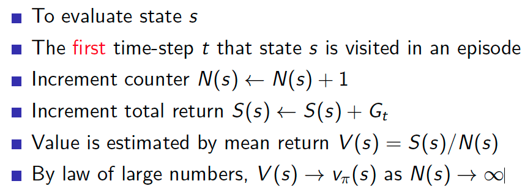
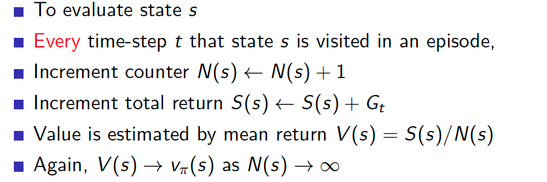
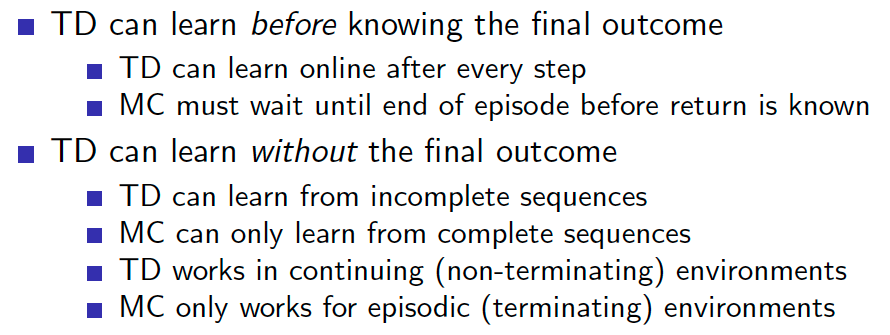
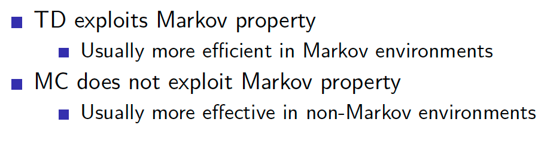
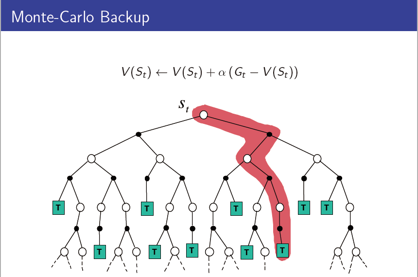
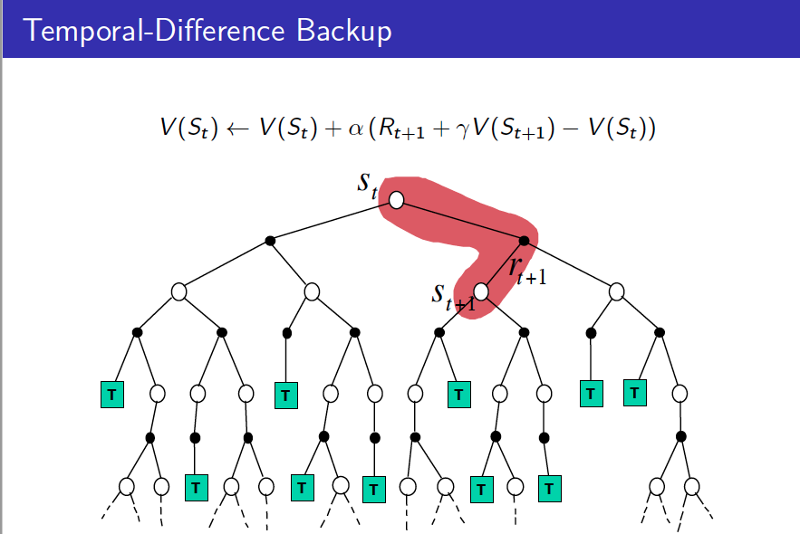

<head>
    <script src="https://cdn.mathjax.org/mathjax/latest/MathJax.js?config=TeX-AMS-MML_HTMLorMML" type="text/javascript"></script>
    <script type="text/x-mathjax-config">
    	MathJax.Hub.Config({tex2jax: {
             inlineMath: [['$','$']],
             displayMath: [["\\(","\\)"],["\\[","\\]"]],
             processEscapes: true
           }
         });
    </script>
</head>

## Model Free Prediction

* Estimate the value function of an unknown MDP

### Monte-Carlo Reinforcement Learning

* 目标, 从历史回放中学习$v_\pi$, $S_1,A_1,R_2,\cdots,S_k\sim \pi$
* return $G_t=R_{t+1}+\gamma R_{t+2}+\cdots+\gamma^{T-1}R_{t+T}$
* $v_\pi(s)=E[G_t|S_t=s]$
* Monte-Carlo policy evaluation uses empirical mean return instead of expected return

#### First-Visit Monte-Carlo Policy Evaluation

#### Every-Visit Monte-Carlo Policy Evaluation

#### Incremental Monte-Carlo Updates
$$
\begin{aligned}
&N\left(S_{t}\right) \leftarrow N\left(S_{t}\right)+1 \\
&V\left(S_{t}\right) \leftarrow V\left(S_{t}\right)+\frac{1}{N\left(S_{t}\right)}\left(G_{t}-V\left(S_{t}\right)\right)
\end{aligned}
$$
In non-stationary problems,
$$
V\left(S_{t}\right) \leftarrow V\left(S_{t}\right)+\alpha\left(G_{t}-V\left(S_{t}\right)\right)
$$

[Test Case: Blackjack](../demos/reinforcement/blackjack.ipynb)

```python
# Monte Carlo Sample with On-Policy
def monte_carlo_on_policy(episodes):
    states_usable_ace = np.zeros((10, 10))
    # initialze counts to 1 to avoid 0 being divided
    states_usable_ace_count = np.ones((10, 10))
    states_no_usable_ace = np.zeros((10, 10))
    # initialze counts to 1 to avoid 0 being divided
    states_no_usable_ace_count = np.ones((10, 10))
    for i in tqdm(range(0, episodes)):
        _, reward, player_trajectory = play(target_policy_player)
        for (usable_ace, player_sum, dealer_card), _ in player_trajectory:
            player_sum -= 12
            dealer_card -= 1
            if usable_ace:
                states_usable_ace_count[player_sum, dealer_card] += 1
                states_usable_ace[player_sum, dealer_card] += reward
            else:
                states_no_usable_ace_count[player_sum, dealer_card] += 1
                states_no_usable_ace[player_sum, dealer_card] += reward
    return states_usable_ace / states_usable_ace_count, states_no_usable_ace / states_no_usable_ace_count

```


### Temporal-Difference Learning
* TD learns from incomplete episodes, by bootstrapping
* TD updates a guess towards a guess

####  Comparison of MC and TD
* MC: $V\left(S_{t}\right) \leftarrow V\left(S_{t}\right)+\alpha\left(G_{t}-V\left(S_{t}\right)\right)$
* TD(0): $V\left(S_{t}\right) \leftarrow V\left(S_{t}\right)+\alpha\left(R_{t+1}+\gamma V\left(S_{t+1}\right)-V\left(S_{t}\right)\right)$
* TD target: $R_{t+1}+\gamma V\left(S_{t+1}\right)$
* TD error: $R_{t+1}+\gamma V\left(S_{t+1}\right)-V\left(S_{t}\right)$







[Test Case: RandomWalk](../demos/reinforcement/random_walk.ipynb)
```python
# @values: current states value, will be updated if @batch is False
# @alpha: step size
# @batch: whether to update @values
def temporal_difference(values, alpha=0.1, batch=False):
    state = 3
    trajectory = [state]
    rewards = [0]
    while True:
        old_state = state
        if np.random.binomial(1, 0.5) == ACTION_LEFT:
            state -= 1
        else:
            state += 1
        # Assume all rewards are 0
        reward = 0
        trajectory.append(state)
        # TD update
        if not batch:
            values[old_state] += alpha * (reward + values[state] - values[old_state])
        if state == 6 or state == 0:
            break
        rewards.append(reward)
    return trajectory, rewards
```

* Bootstrapping: update involves an estimate
  * MC does not bootstrap
  * DP bootstraps
  * TD bootstraps
* Sampling: update samples an expectation
  * MC samples
  * DP does not sample
  * TD samples


### TD($\lambda$)

#### n-step TD

$\begin{array}{ccc}n=1 & (T D) & G_{t}^{(1)}=R_{t+1}+\gamma V\left(S_{t+1}\right) \\ n=2 & & G_{t}^{(2)}=R_{t+1}+\gamma R_{t+2}+\gamma^{2} V\left(S_{t+2}\right) \\ \vdots & & \vdots & \\ n=\infty & (M C) & G_{t}^{(\infty)} & =R_{t+1}+\gamma R_{t+2}+\ldots+\gamma^{T-1} R_{T}\end{array}$

* Update function:

$V\left(S_{t}\right) \leftarrow V\left(S_{t}\right)+\alpha\left(G_{t}^{(n)}-V\left(S_{t}\right)\right)$

[Test Case: LargeRandomWalk](../demos/reinforcement/TD_lambda.ipynb)