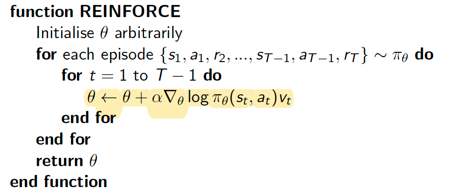
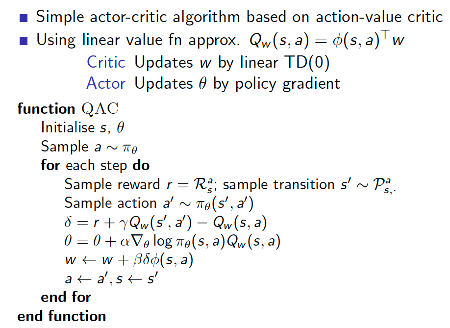

<head>
    
    
</head>

## Policy Gradient

### Monte-Carlo Policy Gradient

### Actor-Critic Policy Gradient
* Monte-Carlo policy gradient still has high variance
* We use a critic to estimate the action-value function
$$
  Q_{w}(s,a) \approx Q^{\pi_{\theta}}(s,a)
$$
* Actor-critic algorithms maintain two sets of parameters
  * Critic Updates action-value function parameters w
  * Actor Updates policy parameters $\theta$, in direction suggested by critic
* Actor-critic algorithms follow an approximate policy gradient
$$
\begin{gathered}
\nabla_{\theta} J(\theta) \approx \mathbb{E}_{\pi_{\theta}}\left[\nabla_{\theta} \log \pi_{\theta}(s, a) Q_{w}(s, a)\right] \\
\Delta \theta=\alpha \nabla_{\theta} \log \pi_{\theta}(s, a) Q_{w}(s, a)
\end{gathered}
$$
* The critic is solving a familiar problem: policy evaluation

#### Advantage Function Critic
* Approximating the policy gradient introduces bias
$$
\nabla_{\theta} J(\theta)=\mathbb{E}_{\pi_{\theta}}\left[\nabla_{\theta} \log \pi_{\theta}(s, a) Q_{w}(s, a)\right]
$$
* We subtract a baseline function B(s) from the policy gradient
* This can reduce variance, without changing expectation
$$
\begin{aligned}
\mathbb{E}_{\pi_{\theta}}\left[\nabla_{\theta} \log \pi_{\theta}(s, a) B(s)\right] &=\sum_{s \in \mathcal{S}} d^{\pi_{\theta}}(s) \sum_{a} \nabla_{\theta} \pi_{\theta}(s, a) B(s) \\
&=\sum_{s \in \mathcal{S}} d^{\pi_{\theta}} B(s) \nabla_{\theta} \sum_{a \in \mathcal{A}} \pi_{\theta}(s, a) \\
&=0
\end{aligned}
$$
* A good baseline is the state value function $B(s) = V^{\pi_{\theta}} (s)$
* So we can rewrite the policy gradient using the advantage function $A^{\pi_{\theta}}(s, a)$
$$
\begin{aligned}
A^{\pi_{\theta}}(s, a) &=Q^{\pi_{\theta}}(s, a)-V^{\pi_{\theta}}(s) \\
\nabla_{\theta} J(\theta) &=\mathbb{E}_{\pi_{\theta}}\left[\nabla_{\theta} \log \pi_{\theta}(s, a) A^{\pi_{\theta}}(s, a)\right]
\end{aligned}
$$
* The advantage function can signicantly reduce variance of policy gradient
#### Estimating the Advantage Function
* For the true value function $V^{\pi_{\theta}} (s)$, the TD error $\delta^{\pi_{\theta}}$
$$
\delta^{\pi_{\theta}}=r+\gamma V^{\pi_{\theta}}\left(s^{\prime}\right)-V^{\pi_{\theta}}(s)
$$
* is an unbiased estimate of the advantage function
$$
\begin{aligned}
\mathbb{E}_{\pi_{\theta}}\left[\delta^{\pi_{\theta}} \mid s, a\right] &=\mathbb{E}_{\pi_{\theta}}\left[r+\gamma V^{\pi_{\theta}}\left(s^{\prime}\right) \mid s, a\right]-V^{\pi_{\theta}}(s) \\
&=Q^{\pi_{\theta}}(s, a)-V^{\pi_{\theta} \mid}(s) \\
&=A^{\pi_{\theta}}(s, a)
\end{aligned}
$$
* So we can use the TD error to compute the policy gradient
$$
\nabla_{\theta} J(\theta)=\mathbb{E}_{\pi_{\theta}}\left[\nabla_{\theta} \log \pi_{\theta}(s, a) \delta^{\pi_{\theta}}\right]
$$
#### Actors at Different Time-Scales
* Monte-Carlo policy gradient uses error from complete return
* Actor-critic policy gradient uses the one-step TD error
* just like forward-view TD($\lambda$), we can mix over time-scales
* Like backward-view TD($\lambda$), we can also use eligibility traces