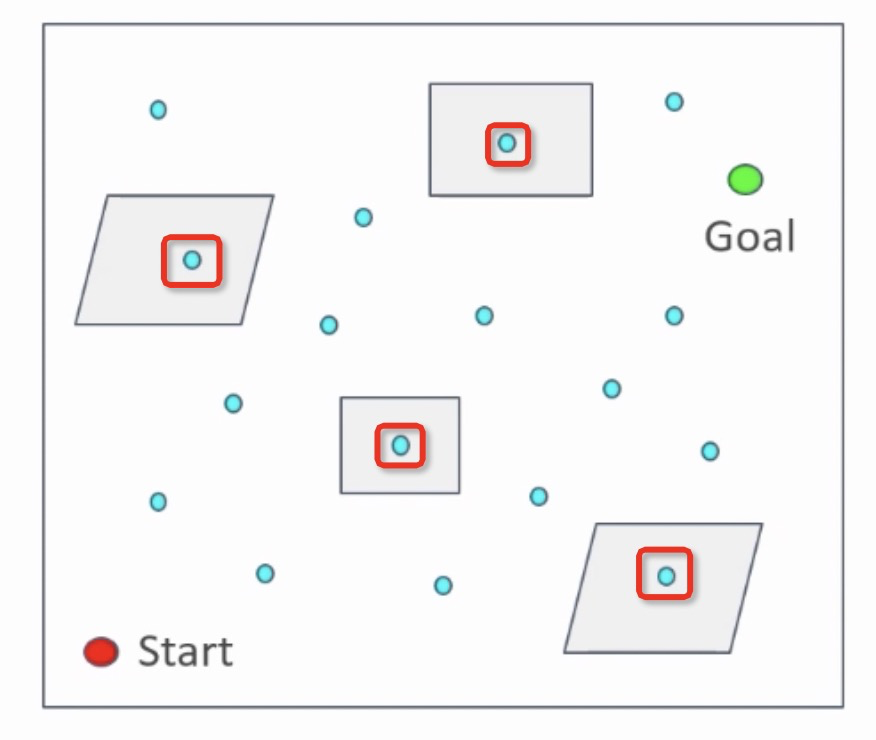
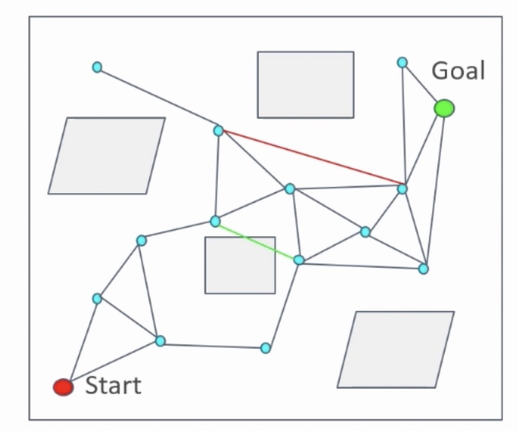
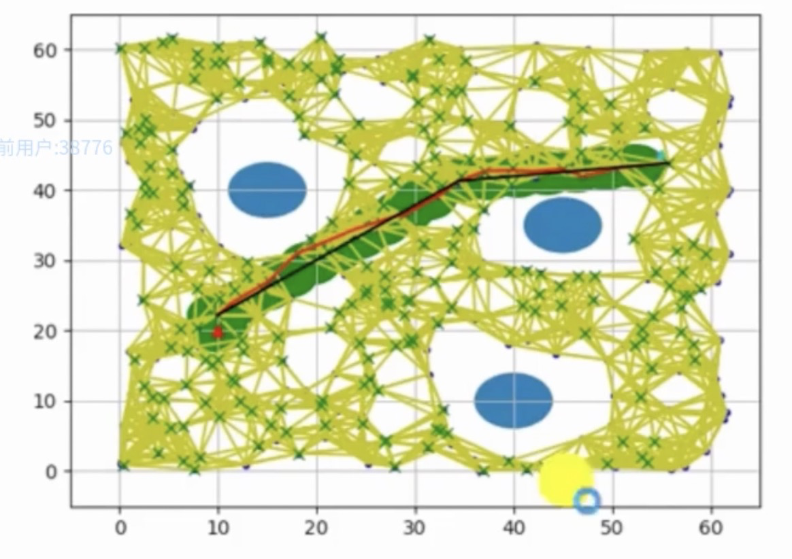

## PRM (Probabilistic Roadmaps)是一种基于图搜索的方法，它将连续空间转换成离散空间，再利用A*等搜索算法在路线图上寻找路径的一种方法。其一共分为两个步骤：学习阶段和查询阶段。
### 算法详解
#### 学习阶段
学习阶段的主要目标是在空间中按照一定分布（如均匀分布）采样N个点，利用碰撞检测等手段去除存在障碍物内的点，在利用线段将点与点进行连线，图下图所示：

其中，蓝色的点为采样点，灰色区域为障碍物区域，红色框内的蓝色点为移除点。

如下图所示，点与点的连接的准则：
* 起始和终点节点要被连接到网络中
* 被连接的两个点之间满足一定距离约束，例如最近邻的几个点；此处，如果没有这个约束的话，最糟糕的情况是得到了全连通图，使得后期路径规划运行时间增加
* 如果两个点之间的连线经过障碍物，则这条线段不可连接
#### 查询阶段
查询阶段的主要目标是在学习阶段构建的图中，基于起始和终点节点，寻找最短路径，常用的算法是采用A*等算法。此时，再利用A*算法，搜索过程会提升很大的性能。原因在于，PRM得到的图数据结构的复杂度远远低于直接将空间进行数据建模。如下图所示：


### 基于Lazy collision-checking的PRM算法
前文讲述的PRM算法，在学习阶段需要对所有的节点和节点之间的连线与障碍物进行碰撞检测，然后将碰撞的节点和边删除。当空间内采样点数量较大时，学习阶段很耗时。为了提升计算效率，基于Lazy collision-checking的PRM算法被提出来了。它的主要思想是在学习阶段，不进行碰撞检测，在查询阶段进行路径搜索时，将不可行的路段和节点再进行删除，重新进行规划。如下图所示：

```python
import math
from PIL import Image
import numpy as np
import networkx as nx
import copy

STAT_OBSTACLE = '#'
STAT_NORMAL = '.'


class RoadMap():

    def __init__(self, img_file):
        test_map = []
        img = Image.open(img_file)
        img_gray = img.convert('L')
        img_arr = np.array(img_gray)
        img_binary = np.where(img_arr < 127, 0, 255)
        for x in range(img_binary.shape[0]):
            temp_row = []
            for y in range(img_binary.shape[1]):
                status = STAT_OBSTACLE if img_binary[x, y] == 0 else STAT_NORMAL
                temp_row.append(status)
            test_map.append(temp_row)

        self.map = test_map
        self.cols = len(self.map[0])
        self.rows = len(self.map)

    def is_valid_xy(self, x, y):
        if x < 0 or x >= self.rows or y < 0 or y >= self.cols:
            return False
        return True

    def not_obstacle(self, x, y):
        return self.map[x][y] != STAT_OBSTACLE

    def EuclidenDistance(self, xy1, xy2):
        """两个像素点之间的欧几里得距离"""
        dis = 0
        for (x1, x2) in zip(xy1, xy2):
            dis += (x1 - x2) ** 2
        return dis ** 0.5

    def ManhattanDistance(self, xy1, xy2):
        """两个像素点之间的曼哈顿距离"""
        dis = 0
        for x1, x2 in zip(xy1, xy2):
            dis += abs(x1 - x2)
        return dis

    def check_path(self, xy1, xy2):
        """碰撞检测 两点之间的连线是否经过障碍物"""
        steps = max(abs(xy1[0] - xy2[0]), abs(xy1[1] - xy2[1]))
        xs = np.linspace(xy1[0], xy2[0], steps + 1)
        ys = np.linspace(xy1[1], xy2[1], steps + 1)
        for i in range(1, steps):
            if not self.not_obstacle(math.ceil(xs[i]), math.ceil(ys[i])):
                return False

        return True

    def plot(self, path):
        out = []
        for x in range(self.rows):
            temp = []
            for y in range(self.cols):
                if self.map[x][y] == STAT_OBSTACLE:
                    temp.append(0)
                elif self.map[x][y] == STAT_NORMAL:
                    temp.append(255)
                elif self.map[x][y] == '*':
                    temp.append(127)
                else:
                    temp.append(255)
            out.append(temp)
        for x, y in path:
            out[x][y] = 127
        out = np.array(out)
        img = Image.fromarray(np.uint8(out))
        img.show()


def path_length(path):
    """计算路径长度"""
    l = 0
    for i in range(len(path) - 1):
        x1, y1 = path[i]
        x2, y2 = path[i + 1]
        if x1 == x2 or y1 == y2:
            l += 1.0
        else:
            l += 1.4
    return l


class PRM(RoadMap):

    def __init__(self, img_file, **param):
        RoadMap.__init__(self, img_file)

        self.num_sample = param['num_sample'] if 'num_sample' in param else 100
        self.distance_neighbor = param['distance_neighbor'] if 'distance_neighbor' in param else 100
        self.G = nx.Graph()

    def learn(self):
        while len(self.G.nodes) < self.num_sample:
            XY = (np.random.randint(0, self.rows), np.random.randint(0, self.cols))
            if self.is_valid_xy(XY[0], XY[1]) and self.not_obstacle(XY[0], XY[1]):
                self.G.add_node(XY)

        for node1 in self.G.nodes:
            for node2 in self.G.nodes:
                if node1 == node2:
                    continue

                dis = self.EuclidenDistance(node1, node2)
                if dis < self.distance_neighbor and self.check_path(node1, node2):
                    self.G.add_edge(node1, node2, weight=dis)

    def find_path(self, startXY=None, endXY=None):
        temp_G = copy.deepcopy(self.G)
        startXY = tuple(startXY) if startXY else (0, 0)
        endXY = tuple(endXY) if endXY else (self.rows - 1, self.cols - 1)
        temp_G.add_node(startXY)
        temp_G.add_node(endXY)
        for node1 in [startXY, endXY]:
            for node2 in temp_G.nodes:
                dis = self.EuclidenDistance(node1, node2)
                if dis < self.distance_neighbor and self.check_path(node1, node2):
                    temp_G.add_edge(node1, node2, weight=dis)

        path = nx.shortest_path(temp_G, source=startXY, target=endXY)

        return self.construct_path(path)

    def construct_path(self, path):
        out = []
        for i in range(len(path) - 1):
            xy1, xy2 = path[i], path[i + 1]
            steps = max(abs(xy1[0] - xy2[0]), abs(xy1[1] - xy2[1]))
            xs = np.linspace(xy1[0], xy2[0], steps + 1)
            ys = np.linspace(xy1[1], xy2[1], steps + 1)
            for j in range(0, steps + 1):
                out.append((math.ceil(xs[j]), math.ceil(ys[j])))
        return out


if __name__ == '__main__':
    prm = PRM('map_1.bmp', num_sample=200, distance_neighbor=200)
    prm.learn()
    path = prm.find_path()
    prm.plot(path)
    print('Path length:', path_length(path))
```