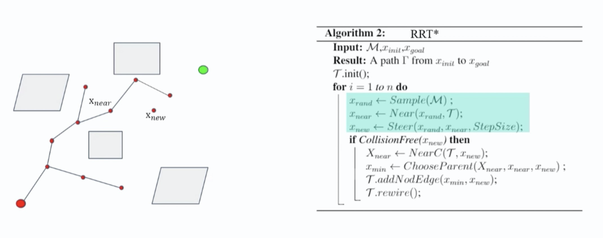

## RRT-Star算法
1. 概述
回顾RRT算法，虽然能快速地找到路径，但是得到的路径并不光滑，对机器人移动而言不是最优路径。因此，本文我们介绍优化RRT的算法，即RRT*算法。RRT*与RRT算法流程基本相同，不同之处就在于最后加入将Xnew
加入搜索树时父节点的选择策略上不同。
2. 算法详解
RRT算法选择新节点Xnew
时，基于随机点和最近邻点，前进制定步长生成。而在RRT*算法中，在选择父节点时会有一个重连(Rewire)过程，也就是以Xnew
为圆心，半径为r的邻域内，找到与Xnew
连接后，代价(从起点移动到Xnew
的路程)最小的节点，并选择该节点作为Xnew
的父节点，而不是Xnear
。RRT*算法详见下图：


代码案例
```python

import numpy as np
import time
import random
import matplotlib
import matplotlib.pyplot as plt
import math
import copy


def get_map(image):
    ima = matplotlib.image.imread(image)
    return ima


def random_point():
    r_x = random.random() * (m_map.shape[0] - 1)
    r_y = random.random() * (m_map.shape[1] - 1)
    return [r_x, r_y]


def feasible_point(p):
    if 0 <= p[0] < m_map.shape[0] and 0 <= p[1] < m_map.shape[1] and m_map[int(p[0])][int(p[1])][0] == 255:
        return True
    else:
        return False


def distance(p, q):
    d = abs(p[0] - q[0]) + abs(p[1] - q[1])
    return d


def nearest(p, tree):
    row, min_d = -1, float('INF')
    for i in range(len(tree)):
        p_n = [tree[i][0], tree[i][1]]
        td = distance(p_n, p)
        if td < min_d:
            min_d = td
            row = i
    p_near = [tree[row][0], tree[row][1]]
    return p_near, row


def extend(p, q, step):
    if distance(p, q) < thresh_hold:
        return q
    else:
        theta = math.atan2((q[1] - p[1]), (q[0] - p[0]))
        p_new = [p[0] + step * math.cos(theta), p[1] + step * math.sin(theta)]
        return p_new


def cost(i, tree):
    c = 0
    while True:
        t = tree[i][2]
        if t == -1:
            break

        c += distance(tree[i][:2], tree[t][:2])
        i = t
    return c


def get_nearby(r, p, tree):
    p_nearby = []
    for i in range(len(tree)):
        p_n = [tree[i][0], tree[i][1]]
        if feasible_point(p_n):
            td = distance(p_n, p)
            if td < r:
                p_nearby.append([p_n, i])
    return p_nearby


def new_father(p_new, p_nearby, tree):
    min_dis, t = float('inf'), -1
    min_father = []
    for i in range(len(p_nearby)):
        t_dis = distance(p_new, p_nearby[i][0]) + cost(p_nearby[i][1], tree)
        if t_dis < min_dis and checkpath(p_nearby[i][0], p_new, 1):
            min_dis = t_dis
            min_father = p_nearby[i]
            t = i
    p_nearby.pop(t)
    if min_father:
        tree.append([p_new[0], p_new[1], min_father[1]])

    i_p_new = len(tree)-1
    cost_p_new = cost(i_p_new, tree)
    for j in p_nearby:
        pre_cost = cost(j[1], tree)
        if cost_p_new + distance(j[0], p_new) < pre_cost and checkpath(p_new, j[0], 1):
            tree[j[1]][2] = i_p_new


def checkpath(p, q, step):
    if distance(p, q) < thresh_hold:
        return True

    theta = math.atan2((q[1] - p[1]), (q[0] - p[0]))
    t = copy.deepcopy(p)
    while distance(t, q) > thresh_hold:
        t = [t[0] + step * math.cos(theta), t[1] + step * math.sin(theta)]
        if not feasible_point(t):
            return False
    return True


def pruning(path, step):
    new_path = [path[0]]
    i = 0
    j = 1
    while i < len(path)-2 and j < len(path):
        if checkpath(path[i], path[j], step):
            if distance(path[j], path[-1]) < thresh_hold:
                new_path.append(path[-1])
                break
            j += 1
        else:
            new_path.append(path[j-1])
            i = j-1
    new_cost = 0
    for i in range(len(new_path)-1):
        new_cost += distance(new_path[i], new_path[i+1])
    return new_path, new_cost


def interp(path, step):
    i_path = [path[0]]
    i = 0
    t = copy.deepcopy(path[0])
    while i < len(path)-1:
        theta = math.atan2((path[i+1][1] - path[i][1]), (path[i+1][0] - path[i][0]))
        while distance(t, path[i+1]) > thresh_hold:
            t = [t[0] + step * math.cos(theta), t[1] + step * math.sin(theta)]
            i_path.append(t)
        t = copy.deepcopy(path[i+1])
        i += 1
    return i_path


def rrt(step, thresh_hold, init, goal, radius, iterations):
    max_attempts, label, i_goal = iterations, 0, -1
    tree = list()
    tree.append(init + [-1])

    count = 0
    while count < max_attempts:
        p_rand = random_point()
        p_near, row = nearest(p_rand, tree)
        p_new = extend(p_near, p_rand, step)

        if not feasible_point(p_new):
            count += 1
            continue

        if distance(p_new, goal) <= thresh_hold:
            tree.append([goal[0], goal[1], row])
            i_goal = len(tree) - 1
            label = 1
            continue

        p_new_near, n_row = nearest(p_new, tree)
        if distance(p_new, p_new_near) < thresh_hold:
            count += 1
            continue

        p_nearby = get_nearby(radius, p_new, tree)
        new_father(p_new, p_nearby, tree)

    if label == 1:
        print("found path")
        path = []
        i = i_goal
        next_i = tree[i][2]
        while next_i != -1:
            path.append([tree[i][0], tree[i][1]])
            i = next_i
            next_i = tree[i][2]
        path.append([init[0], init[1]])
        c = cost(i_goal, tree)
        return path[::-1], tree, c
    else:
        print('reached max attempts')
        return tree


if __name__ == '__main__':
    m_map = get_map('map_2.bmp')

    m_map = m_map.swapaxes(0, 1)
    init = [10, 10]
    goal = [490, 490]
    step = 15
    thresh_hold = 15
    radius = 30
    iterations = 5000

    path, tree, cost = rrt(step, thresh_hold, init, goal, radius, iterations)

    print('cost: ', cost)
    x = [i[0] for i in path]
    y = [i[1] for i in path]
    p_tree, tx, ty = [], [], []
    for i in tree:
        tx.append(i[0])
        ty.append(i[1])

    plt.plot(x, y, color="darkblue")
    plt.scatter(tx, ty, color='lightsteelblue', s=5)

    new_path, new_cost = pruning(path, step)
    print('new_cost: ', new_cost)
    n_x = [i[0] for i in new_path]
    n_y = [i[1] for i in new_path]
    plt.plot(n_x, n_y, color="green")

    i_path = interp(new_path, step)
    i_x = [i[0] for i in i_path]
    i_y = [i[1] for i in i_path]

    m_map = m_map.swapaxes(0, 1)
    plt.imshow(m_map)

    plt.show()


```