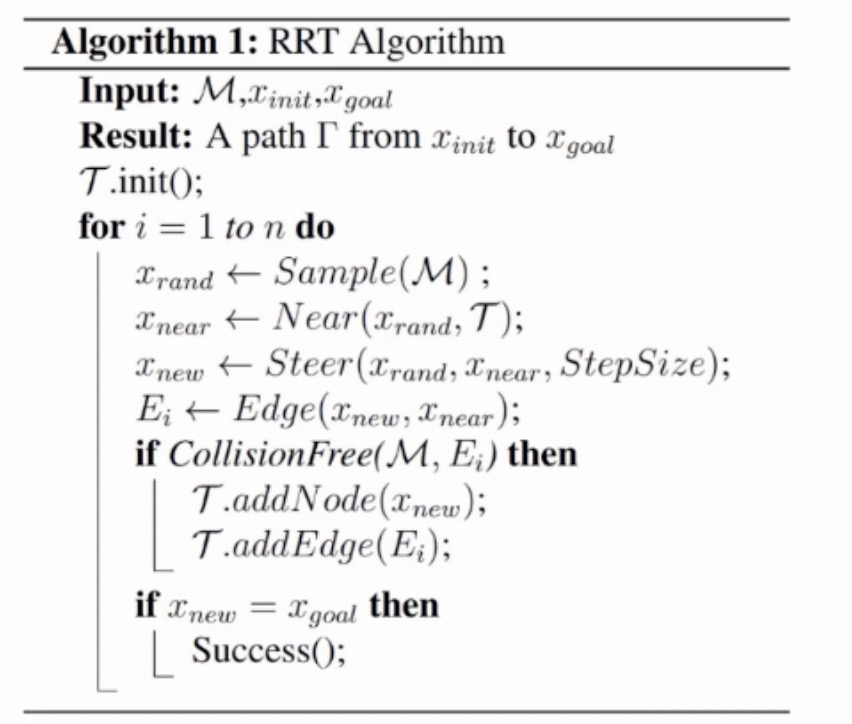

## RRT算法
算法主要思想：

* 将起点初始化为搜索树T的根节点Xinit
* 在空间中采样点Xrand，按照设定的随机采样概率进行随机采样，其余情况直接将目标点作为采样点
* 从搜索树T中取出距离采样点Xrand
* 最近的节点Xnear
* 沿着Xnear 到Xrand 方向前进Step size，得到Xnew，继而得到连边(Xnew,Xnear)
* 利用CollisionFree方法检测该边是否与地图边界及其内障碍物碰撞，如果没有碰撞，则将成功完成一次空间搜索拓展，如果碰撞，重新构建重复上述过程，直至达到目标位置
节点扩展过程如下图所示：

