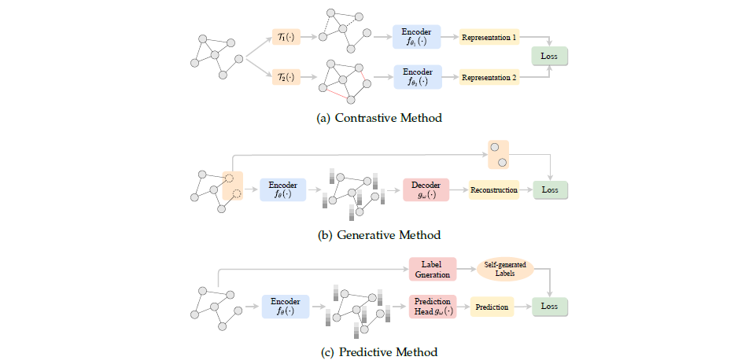

## 自监督学习(Self-Supervised Learning)

- 对比式方法：对不同的增广$\Tau_1(\cdot)$ 和$\Tau_2(\cdot)$产生的视图进行对比学习，将数据-数据对（inter-data）之间的共性和差异信息作为监督信号。
- 生成式方法：关注图数据内部（intra-data）的信息，一般基于特征/结构重构等代理任务，利用图本身的特征和结构作为监督信号。
- 预测式方法：通过一些简单的统计分析或专家知识self-generate伪标签，然后根据生成的伪标签设计基于预测的代理任务来处理数据-标签（data-label）关系。

